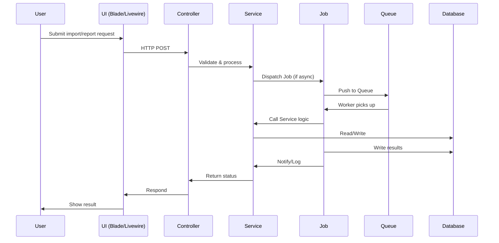

# AGENTS

## Table of Contents

- [1. Overview](#1-overview)
- [2. Architecture](#2-architecture)
  - [2.1 Component Diagram](#21-component-diagram)
  - [2.2 Typical Execution Flow](#22-typical-execution-flow)
- [3. Agent Catalog](#3-agent-catalog)
- [4. Orchestration and Routing](#4-orchestration-and-routing)
- [5. Tools and Integrations](#5-tools-and-integrations)
- [6. Configuration](#6-configuration)
- [7. Running Locally](#7-running-locally)
- [8. Deployment](#8-deployment)
- [9. Observability](#9-observability)
- [10. Quality and Testing](#10-quality-and-testing)
- [11. Security and Compliance](#11-security-and-compliance)
- [12. Troubleshooting](#12-troubleshooting)
- [13. Extending the System](#13-extending-the-system)
- [14. Glossary](#14-glossary)
- [15. Changelog and Maintenance Notes](#15-changelog-and-maintenance-notes)

---

## 1. Overview

This repository currently does **not implement any intelligent agents, LLMs, or AI orchestration frameworks** (e.g., LangChain, CrewAI, Autogen, LangGraph, OpenAI, etc.).

All business logic, automation, and background processing are implemented using standard Laravel service classes and jobs (see [app/Services/](app/Services/) and [app/Jobs/](app/Jobs/)).

> **Note:** If you intend to add an agent, LLM, or AI workflow, see [13. Extending the System](#13-extending-the-system) for a prescriptive template and checklist.

---

## 2. Architecture

### 2.1 Component Diagram

```mermaid
graph TD
    subgraph Laravel Application
        SVC[Service Layer (app/Services)]
        JOB[Jobs (app/Jobs)]
        CTL[Controllers (app/Http/Controllers)]
        Q[Queue (Redis/DB)]
        DB[(MySQL/MariaDB)]
        UI[Frontend (Blade/Livewire)]
    end
    SVC --> JOB
    CTL --> SVC
    JOB --> Q
    Q --> JOB
    SVC --> DB
    JOB --> DB
    UI --> CTL
```

### 2.2 Typical Execution Flow



---

## 3. Agent Catalog

> **No intelligent agents or LLM-based orchestrators are implemented in this repository.**

All automation is handled by Laravel service classes and jobs:

- [app/Services/HomestayService.php](app/Services/HomestayService.php)
- [app/Services/ImportService.php](app/Services/ImportService.php)
- [app/Services/PerformanceService.php](app/Services/PerformanceService.php)
- [app/Services/ReportService.php](app/Services/ReportService.php)
- [app/Services/UserAccessService.php](app/Services/UserAccessService.php)
- [app/Jobs/GenerateReportJob.php](app/Jobs/GenerateReportJob.php)
- [app/Jobs/ProcessImportJob.php](app/Jobs/ProcessImportJob.php)

**If you add an agent, document it here with:**

- Name, summary, responsibilities
- Inputs/outputs
- Tools/APIs used
- Models (provider, params)
- Memory/context
- Orchestration/termination
- Entrypoints
- Source links

---

## 4. Orchestration and Routing

- No agent orchestration, routing, or planning frameworks are present.
- All workflows are implemented via Laravel service methods and queued jobs.
- See [app/Services/](app/Services/) and [app/Jobs/](app/Jobs/).

---

## 5. Tools and Integrations

- **Queue:** Laravel Queue (Redis, Database)
- **Excel Import/Export:** [maatwebsite/excel](https://laravel-excel.com/)
- **Notifications:** Laravel Notification, Mail, Slack (see [config/services.php](config/services.php))
- **Database:** MySQL/MariaDB
- **Frontend:** Blade, Livewire, AlpineJS, Bootstrap 5
- **No LLM, vector DB, or AI toolchains present.**

---

## 6. Configuration

### Environment Variables

| Name                    | Required | Default         | Description                                 |
|-------------------------|----------|-----------------|---------------------------------------------|
| APP_NAME                | Yes      | homestay-system | Application name                            |
| APP_ENV                 | Yes      | local           | Environment (local, production, etc.)       |
| APP_KEY                 | Yes      | (none)          | Laravel app key                             |
| APP_DEBUG               | No       | true            | Debug mode                                  |
| APP_URL                 | Yes      | <http://127.0.0.1:8000> | App URL                              |
| APP_LOCALE              | Yes      | ms              | Default locale                              |
| APP_FALLBACK_LOCALE     | Yes      | en              | Fallback locale                             |
| APP_TIMEZONE            | Yes      | Asia/Kuala_Lumpur | Timezone                                 |
| DB_CONNECTION           | Yes      | mysql           | DB driver                                   |
| DB_HOST                 | Yes      | 127.0.0.1       | DB host                                     |
| DB_PORT                 | Yes      | 3306            | DB port                                     |
| DB_DATABASE             | Yes      | homestay_db     | DB name                                     |
| DB_USERNAME             | Yes      | root            | DB user                                     |
| DB_PASSWORD             | Yes      | (none)          | DB password                                 |
| QUEUE_CONNECTION        | Yes      | database        | Queue backend                               |
| REDIS_HOST              | No       | 127.0.0.1       | Redis host                                  |
| REDIS_PORT              | No       | 6379            | Redis port                                  |
| MAIL_MAILER             | No       | smtp            | Mail driver                                 |
| MAIL_HOST               | No       | 127.0.0.1       | Mail host                                   |
| MAIL_PORT               | No       | 1025            | Mail port                                   |
| MAIL_FROM_ADDRESS       | No       | <noreply@motac.gov.my> | Mail from address                      |
| AWS_ACCESS_KEY_ID       | No       | (none)          | AWS key (if using S3, SES, etc.)            |
| AWS_SECRET_ACCESS_KEY   | No       | (none)          | AWS secret                                  |
| AWS_DEFAULT_REGION      | No       | us-east-1       | AWS region                                  |
| VITE_APP_NAME           | No       | ${APP_NAME}     | Frontend app name                           |

**See [.env.example](.env.example) for full list.**

#### Example .env snippet

```dotenv
APP_NAME="homestay-system"
APP_ENV=local
APP_KEY=base64:YOURKEYHERE
APP_DEBUG=true
APP_URL=http://127.0.0.1:8000
DB_CONNECTION=mysql
DB_HOST=127.0.0.1
DB_PORT=3306
DB_DATABASE=homestay_db
DB_USERNAME=root
DB_PASSWORD=yourpassword
QUEUE_CONNECTION=database
```

---

## 7. Running Locally

### Prerequisites

- PHP 8.2+
- Composer
- Node.js 18+
- MySQL/MariaDB
- Redis (for queue, optional)

### Setup

```bash
composer install
npm install
cp .env.example .env
php artisan key:generate
php artisan migrate --seed
npm run dev
php artisan serve
```

### Running Queues

```bash
php artisan queue:work
# or for Horizon (if installed):
php artisan horizon
```

---

## 8. Deployment

- Environments: local, staging, production
- CI/CD: Not documented in code. **TODO: Add GitHub Actions or deployment pipeline details.**
- Required secrets: see [6. Configuration](#6-configuration)
- Scaling: Use Horizon for queue scaling; DB and Redis can be clustered.

---

## 9. Observability

- Logs: Laravel log files ([storage/logs/](storage/logs/)), log channel set in `.env`
- Metrics: Not implemented. **TODO: Add metrics/monitoring guidance.**
- Tracing: Not implemented.
- Dashboards: Not implemented.
- Common queries: See [storage/logs/](storage/logs/)

---

## 10. Quality and Testing

- Unit and feature tests: [tests/](tests/)
- Factories: [database/factories/](database/factories/)
- Run all tests:

  ```bash
  php artisan test
  ```

- Run a single test file:

  ```bash
  php artisan test tests/Unit/Services/ImportServiceTest.php
  ```

- Mocks and fakes: Use Laravel's built-in testing tools
- Playbooks/simulations: Not implemented

---

## 11. Security and Compliance

- Secrets: Store in `.env`, never commit real secrets
- Data handling: Follows Laravel security defaults (CSRF, XSS, SQLi protection)
- Least privilege: RBAC via Spatie Laravel Permission
- Rate limiting: Not implemented for agents (see API docs for API rate limits)
- Safety filters: Not implemented

---

## 12. Troubleshooting

| Error/Symptom                | Likely Cause                        | Fix/Diagnostic Command                |
|------------------------------|-------------------------------------|---------------------------------------|
| `npm run dev` fails          | Node version, missing deps, Vite    | `node -v`, `npm install`              |
| `php artisan migrate` fails  | DB config, missing DB, perms        | Check `.env`, DB running, user perms  |
| Queue jobs not running       | Queue worker not started            | `php artisan queue:work`              |
| No .env or APP_KEY missing   | Missing/invalid .env                | `cp .env.example .env`, `php artisan key:generate` |
| 500 error on import/report   | Permissions, DB, queue, code error  | Check logs in `storage/logs/`         |

---

## 13. Extending the System

### Adding a New Agent or Tool

> **No agent/LLM framework is present.**

#### Checklist

1. Decide agent type (LLM, workflow, retriever, etc.)
2. Add dependencies (e.g., OpenAI SDK, LangChain, etc.)
3. Create agent class/module in `app/Agents/` (suggested)
4. Register agent in service provider or orchestrator
5. Add config to `.env` and `config/agents.php` (suggested)
6. Implement tools/functions with clear interfaces
7. Add tests in `tests/Agents/`
8. Document agent in [3. Agent Catalog](#3-agent-catalog)
9. Update diagrams and config tables
10. Review security, rate limits, and data handling

#### Code Link Templates

- Agent: `app/Agents/MyAgent.php`
- Tool: `app/Agents/Tools/MyTool.php`
- Config: `config/agents.php`
- Test: `tests/Agents/MyAgentTest.php`

#### Testing Guidance

- Use PHPUnit for all agent logic
- Mock external APIs and secrets
- Cover happy, error, and edge cases

---

## 14. Glossary

| Term         | Definition |
|--------------|------------|
| Agent        | (Not implemented) An autonomous or semi-autonomous process, often LLM-based, that can plan, act, or reason using tools or APIs |
| Job          | A background task executed via Laravel's queue system |
| Service      | A class encapsulating business logic, called by controllers or jobs |
| Tool         | (Not implemented) A function or API an agent can use to perform actions |
| Orchestrator | (Not implemented) A component that routes tasks between agents or tools |

---

## 15. Changelog and Maintenance Notes

- 2025-10-14: Initial AGENTS.md created. No agents present. Template and checklist for future agent addition included.
- TODO: Update this file if/when agents, LLMs, or orchestration are added.

---
