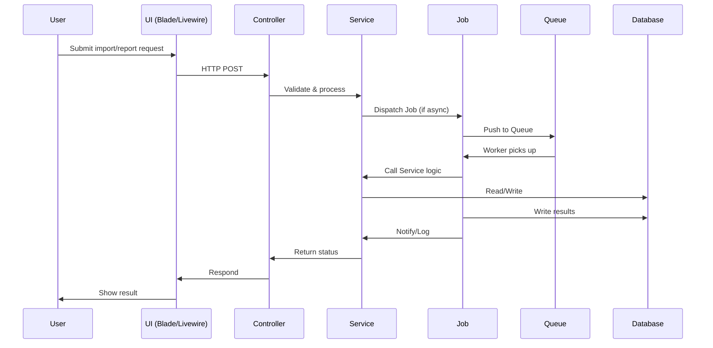

# AGENTS

## Table of Contents

- [1. Overview](#1-overview)
- [2. Architecture](#2-architecture)
  - [2.1 Component Diagram](#21-component-diagram)
  - [2.2 Typical Execution Flow](#22-typical-execution-flow)
- [3. Agent Catalog](#3-agent-catalog)
- [4. Orchestration and Routing](#4-orchestration-and-routing)
- [5. Tools and Integrations](#5-tools-and-integrations)
- [6. Configuration](#6-configuration)
- [7. Running Locally](#7-running-locally)
- [8. Deployment](#8-deployment)
- [9. Observability](#9-observability)
- [10. Quality and Testing](#10-quality-and-testing)
- [11. Security and Compliance](#11-security-and-compliance)
- [12. Troubleshooting](#12-troubleshooting)
- [13. Extending the System](#13-extending-the-system)
- [14. Glossary](#14-glossary)
- [15. Changelog and Maintenance Notes](#15-changelog-and-maintenance-notes)

---

## 1. Overview

This repository currently does **not implement any intelligent agents, LLMs, or AI orchestration frameworks** (e.g., LangChain, CrewAI, Autogen, LangGraph, OpenAI, etc.).

All business logic, automation, and background processing are implemented using standard Laravel service classes and jobs (see [app/Services/](app/Services/) and [app/Jobs/](app/Jobs/)).

> **Note:** If you intend to add an agent, LLM, or AI workflow, see [13. Extending the System](#13-extending-the-system) for a prescriptive template and checklist.

---

## 2. Architecture

### 2.1 Component Diagram

```mermaid
graph TD
    subgraph Laravel Application
        SVC[Service Layer (app/Services)]
        JOB[Jobs (app/Jobs)]
        CTL[Controllers (app/Http/Controllers)]
        Q[Queue (Redis/DB)]
        DB[(MySQL/MariaDB)]
        UI[Frontend (Blade/Livewire)]
    end
    SVC --> JOB
    CTL --> SVC
    JOB --> Q
    Q --> JOB
    SVC --> DB
    JOB --> DB
    UI --> CTL
```

### 2.2 Typical Execution Flow



---

## 3. Agent Catalog

> **No intelligent agents or LLM-based orchestrators are implemented in this repository.**

All automation is handled by Laravel service classes and jobs:

- [app/Services/HomestayService.php](app/Services/HomestayService.php)
- [app/Services/ImportService.php](app/Services/ImportService.php)
- [app/Services/PerformanceService.php](app/Services/PerformanceService.php)
- [app/Services/ReportService.php](app/Services/ReportService.php)
- [app/Services/UserAccessService.php](app/Services/UserAccessService.php)
- [app/Jobs/GenerateReportJob.php](app/Jobs/GenerateReportJob.php)
- [app/Jobs/ProcessImportJob.php](app/Jobs/ProcessImportJob.php)

**If you add an agent, document it here with:**

- Name, summary, responsibilities
- Inputs/outputs
- Tools/APIs used
- Models (provider, params)
- Memory/context
- Orchestration/termination
- Entrypoints
- Source links

---

## 4. Orchestration and Routing

- No agent orchestration, routing, or planning frameworks are present.
- All workflows are implemented via Laravel service methods and queued jobs.
- See [app/Services/](app/Services/) and [app/Jobs/](app/Jobs/).

---

## 5. Tools and Integrations

- **Queue:** Laravel Queue (Redis, Database)
- **Excel Import/Export:** [maatwebsite/excel](https://laravel-excel.com/)
- **Notifications:** Laravel Notification, Mail, Slack (see [config/services.php](config/services.php))
- **Database:** MySQL/MariaDB
- **Frontend:** Blade, Livewire, AlpineJS, Bootstrap 5
- **No LLM, vector DB, or AI toolchains present.**

---

## 6. Configuration

### Environment Variables

| Name                    | Required | Default         | Description                                 |
|-------------------------|----------|-----------------|---------------------------------------------|
| APP_NAME                | Yes      | homestay-system | Application name                            |
| APP_ENV                 | Yes      | local           | Environment (local, production, etc.)       |
| APP_KEY                 | Yes      | (none)          | Laravel app key                             |
| APP_DEBUG               | No       | true            | Debug mode                                  |
| APP_URL                 | Yes      | <http://127.0.0.1:8000> | App URL                              |
| APP_LOCALE              | Yes      | ms              | Default locale                              |
| APP_FALLBACK_LOCALE     | Yes      | en              | Fallback locale                             |
| APP_TIMEZONE            | Yes      | Asia/Kuala_Lumpur | Timezone                                 |
| DB_CONNECTION           | Yes      | mysql           | DB driver                                   |
| DB_HOST                 | Yes      | 127.0.0.1       | DB host                                     |
| DB_PORT                 | Yes      | 3306            | DB port                                     |
| DB_DATABASE             | Yes      | homestay_db     | DB name                                     |
| DB_USERNAME             | Yes      | root            | DB user                                     |
| DB_PASSWORD             | Yes      | (none)          | DB password                                 |
| QUEUE_CONNECTION        | Yes      | database        | Queue backend                               |
| REDIS_HOST              | No       | 127.0.0.1       | Redis host                                  |
| REDIS_PORT              | No       | 6379            | Redis port                                  |
| MAIL_MAILER             | No       | smtp            | Mail driver                                 |
| MAIL_HOST               | No       | 127.0.0.1       | Mail host                                   |
| MAIL_PORT               | No       | 1025            | Mail port                                   |
| MAIL_FROM_ADDRESS       | No       | <noreply@motac.gov.my> | Mail from address                      |
| AWS_ACCESS_KEY_ID       | No       | (none)          | AWS key (if using S3, SES, etc.)            |
| AWS_SECRET_ACCESS_KEY   | No       | (none)          | AWS secret                                  |
| AWS_DEFAULT_REGION      | No       | us-east-1       | AWS region                                  |
| VITE_APP_NAME           | No       | ${APP_NAME}     | Frontend app name                           |

**See [.env.example](.env.example) for full list.**

#### Example .env snippet

```dotenv
APP_NAME="homestay-system"
APP_ENV=local
APP_KEY=base64:YOURKEYHERE
APP_DEBUG=true
APP_URL=http://127.0.0.1:8000
DB_CONNECTION=mysql
DB_HOST=127.0.0.1
DB_PORT=3306
DB_DATABASE=homestay_db
DB_USERNAME=root
DB_PASSWORD=yourpassword
QUEUE_CONNECTION=database
```

---

## 7. Running Locally

### Prerequisites

- PHP 8.2+
- Composer
- Node.js 18+
- MySQL/MariaDB
- Redis (for queue, optional)

### Setup

```bash
composer install
npm install
cp .env.example .env
php artisan key:generate
php artisan migrate --seed
npm run dev
php artisan serve
```

### Running Queues

```bash
php artisan queue:work
# or for Horizon (if installed):
php artisan horizon
```

---

## 8. Deployment

- Environments: local, staging, production
- CI/CD: Not documented in code. **TODO: Add GitHub Actions or deployment pipeline details.**
- Required secrets: see [6. Configuration](#6-configuration)
- Scaling: Use Horizon for queue scaling; DB and Redis can be clustered.

---

## 9. Observability

- Logs: Laravel log files ([storage/logs/](storage/logs/)), log channel set in `.env`
- Metrics: Not implemented. **TODO: Add metrics/monitoring guidance.**
- Tracing: Not implemented.
- Dashboards: Not implemented.
- Common queries: See [storage/logs/](storage/logs/)

---

## 10. Quality and Testing

- Unit and feature tests: [tests/](tests/)
- Factories: [database/factories/](database/factories/)
- Run all tests:

  ```bash
  php artisan test
  ```

- Run a single test file:

  ```bash
  php artisan test tests/Unit/Services/ImportServiceTest.php
  ```

- Mocks and fakes: Use Laravel's built-in testing tools
- Playbooks/simulations: Not implemented

---

## 11. Security and Compliance

- Secrets: Store in `.env`, never commit real secrets
- Data handling: Follows Laravel security defaults (CSRF, XSS, SQLi protection)
- Least privilege: RBAC via Spatie Laravel Permission
- Rate limiting: Not implemented for agents (see API docs for API rate limits)
- Safety filters: Not implemented

---

## 12. Troubleshooting

| Error/Symptom                | Likely Cause                        | Fix/Diagnostic Command                |
|------------------------------|-------------------------------------|---------------------------------------|
| `npm run dev` fails          | Node version, missing deps, Vite    | `node -v`, `npm install`              |
| `php artisan migrate` fails  | DB config, missing DB, perms        | Check `.env`, DB running, user perms  |
| Queue jobs not running       | Queue worker not started            | `php artisan queue:work`              |
| No .env or APP_KEY missing   | Missing/invalid .env                | `cp .env.example .env`, `php artisan key:generate` |
| 500 error on import/report   | Permissions, DB, queue, code error  | Check logs in `storage/logs/`         |

---

## 13. Extending the System

### Adding a New Agent or Tool

> **No agent/LLM framework is present.**

#### Checklist

1. Decide agent type (LLM, workflow, retriever, etc.)
2. Add dependencies (e.g., OpenAI SDK, LangChain, etc.)
3. Create agent class/module in `app/Agents/` (suggested)
4. Register agent in service provider or orchestrator
5. Add config to `.env` and `config/agents.php` (suggested)
6. Implement tools/functions with clear interfaces
7. Add tests in `tests/Agents/`
8. Document agent in [3. Agent Catalog](#3-agent-catalog)
9. Update diagrams and config tables
10. Review security, rate limits, and data handling

#### Code Link Templates

- Agent: `app/Agents/MyAgent.php`
- Tool: `app/Agents/Tools/MyTool.php`
- Config: `config/agents.php`
- Test: `tests/Agents/MyAgentTest.php`

#### Testing Guidance

- Use PHPUnit for all agent logic
- Mock external APIs and secrets
- Cover happy, error, and edge cases

---

## 14. Glossary

| Term         | Definition |
|--------------|------------|
| Agent        | (Not implemented) An autonomous or semi-autonomous process, often LLM-based, that can plan, act, or reason using tools or APIs |
| Job          | A background task executed via Laravel's queue system |
| Service      | A class encapsulating business logic, called by controllers or jobs |
| Tool         | (Not implemented) A function or API an agent can use to perform actions |
| Orchestrator | (Not implemented) A component that routes tasks between agents or tools |

---

## 15. Changelog and Maintenance Notes

- 2025-10-14: Initial AGENTS.md created. No agents present. Template and checklist for future agent addition included.
- TODO: Update this file if/when agents, LLMs, or orchestration are added.

---

===

<laravel-boost-guidelines>
=== foundation rules ===

# Laravel Boost Guidelines

The Laravel Boost guidelines are specifically curated by Laravel maintainers for this application. These guidelines should be followed closely to enhance the user's satisfaction building Laravel applications.

## Foundational Context
This application is a Laravel application and its main Laravel ecosystems package & versions are below. You are an expert with them all. Ensure you abide by these specific packages & versions.

- php - 8.2.12
- laravel/framework (LARAVEL) - v12
- laravel/prompts (PROMPTS) - v0
- laravel/sanctum (SANCTUM) - v4
- larastan/larastan (LARASTAN) - v3
- laravel/breeze (BREEZE) - v2
- laravel/mcp (MCP) - v0
- laravel/pint (PINT) - v1
- laravel/sail (SAIL) - v1
- laravel/telescope (TELESCOPE) - v5
- livewire/livewire (LIVEWIRE) - v3
- livewire/volt (VOLT) - v1
- phpunit/phpunit (PHPUNIT) - v11
- alpinejs (ALPINEJS) - v3


## Conventions
- You must follow all existing code conventions used in this application. When creating or editing a file, check sibling files for the correct structure, approach, naming.
- Use descriptive names for variables and methods. For example, `isRegisteredForDiscounts`, not `discount()`.
- Check for existing components to reuse before writing a new one.

## Verification Scripts
- Do not create verification scripts or tinker when tests cover that functionality and prove it works. Unit and feature tests are more important.

## Application Structure & Architecture
- Stick to existing directory structure - don't create new base folders without approval.
- Do not change the application's dependencies without approval.

## Frontend Bundling
- If the user doesn't see a frontend change reflected in the UI, it could mean they need to run `npm run build`, `npm run dev`, or `composer run dev`. Ask them.

## Replies
- Be concise in your explanations - focus on what's important rather than explaining obvious details.

## Documentation Files
- You must only create documentation files if explicitly requested by the user.


=== boost rules ===

## Laravel Boost
- Laravel Boost is an MCP server that comes with powerful tools designed specifically for this application. Use them.

## Artisan
- Use the `list-artisan-commands` tool when you need to call an Artisan command to double check the available parameters.

## URLs
- Whenever you share a project URL with the user you should use the `get-absolute-url` tool to ensure you're using the correct scheme, domain / IP, and port.

## Tinker / Debugging
- You should use the `tinker` tool when you need to execute PHP to debug code or query Eloquent models directly.
- Use the `database-query` tool when you only need to read from the database.

## Reading Browser Logs With the `browser-logs` Tool
- You can read browser logs, errors, and exceptions using the `browser-logs` tool from Boost.
- Only recent browser logs will be useful - ignore old logs.

## Searching Documentation (Critically Important)
- Boost comes with a powerful `search-docs` tool you should use before any other approaches. This tool automatically passes a list of installed packages and their versions to the remote Boost API, so it returns only version-specific documentation specific for the user's circumstance. You should pass an array of packages to filter on if you know you need docs for particular packages.
- The 'search-docs' tool is perfect for all Laravel related packages, including Laravel, Inertia, Livewire, Filament, Tailwind, Pest, Nova, Nightwatch, etc.
- You must use this tool to search for Laravel-ecosystem documentation before falling back to other approaches.
- Search the documentation before making code changes to ensure we are taking the correct approach.
- Use multiple, broad, simple, topic based queries to start. For example: `['rate limiting', 'routing rate limiting', 'routing']`.
- Do not add package names to queries - package information is already shared. For example, use `test resource table`, not `filament 4 test resource table`.

### Available Search Syntax
- You can and should pass multiple queries at once. The most relevant results will be returned first.

1. Simple Word Searches with auto-stemming - query=authentication - finds 'authenticate' and 'auth'
2. Multiple Words (AND Logic) - query=rate limit - finds knowledge containing both "rate" AND "limit"
3. Quoted Phrases (Exact Position) - query="infinite scroll" - Words must be adjacent and in that order
4. Mixed Queries - query=middleware "rate limit" - "middleware" AND exact phrase "rate limit"
5. Multiple Queries - queries=["authentication", "middleware"] - ANY of these terms


=== php rules ===

## PHP

- Always use strict typing at the head of a `.php` file: `declare(strict_types=1);`.
- Always use curly braces for control structures, even if it has one line.

### Constructors
- Use PHP 8 constructor property promotion in `__construct()`.
    - <code-snippet>public function __construct(public GitHub $github) { }</code-snippet>
- Do not allow empty `__construct()` methods with zero parameters.

### Type Declarations
- Always use explicit return type declarations for methods and functions.
- Use appropriate PHP type hints for method parameters.

<code-snippet name="Explicit Return Types and Method Params" lang="php">
protected function isAccessible(User $user, ?string $path = null): bool
{
    ...
}
</code-snippet>

## Comments
- Prefer PHPDoc blocks over comments. Never use comments within the code itself unless there is something _very_ complex going on.

## PHPDoc Blocks
- Add useful array shape type definitions for arrays when appropriate.

## Enums
- Typically, keys in an Enum should be TitleCase. For example: `FavoritePerson`, `BestLake`, `Monthly`.


=== laravel/core rules ===

## Do Things the Laravel Way

- Use `php artisan make:` commands to create new files (i.e. migrations, controllers, models, etc.). You can list available Artisan commands using the `list-artisan-commands` tool.
- If you're creating a generic PHP class, use `artisan make:class`.
- Pass `--no-interaction` to all Artisan commands to ensure they work without user input. You should also pass the correct `--options` to ensure correct behavior.

### Database
- Always use proper Eloquent relationship methods with return type hints. Prefer relationship methods over raw queries or manual joins.
- Use Eloquent models and relationships before suggesting raw database queries
- Avoid `DB::`; prefer `Model::query()`. Generate code that leverages Laravel's ORM capabilities rather than bypassing them.
- Generate code that prevents N+1 query problems by using eager loading.
- Use Laravel's query builder for very complex database operations.

### Model Creation
- When creating new models, create useful factories and seeders for them too. Ask the user if they need any other things, using `list-artisan-commands` to check the available options to `php artisan make:model`.

### APIs & Eloquent Resources
- For APIs, default to using Eloquent API Resources and API versioning unless existing API routes do not, then you should follow existing application convention.

### Controllers & Validation
- Always create Form Request classes for validation rather than inline validation in controllers. Include both validation rules and custom error messages.
- Check sibling Form Requests to see if the application uses array or string based validation rules.

### Queues
- Use queued jobs for time-consuming operations with the `ShouldQueue` interface.

### Authentication & Authorization
- Use Laravel's built-in authentication and authorization features (gates, policies, Sanctum, etc.).

### URL Generation
- When generating links to other pages, prefer named routes and the `route()` function.

### Configuration
- Use environment variables only in configuration files - never use the `env()` function directly outside of config files. Always use `config('app.name')`, not `env('APP_NAME')`.

### Testing
- When creating models for tests, use the factories for the models. Check if the factory has custom states that can be used before manually setting up the model.
- Faker: Use methods such as `$this->faker->word()` or `fake()->randomDigit()`. Follow existing conventions whether to use `$this->faker` or `fake()`.
- When creating tests, make use of `php artisan make:test [options] <name>` to create a feature test, and pass `--unit` to create a unit test. Most tests should be feature tests.

### Vite Error
- If you receive an "Illuminate\Foundation\ViteException: Unable to locate file in Vite manifest" error, you can run `npm run build` or ask the user to run `npm run dev` or `composer run dev`.


=== laravel/v12 rules ===

## Laravel 12

- Use the `search-docs` tool to get version specific documentation.
- Since Laravel 11, Laravel has a new streamlined file structure which this project uses.

### Laravel 12 Structure
- No middleware files in `app/Http/Middleware/`.
- `bootstrap/app.php` is the file to register middleware, exceptions, and routing files.
- `bootstrap/providers.php` contains application specific service providers.
- **No app\Console\Kernel.php** - use `bootstrap/app.php` or `routes/console.php` for console configuration.
- **Commands auto-register** - files in `app/Console/Commands/` are automatically available and do not require manual registration.

### Database
- When modifying a column, the migration must include all of the attributes that were previously defined on the column. Otherwise, they will be dropped and lost.
- Laravel 11 allows limiting eagerly loaded records natively, without external packages: `$query->latest()->limit(10);`.

### Models
- Casts can and likely should be set in a `casts()` method on a model rather than the `$casts` property. Follow existing conventions from other models.


=== pint/core rules ===

## Laravel Pint Code Formatter

- You must run `vendor/bin/pint --dirty` before finalizing changes to ensure your code matches the project's expected style.
- Do not run `vendor/bin/pint --test`, simply run `vendor/bin/pint` to fix any formatting issues.


=== livewire/core rules ===

## Livewire Core
- Use the `search-docs` tool to find exact version specific documentation for how to write Livewire & Livewire tests.
- Use the `php artisan make:livewire [Posts\CreatePost]` artisan command to create new components
- State should live on the server, with the UI reflecting it.
- All Livewire requests hit the Laravel backend, they're like regular HTTP requests. Always validate form data, and run authorization checks in Livewire actions.

## Livewire Best Practices
- Livewire components require a single root element.
- Use `wire:loading` and `wire:dirty` for delightful loading states.
- Add `wire:key` in loops:

    ```blade
    @foreach ($items as $item)
        <div wire:key="item-{{ $item->id }}">
            {{ $item->name }}
        </div>
    @endforeach
    ```

- Prefer lifecycle hooks like `mount()`, `updatedFoo()` for initialization and reactive side effects:

<code-snippet name="Lifecycle hook examples" lang="php">
    public function mount(User $user) { $this->user = $user; }
    public function updatedSearch() { $this->resetPage(); }
</code-snippet>


## Testing Livewire

<code-snippet name="Example Livewire component test" lang="php">
    Livewire::test(Counter::class)
        ->assertSet('count', 0)
        ->call('increment')
        ->assertSet('count', 1)
        ->assertSee(1)
        ->assertStatus(200);
</code-snippet>


    <code-snippet name="Testing a Livewire component exists within a page" lang="php">
        $this->get('/posts/create')
        ->assertSeeLivewire(CreatePost::class);
    </code-snippet>


=== livewire/v3 rules ===

## Livewire 3

### Key Changes From Livewire 2
- These things changed in Livewire 2, but may not have been updated in this application. Verify this application's setup to ensure you conform with application conventions.
    - Use `wire:model.live` for real-time updates, `wire:model` is now deferred by default.
    - Components now use the `App\Livewire` namespace (not `App\Http\Livewire`).
    - Use `$this->dispatch()` to dispatch events (not `emit` or `dispatchBrowserEvent`).
    - Use the `components.layouts.app` view as the typical layout path (not `layouts.app`).

### New Directives
- `wire:show`, `wire:transition`, `wire:cloak`, `wire:offline`, `wire:target` are available for use. Use the documentation to find usage examples.

### Alpine
- Alpine is now included with Livewire, don't manually include Alpine.js.
- Plugins included with Alpine: persist, intersect, collapse, and focus.

### Lifecycle Hooks
- You can listen for `livewire:init` to hook into Livewire initialization, and `fail.status === 419` for the page expiring:

<code-snippet name="livewire:load example" lang="js">
document.addEventListener('livewire:init', function () {
    Livewire.hook('request', ({ fail }) => {
        if (fail && fail.status === 419) {
            alert('Your session expired');
        }
    });

    Livewire.hook('message.failed', (message, component) => {
        console.error(message);
    });
});
</code-snippet>


=== volt/core rules ===

## Livewire Volt

- This project uses Livewire Volt for interactivity within its pages. New pages requiring interactivity must also use Livewire Volt. There is documentation available for it.
- Make new Volt components using `php artisan make:volt [name] [--test] [--pest]`
- Volt is a **class-based** and **functional** API for Livewire that supports single-file components, allowing a component's PHP logic and Blade templates to co-exist in the same file
- Livewire Volt allows PHP logic and Blade templates in one file. Components use the `@livewire("volt-anonymous-fragment-eyJuYW1lIjoidm9sdC1hbm9ueW1vdXMtZnJhZ21lbnQtYmQ5YWJiNTE3YWMyMTgwOTA1ZmUxMzAxODk0MGJiZmIiLCJwYXRoIjoic3RvcmFnZVxcZnJhbWV3b3JrXFx2aWV3c1wvMTUxYWRjZWRjMzBhMzllOWIxNzQ0ZDRiMWRjY2FjYWIuYmxhZGUucGhwIn0=", Livewire\Volt\Precompilers\ExtractFragments::componentArguments([...get_defined_vars(), ...array (
)]))
</code-snippet>


### Volt Class Based Component Example
To get started, define an anonymous class that extends Livewire\Volt\Component. Within the class, you may utilize all of the features of Livewire using traditional Livewire syntax:


<code-snippet name="Volt Class-based Volt Component Example" lang="php">
use Livewire\Volt\Component;

new class extends Component {
    public $count = 0;

    public function increment()
    {
        $this->count++;
    }
} ?>

<div>
    <h1>{{ $count }}</h1>
    <button wire:click="increment">+</button>
</div>
</code-snippet>


### Testing Volt & Volt Components
- Use the existing directory for tests if it already exists. Otherwise, fallback to `tests/Feature/Volt`.

<code-snippet name="Livewire Test Example" lang="php">
use Livewire\Volt\Volt;

test('counter increments', function () {
    Volt::test('counter')
        ->assertSee('Count: 0')
        ->call('increment')
        ->assertSee('Count: 1');
});
</code-snippet>


<code-snippet name="Volt Component Test Using Pest" lang="php">
declare(strict_types=1);

use App\Models\{User, Product};
use Livewire\Volt\Volt;

test('product form creates product', function () {
    $user = User::factory()->create();

    Volt::test('pages.products.create')
        ->actingAs($user)
        ->set('form.name', 'Test Product')
        ->set('form.description', 'Test Description')
        ->set('form.price', 99.99)
        ->call('create')
        ->assertHasNoErrors();

    expect(Product::where('name', 'Test Product')->exists())->toBeTrue();
});
</code-snippet>


### Common Patterns


<code-snippet name="CRUD With Volt" lang="php">
<?php

use App\Models\Product;
use function Livewire\Volt\{state, computed};

state(['editing' => null, 'search' => '']);

$products = computed(fn() => Product::when($this->search,
    fn($q) => $q->where('name', 'like', "%{$this->search}%")
)->get());

$edit = fn(Product $product) => $this->editing = $product->id;
$delete = fn(Product $product) => $product->delete();

?>

<!-- HTML / UI Here -->
</code-snippet>

<code-snippet name="Real-Time Search With Volt" lang="php">
    <flux:input
        wire:model.live.debounce.300ms="search"
        placeholder="Search..."
    />
</code-snippet>

<code-snippet name="Loading States With Volt" lang="php">
    <flux:button wire:click="save" wire:loading.attr="disabled">
        <span wire:loading.remove>Save</span>
        <span wire:loading>Saving...</span>
    </flux:button>
</code-snippet>


=== phpunit/core rules ===

## PHPUnit Core

- This application uses PHPUnit for testing. All tests must be written as PHPUnit classes. Use `php artisan make:test --phpunit <name>` to create a new test.
- If you see a test using "Pest", convert it to PHPUnit.
- Every time a test has been updated, run that singular test.
- When the tests relating to your feature are passing, ask the user if they would like to also run the entire test suite to make sure everything is still passing.
- Tests should test all of the happy paths, failure paths, and weird paths.
- You must not remove any tests or test files from the tests directory without approval. These are not temporary or helper files, these are core to the application.

### Running Tests
- Run the minimal number of tests, using an appropriate filter, before finalizing.
- To run all tests: `php artisan test`.
- To run all tests in a file: `php artisan test tests/Feature/ExampleTest.php`.
- To filter on a particular test name: `php artisan test --filter=testName` (recommended after making a change to a related file).


=== tests rules ===

## Test Enforcement

- Every change must be programmatically tested. Write a new test or update an existing test, then run the affected tests to make sure they pass.
- Run the minimum number of tests needed to ensure code quality and speed. Use `php artisan test` with a specific filename or filter.
</laravel-boost-guidelines>
