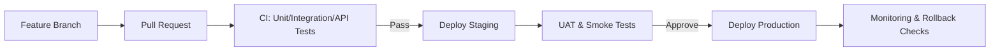
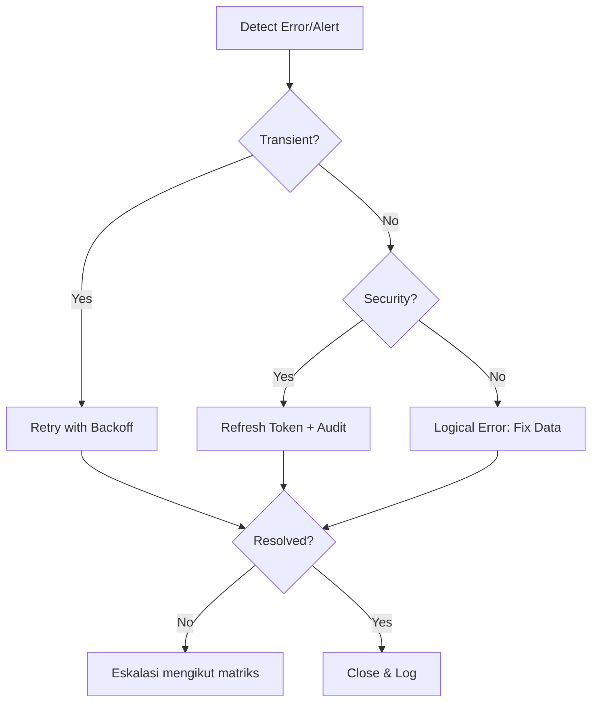
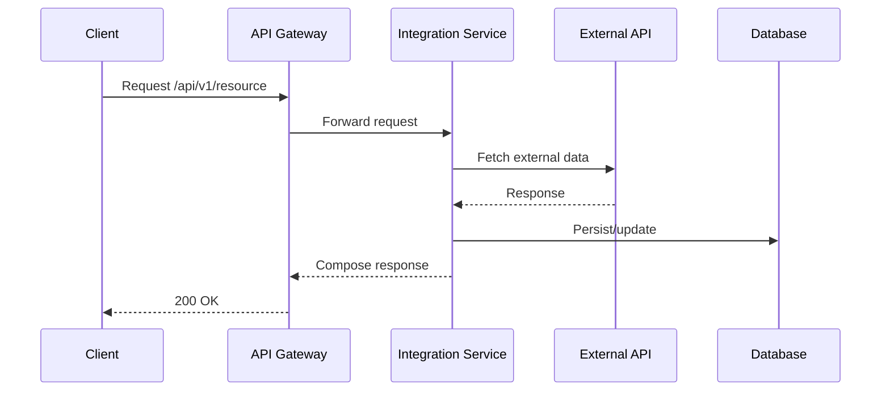

# Pelan Integrasi Sistem (System Integration Plan)

**Sistem:** Sistem Pengurusan & Analitik Homestay Malaysia  
**Pemilik Sistem:** MOTAC, Tourism Malaysia  
**Tarikh:** 11 Oktober 2025

---

## Metadata Dokumen & Kawalan Versi (Document Metadata & Version Control)

| Versi | Tarikh      | Perubahan   | Disemak Oleh | Diluluskan Oleh |
|-------|-------------|-------------|--------------|-----------------|
| 1.0   | 11 Okt 2025 | Draf awal   | BPM MOTAC    | JPK MOTAC       |

**Status:** Draf Awal  
**Penulis:** Pasukan Pembangunan MOTAC  
**Penyemak:** BPM MOTAC  
**Kelulusan:** Ketua Bahagian JPK MOTAC

**Log Perubahan (Change Log):**

| Tarikh      | Versi | Perubahan                | Oleh         |
|-------------|-------|--------------------------|--------------|
| 11 Okt 2025 | 1.0   | Draf awal dokumen        | Dev Team     |

---

## Rujukan Dokumen Berkaitan (Related Document References)

| Kod  | Nama Dokumen                                      | Versi | Pautan                |
|------|---------------------------------------------------|-------|-----------------------|
| D01  | System Development Plan (SDP)                     | 1.0   | [D01_SYSTEM_DEVELOPMENT_PLAN.md](D01_SYSTEM_DEVELOPMENT_PLAN.md) |
| D03  | Software Requirements Specification (SRS)          | 1.0   | [D03_SYSTEM_REQUIREMENT_SPECIFICATIONS.md](D03_SYSTEM_REQUIREMENT_SPECIFICATIONS.md) |
| D04  | System Design Document (SDD)                       | 1.0   | [D04_SYSTEM_DESIGN_DOCUMENT.md](D04_SYSTEM_DESIGN_DOCUMENT.md) |
| D08  | System Integration Specification (SIS)             | 1.0   | [D08_SYSTEM_INTEGRATION_SPECIFICATION.md](D08_SYSTEM_INTEGRATION_SPECIFICATION.md) |
| D09  | Database Documentation (DBD)                       | 1.0   | [D09_DATABASE_DOCUMENTATION.md](D09_DATABASE_DOCUMENTATION.md) |
| D10  | Source Code Documentation                          | 1.0   | [D10_SOURCE_CODE_DOCUMENTATION.md](D10_SOURCE_CODE_DOCUMENTATION.md) |

---

## 1. Tujuan & Skop Integrasi (Purpose & Integration Scope)

**Tujuan:**

- Memastikan interoperabiliti, konsistensi fungsi antara modul, dan kesinambungan integrasi dengan sistem luaran.
- Menyediakan garis panduan teknikal dan prosedur untuk integrasi dalaman (modul Laravel), luaran (API MOTAC/negeri), dan cross-platform (peta, notifikasi, perkhidmatan pihak ketiga).

**Skop:**

- Internal: Integrasi antara modul utama sistem (import, dashboard, notifikasi, dsb).
- External: Integrasi dengan API MOTAC, API negeri, Google Maps, dan perkhidmatan pihak ketiga.
- Cross-platform: Integrasi dengan sistem pelaporan, notifikasi, dan sokongan peta.

**Kriteria Kejayaan:**

- Kadar kejayaan integrasi > 99.5% pada peringkat end-to-end.
- Latency API < 500ms untuk operasi penting.

---

---

## 2. Strategi & Pendekatan Integrasi (Integration Strategy & Approach)

- **Pendekatan:** Incremental integration (modul → subsistem → sistem penuh) dengan sokongan continuous integration (CI) untuk ujian automatik. Big-bang hanya untuk modul yang tidak membawa risiko tinggi.
- **Pengurusan Versi:** Semua API perlu versi (v1, v2...), dan backward compatibility mesti didokumenkan.
- **Persekitaran Integrasi:** Dev → Staging → Production. Staging mesti menjadi cermin (mirror) kepada production sebanyak mungkin untuk ujian end-to-end.
- **Change Control:** Semua perubahan konfigurasi dan endpoint mesti melalui proses semakan dan kelulusan.

### 2.1 Aliran CI/CD (CI/CD Flow)

- Repositori: GitHub (branch protection, PR reviews, required checks)
- CI: PHPUnit, PHPStan/Psalm, ESLint (jika front-end), API contract tests (Postman/Newman)
- CD: GitHub Actions/Envoy – deploy ke Staging pada merge ke main; Production melalui approval manual (environment protection)
- Artefak: Docker image / build artifacts versioned; release notes automatik



### 2.2 Strategi Rollback (Rollback Strategy)

- Blue/Green atau Rolling deploy (bergantung infrastruktur)
- Rollback conditions: error rate > 1%, SLA breach, migration/integration job failures
- Rollback actions: revert to previous release artefact; reconfigure API Gateway routing ke versi stabil; re-queue failed jobs
- Data considerations: gunakan idempotent endpoints; simpan event logs untuk re-play jika perlu

### 2.3 Polisi Versi API (API Versioning & Deprecation)

- Versioning: URL-based (e.g., /api/v1/...), semantic rules untuk perubahan
- Deprecation: notis 90 hari; header Deprecation & Sunset; dokumen perubahan di changelog
- Backward compatibility: sediakan adapter/transform layer untuk klien lama

### 2.4 Matriks Kebergantungan (Integration Dependencies Matrix)

| Modul/Integrasi | Bergantung Pada | Jenis | Nota |
|------------------|-----------------|------|------|
| Import Data      | DB, Queue       | Internal | Memerlukan worker aktif |
| Dashboard        | DB, Import      | Internal | Bergantung pada ETL siap |
| MOTAC API        | API Gateway     | External | Token sah & rate limit |
| Negeri API       | OAuth2, Gateway | External | Refresh token berkala |
| Notifikasi       | Queue, Email/SMS| Internal | Pengurusan kegagalan diperlukan |

---

## 3. Senibina Integrasi (Integration Architecture)

**Gambaran Aliran Data (Data Flow):**

```mermaid
flowchart TD
    A[Homestay Import] --> B(ImportService)
    B --> C(Queue)
    C --> D(Transform)
    D --> E(DB)
    E --> F(DashboardAnalytics)
    G[External API (MOTAC)] <--> H(API Gateway)
    H <--> I(Integration Service)
    I <--> E
    J[Notifications] --> K(Queue)
    K --> L(Worker)
    L --> M(Email/SMS)
```

- **Middleware & Komponen Integrasi:** API Gateway, Integration Service (Laravel HTTP Clients), Queue (Redis/Beanstalk), Worker Processes.
- **Komunikasi:** Synchronous untuk operasi CRUD API (HTTP/REST), Asynchronous untuk import besar dan penjanaan laporan (queues/events).
- **Service Boundaries:** Setiap modul Laravel berkomunikasi melalui service layer dan API, dengan pemisahan jelas antara domain.

### 3.1 Lapisan Senibina (Architecture Layers)

- Presentation: Blade/SPA UI, Controllers (thin)
- Business/Domain: Services, Policies, Validation, Events
- Integration: HTTP Clients (Laravel/Guzzle), API Gateway, Transformers
- Data: Repositories (Eloquent), Cache (Redis), Queues

### 3.2 Arah Aliran Data (Inbound vs Outbound)

- Inbound: Permintaan dari sistem luaran ke API Gateway → Integration Service → Domain/DB
- Outbound: Panggilan dari sistem ke perkhidmatan luaran melalui Integration Service → API Gateway
- Event-driven: Import/Notifikasi menggunakan queue untuk pemprosesan asynchronous

### 3.3 Tumpukan Integrasi (Integration Stack)

- Framework: Laravel 10+
- HTTP: Laravel HTTP Client / Guzzle
- Queue: Redis/Beanstalk + Laravel Horizon (opsyen)
- Observability: Laravel Telescope, Sentry, OpenTelemetry (opsyen)

### 3.4 Polisi API Gateway (Rate Limit, Logging, Failover)

- Rate limiting per-klien; circuit breaker untuk endpoint rapuh
- Centralized request/response logging (mask PII)
- Failover routing: alih trafik ke instance sihat; health-check per route

---

## 4. Komponen & Titik Integrasi (Integration Components & Points)

| Modul / Sistem        | Jenis Integrasi | Protokol | Kaedah | Frekuensi | Autentikasi  |
|----------------------|-----------------|----------|--------|----------:|--------------|
| MOTAC API            | External        | REST     | Pull   | Harian    | Bearer Token |
| Negeri API           | External        | REST     | Push   | On-demand | OAuth2       |
| Import Data Module   | Internal        | Queue/API| Push   | Real-time | System Auth  |
| Notification Service | Internal        | Queue    | Async  | Real-time | System Auth  |
| Google Maps (if used)| External        | REST     | Pull   | On-request| API Key      |

- **Queues & Notification Handlers:** Semua proses asynchronous menggunakan Redis/Beanstalk queue dan worker Laravel.

### 4.1 Kontrak Antara Muka (API Interface Contracts)

| API/Endpoint | Input (Schema) | Output (Schema) | Kod Status | Nota |
|--------------|-----------------|------------------|-----------:|------|
| GET /api/v1/homestays | query: state, page | list\<Homestay\> | 200/400/500 | Paginasi standard |
| POST /api/v1/import | file: csv/xlsx | jobId, status | 202/400 | Async melalui queue |
| GET /api/v1/metrics | none | metrics payload | 200/401 | Auth diperlukan |

Rujuk D08 (SIS) dan dokumentasi API (Postman/OpenAPI) untuk schema terperinci.

### 4.2 Pemilikan Data (Data Ownership)

- Master data Homestay: Sistem ini (truth source selepas migrasi)
- Master kod negeri/koperasi: MOTAC pusat (rujuk repositori kod rasmi)
- Data prestasi (metrik): dihasilkan oleh sistem ini; integrasi luaran hanya membaca

### 4.3 Pencetus & Frekuensi Integrasi (Triggers & Frequency)

- Import data: on-demand / terjadual (harian 02:00)
- Sync API MOTAC: harian; delta sync jika tersedia
- Notifikasi: real-time via queue

### 4.4 Kitaran Autentikasi & Pemantauan Token (Token Lifecycle)

- Expiry: 60–90 min sesi; refresh token setiap 24 jam (contoh)
- Monitoring: alert jika token hampir tamat (<10% masa tinggal) atau ralat 401 meningkat
- Rotation: ikut polisi keselamatan; rekod perubahan dalam audit log

---

## 5. Pengurusan Konfigurasi & Data (Configuration & Data Management)

- **Pemboleh Ubah Persekitaran (.env):**

  - APP_ENV, APP_URL
  - DB_HOST, DB_DATABASE, DB_USERNAME, DB_PASSWORD
  - MOTAC_API_URL, MOTAC_API_TOKEN
  - QUEUE_CONNECTION, REDIS_HOST
  - NOTIFICATION_EMAIL_FROM
- **Pengurusan Token & Endpoint:** Token disimpan dalam secrets manager; rotate tokens mengikut polisi keselamatan.
- **Versioning Konfigurasi:** Simpan konfigurasi persekitaran di repositori konfigurasi tersilit, dan gunakan change control untuk kemaskini.
- **Change Management:** Semua perubahan konfigurasi mesti direkod dan diaudit.

### 5.1 Dasar Repositori Konfigurasi (Config Repository Policy)

- Fail `.env.staging` dan `.env.production` tidak disimpan dalam repo kod; gunakan repositori konfigurasi/secret manager
- Gunakan templat `.env.example` untuk pembangun
- Semua perubahan konfigurasi melalui PR dan kelulusan (review dua pihak)

### 5.2 Pengurusan Rahsia (Secrets Management)

- Simpan rahsia (token, password) dalam Secret Manager (GitHub Environments/Azure Key Vault/HashiCorp Vault)
- Enkripsi pada rehat (AES-256) dan semasa transit (TLS 1.3)
- Putaran kunci/token berkala; log semua akses rahsia untuk audit

### 5.3 Validasi Rentas Persekitaran (Cross-Environment Validation)

- Jalankan script validasi untuk mengesan mismatch konfigurasi (diff antara staging vs production)
- Health-check selepas deploy memastikan dependency (DB, queue, API) tersedia

---

## 6. Prosedur Ujian Integrasi (Integration Testing Procedures)

- **Strategi Ujian:**

  - Unit tests → Integration tests → End-to-end tests
  - Ujian automatik dengan PHPUnit (server-side) dan Postman/Newman (API contract)
- **Kes Ujian Utama:**

  - Import success triggers dashboard update
  - External API failure handled with retries and logged
  - Notification delivered via queue and worker
- **Kriteria Penerimaan:**

  - Pass rate ≥ 99.5% for integration tests; critical paths must have 100% success in staging
- **Pengujian Prestasi:**

  - Latency < 500ms, throughput > 100 req/min untuk endpoint utama

### 6.1 Senario UAT & Kelulusan (UAT Scenarios & Sign-off)

- Senario: import berjaya → dashboard dikemas kini; kegagalan API luaran → retry → alert
- Penerimaan: semua senario kritikal lulus di staging; sign-off oleh QA Lead & Integration Lead

### 6.2 Matriks Regresi (Regression Matrix)

| Modul | Kes Ujian | Jangkaan | Status |
|-------|-----------|----------|--------|
| Import | Fail format | Ditolak dengan ralat jelas | |
| API MOTAC | Timeout | Retry 3x dan log | |
| Notifikasi | Queue down | Retry/backoff dan alert | |

### 6.3 Smoke Test Pasca-Deploy (Post-Deployment Smoke Tests)

- Ping health-check endpoints; panggil API utama (read-only) untuk verifikasi cepat
- Semak queue dan worker aktif; semak log error harian

### 6.4 Ujian Injeksi Ralat (Error Injection)

- Simulasi timeout, 500 server error, dan invalid token untuk mengesahkan ketahanan

---

## 7. Pengurusan Ralat & Pemulihan (Error Handling & Recovery)

- **Retry & Timeout Policy:** Retry up to 3 times with exponential backoff for transient errors; timeout thresholds (API calls) default 10s.
- **Fallback Mechanisms:** Use cached data or queue job fallback to prevent loss of user experience during external API downtime.
- **Notifikasi Kegagalan:** Automatik e-mel & ticket creation (JIRA/GitHub Issue) untuk kes kegagalan kritikal.
- **Re-sync:** Prosedur re-sync untuk rekod hilang/terkandas yang boleh dijalankan dari admin interface.

### 7.1 Taksonomi Ralat (Error Taxonomy)

- Transient: timeout, network glitch → retry/backoff
- Logical: data validation failures → pembetulan data, re-run
- Security: 401/403, token luput → refresh token, audit log

### 7.2 Matriks Eskalasi (Escalation Matrix)

| Keutamaan | Contoh | SLA Respon | Notifikasi |
|-----------|--------|------------|------------|
| P1 | Outage integrasi kritikal | 15 min | Pager/Telefon, War Room |
| P2 | Kadar ralat > 1% | 1 jam | Email/Chat + Ticket |
| P3 | Ralat terpencil | 1 hari | Ticket biasa |

### 7.3 Aliran Pemulihan (Recovery Flow)



---

## 8. Keselamatan Integrasi (Integration Security)

- **Standard Keselamatan:** HTTPS/TLS 1.3, OAuth2 untuk integrasi luaran, Bearer token untuk perkhidmatan dalaman.
- **Token Policy:** Token expiry dan rotating policy; simpan token dalam secret manager.
- **Audit Log:** Semua panggilan API dan perubahan konfigurasi direkod untuk audit.
- **Access Control:** Endpoint dalaman hanya boleh diakses oleh sistem berdaftar; endpoint luaran dikawal melalui firewall dan whitelist.
- **Intrusion Detection:** Pantau percubaan akses tidak sah dan aktifkan alert.

### 8.1 RBAC Integrasi (Integration RBAC Matrix)

| Peranan | Akses | Skop |
|---------|-------|------|
| Integration Admin | Manage endpoints, tokens | Semua persekitaran |
| Integration Operator | Monitor, re-sync, view logs | Staging/Production |
| Developer | Read-only API docs, dev tokens | Development |

### 8.2 Ujian Keselamatan (Penetration Testing)

- Jadual pentest berkala (pra-GoLive dan tahunan)
- Skop: API endpoints, auth flows, rate limit bypass, data leakage
- Remediasi: isu kritikal dibaiki sebelum production release

### 8.3 Putaran Token & Logging (Token Rotation & Logging)

- Putaran token mengikut jadual (contoh: 30–90 hari)
- Log akses API termasuk subjek, endpoint, status code (PII dimask)

### 8.4 Senarai Semak Pematuhan (Compliance Checklist)

- PDPA: data minimization, lawful processing, consent (jika perlu)
- ISO/IEC 27001: kontrol akses, pengurusan aset, logging & monitoring

---

## 9. Pemantauan & Audit (Monitoring & Audit)

- **Pemantauan Masa Nyata:** Gunakan tools seperti Laravel Telescope, Sentry, atau custom API dashboard untuk memantau latency dan error rates.
- **Metrix & Alerts:** Tetapkan alert untuk error rate > 1% atau latency > 1s pada endpoint kritikal.
- **Audit Berkala:** Semakan integrasi luaran setiap bulan untuk memastikan konsistensi dan keselamatan.
- **Audit Trail:** Semua transaksi API dan perubahan konfigurasi direkod untuk audit.

### 9.1 Metrik SLA (SLA Metrics)

- Ketersediaan (Availability) ≥ 99.5%
- Masa tindak balas (P95) < 500ms untuk endpoint kritikal
- Kadar ralat < 1%

### 9.2 Polisi Retensi Log (Log Retention)

- Minimum 90 hari untuk log operasional; 12 bulan untuk log audit penting

### 9.3 Health-check & Uptime Monitoring

- Endpoint `/health` dan `/ready` untuk liveness/readiness
- Uptime monitor (Pingdom/StatusCake/self-hosted) dengan alert automatik

### 9.4 Prosedur Insiden (Incident Response)

- Ambang alert → eskalasi → triage → mitigasi → postmortem
- Postmortem termasuk RCA, tindakan susulan, dan due-dates

---

## 10. Jadual Pelaksanaan Integrasi (Integration Schedule & Milestones)

| Fasa                        | Aktiviti                                    | Tempoh     |
|-----------------------------|----------------------------------------------|------------|
| Persediaan                  | Persekitaran & dokumentasi                   | 1 minggu   |
| Integrasi Dalaman           | Sprint per modul                            | 2 minggu   |
| Integrasi API Luaran & Ujian| Integrasi & pengujian API MOTAC/negeri      | 1 minggu   |
| End-to-end Staging & UAT    | Ujian staging & UAT                         | 1 minggu   |
| Go-live & Pemantauan Awal   | Deploy & pemantauan                         | 1 minggu   |

### 10.1 Kebergantungan & PIC (Dependencies & Owners)

| Milestone | Bergantung Pada | PIC |
|-----------|------------------|-----|
| Integrasi Dalaman siap | Persediaan | Lead Developer |
| Ujian API Luaran | Integrasi Dalaman | Integration Lead |
| UAT Staging | Ujian API Luaran | QA Lead |
| Go-live | UAT Staging | Project Manager |

### 10.2 Ringkasan Gantt (Gantt-like Summary)

| Minggu | M1 | M2 | M3 | M4 | M5 |
|--------|----|----|----|----|----|
| Persediaan | ███ |    |    |    |    |
| Integrasi Dalaman |    | ███ | ███ |    |    |
| API Luaran & Ujian |    |    | ███ |    |    |
| Staging & UAT |    |    |    | ███ |    |
| Go-live & Pemantauan |    |    |    |    | ███ |

---

## 11. Risiko & Mitigasi (Risks & Mitigation)

| Risiko | Kebarangkalian | Impak | Mitigasi | Kontingensi | Pemilik | Risiko Residu |
|--------|-----------------|-------|----------|-------------|---------|---------------|
| API luaran versi berlainan | Sederhana | Tinggi | Versioning, backward compatibility tests | Adapter layer, freeze upgrade | Integration Lead | Rendah |
| Beban tinggi pada endpoint | Sederhana | Sederhana | Throttling, cache, autoscaling | Scale-out sementara | DevOps | Rendah |
| Kegagalan queue/worker | Rendah | Tinggi | Redundancy, monitoring, retry policies | Switch provider/node | DevOps | Rendah |
| Isu keselamatan/token bocor | Rendah | Tinggi | Rotate tokens, intrusion detection | Revoke & rotate, incident response | Security | Rendah |
| Kelewatan sambungan API | Sederhana | Sederhana | Fallback cache, alert, retry | Degrade fitur non-kritikal | Integration Lead | Sederhana |
| Sandbox/Prod config mismatch | Rendah | Tinggi | Ujian staging, config sync, audit | Hotfix config, rollback | DevOps | Rendah |

---

## 12. Koordinasi Pasukan & Komunikasi (Team Coordination & Communication)

- **Struktur Komunikasi:**

  - Daily standups semasa fasa integrasi, technical sync 3x seminggu.
  - Laporan kemajuan mingguan dan notifikasi isu kritikal secara ad-hoc.
- **Saluran Laporan Isu:**

  - JIRA, GitHub Issues, WhatsApp group untuk notifikasi segera.
- **Eskalasi:**

  - Isu kritikal diekalasi kepada PIC integrasi dan pengurusan projek.

### 12.1 Hierarki & Eskalasi (Team Hierarchy & Escalation)

| Peranan | Tanggungjawab | Eskalasi Ke |
|---------|----------------|-------------|
| Integration Lead | Koordinasi integrasi, keputusan teknikal | Project Manager |
| QA Lead | UAT, regression, sign-off | Integration Lead |
| DevOps | CI/CD, monitoring, incident response | Integration Lead |
| Developer | Implementasi & perbaikan | Tech Lead |

### 12.2 Pihak Berkepentingan Luaran (External Stakeholders)

- MOTAC ICT: penyelarasan polisi keselamatan & jaringan
- Vendor/Agensi Negeri: koordinasi API & jadual perubahan
- Pentester pihak ketiga: ujian keselamatan berkala

---

## 13. Lampiran (Appendices)

- **Integration Flow Diagram:**

  - Lihat seksyen Senibina Integrasi atau fail diagram berasingan (mermaid/svg/png).
- **Contoh Konfigurasi `.env`:**

  - APP_ENV=staging
  - DB_HOST=localhost
  - MOTAC_API_URL=<https://api.motac.gov.my>
  - MOTAC_API_TOKEN=xxxxxxx
- **Template Laporan Integrasi:**

  - Status test, audit log sample, dan format laporan kemajuan.

### 13.1 Sequence Diagram (API Transaction Flow)



### 13.2 Contoh Laporan Ujian Integrasi (Sample Test Report)

| Test Case | Result | Evidence |
|-----------|--------|----------|
| API 200 response | Pass | newman-report.html |
| Retry on 500 | Pass | logs/sentry.png |
| Token expiry handled | Pass | telescope-screenshot.png |

### 13.3 Senarai Semak Kesiapan Integrasi (Integration Readiness Checklist)

- [ ] Endpoint didokumenkan (OpenAPI/Postman)
- [ ] Keys/tokens tersedia dan diuji di staging
- [ ] Health-check & monitoring aktif
- [ ] Alert thresholds ditetapkan
- [ ] UAT sign-off diterima

### 13.4 Pautan Skema API (API Schema Links)

- `docs/api-schema.yaml` atau koleksi Postman: `docs/postman_collection.json`

---

## Akhir Dokumen
