# Spesifikasi Integrasi Sistem | System Integration Specification (SIS)

**Sistem:** Sistem Pengurusan & Analitik Homestay Malaysia  
**Pemilik Sistem:** MOTAC, Tourism Malaysia  
**Tarikh:** 12 Oktober 2025  
**Versi:** 1.1

---

## Metadata Dokumen & Kawalan Versi | Document Metadata & Version Control

| Versi | Tarikh      | Perubahan                    | Disemak Oleh | Diluluskan Oleh |
|-------|-------------|------------------------------|--------------|-----------------|
| 1.0   | 11 Okt 2025 | Draf awal                    | BPM MOTAC    | JPK MOTAC       |
| 1.2.0 | 15 Okt 2025 | Menambah senario UAT kebolehcapaian dan panduan integrasi aksesibiliti; pengemaskinian kontrak API | BPM MOTAC    | JPK MOTAC       |

**Status:** Draf Diperkaya | Enhanced Draft  
**Penulis:** Pasukan Pembangunan MOTAC  
**Penyemak:** BPM MOTAC  
**Kelulusan:** Ketua Bahagian JPK MOTAC

**Standard Pematuhan | Compliance Standards:**

- IEEE 12207:2017 - Systems and Software Engineering (Integration Process)
- ISO/IEC 27001:2022 - Information Security Management (Secure System Interfaces)
- MOTAC BPM Guidelines for System Integration

**Log Perubahan | Change Log:**

| Tarikh      | Versi | Perubahan                              | Oleh         |
|-------------|-------|----------------------------------------|--------------|
| 11 Okt 2025 | 1.0   | Draf awal dokumen                      | Dev Team     |
| 12 Okt 2025 | 1.1   | Pengayaan IEEE 12207/ISO27001 compliance| Dev Team     |

---

## Rujukan Dokumen Berkaitan (Related Document References)

| Kod  | Nama Dokumen                                      | Versi | Pautan                |
|------|---------------------------------------------------|-------|-----------------------|
| D03  | Software Requirements Specification (SRS)          | 1.0   | [D03_SYSTEM_REQUIREMENT_SPECIFICATIONS.md](D03_SYSTEM_REQUIREMENT_SPECIFICATIONS.md) |
| D04  | System Design Document (SDD)                       | 1.0   | [D04_SYSTEM_DESIGN_DOCUMENT.md](D04_SYSTEM_DESIGN_DOCUMENT.md) |
| D07  | System Integration Plan (SIP)                      | 1.0   | [D07_SYSTEM_INTEGRATION_PLAN.md](D07_SYSTEM_INTEGRATION_PLAN.md) |
| D09  | Database Documentation (DBD)                       | 1.0   | [D09_DATABASE_DOCUMENTATION.md](D09_DATABASE_DOCUMENTATION.md) |
| D10  | Source Code Documentation                          | 1.0   | [D10_SOURCE_CODE_DOCUMENTATION.md](D10_SOURCE_CODE_DOCUMENTATION.md) |

---

## 1. Tujuan & Skop Integrasi | Integration Objective & Scope

### 1.1 Objektif Integrasi | Integration Objectives

**Objektif Utama | Primary Objectives:**

- **Interoperabiliti Sistem | System Interoperability:** Memastikan komunikasi seamless antara modul dalaman dan sistem luaran dengan <1% failure rate dan uptime >99.5%
- **Integriti Data | Data Integrity:** Mengekalkan konsistensi dan ketepatan data merentas semua titik integrasi dengan 95%+ accuracy rate
- **Keselamatan Komunikasi | Communication Security:** Melindungi semua pertukaran data dengan enkripsi TLS 1.3 dan autentikasi OAuth2/JWT
- **Prestasi Optimum | Optimal Performance:** Mencapai response time <2s untuk 95% transaksi dan throughput >1000 req/min

**Objektif Lapisan | Layer-Specific Objectives:**

#### Lapisan Fungsi | Functional Layer

- Automasi workflow antara modul import, dashboard, pelaporan, dan notifikasi
- Real-time data synchronization dengan sistem MOTAC HQ dan negeri
- Seamless user experience dengan single sign-on (SSO) capability

#### Lapisan Data | Data Layer

- Centralized data governance dengan clear data ownership
- Standardized data format (JSON, UTF-8, ISO8601 dates)
- Audit trail untuk semua data transactions dan transformations

#### Lapisan Keselamatan | Security Layer

- Zero-trust architecture dengan role-based access control (RBAC)
- End-to-end encryption untuk data at rest dan in transit
- Compliance dengan PDPA 2010 dan MyGOV ICT Security Policy

### 1.2 Skop Sistem | System Scope

**Sistem Dalam Skop | In-Scope Systems:**

| Kategori | Sistem/Modul | Jenis Integrasi | Keutamaan |
|----------|--------------|-----------------|-----------|
| **Modul Dalaman** | Import Data Module | Synchronous | Kritikal |
| **Modul Dalaman** | Dashboard Analytics | Real-time | Kritikal |
| **Modul Dalaman** | Reporting Engine | Batch/Scheduled | Tinggi |
| **Modul Dalaman** | User Management | Session-based | Kritikal |
| **Modul Dalaman** | Cooperative Management | CRUD Operations | Tinggi |
| **Modul Dalaman** | Audit Trail System | Event-driven | Kritikal |
| **Sistem Luaran** | MOTAC HQ API | RESTful | Kritikal |
| **Sistem Luaran** | State Office APIs | RESTful | Tinggi |
| **Sistem Luaran** | Cooperative APIs | RESTful | Sederhana |
| **Sistem Luaran** | Email/SMS Gateway | Message Queue | Tinggi |
| **Sistem Luaran** | Google Maps API | On-demand | Sederhana |
| **Sistem Luaran** | MyGOV Identity Provider | OAuth2/SAML | Tinggi |

**Sistem Luar Skop | Out-of-Scope Systems:**

- Tourism CRM dan visitor booking platforms
- Financial management systems (pembayaran, billing)
- Third-party analytics platforms (Google Analytics, Mixpanel)
- Social media integration APIs
- Mobile application backends (jika ada)
- Legacy systems yang tidak aktif

### 1.3 Model Kematangan Integrasi | Integration Maturity Model

**Tahap Sasaran | Target Maturity Level:** Level 4 (Optimized Integration)

| Level | Tahap | Ciri-ciri | Status Sasaran |
|-------|-------|-----------|----------------|
| 1 | Ad-hoc | Manual, point-to-point | ❌ Tidak disarankan |
| 2 | Managed | Standardized protocols | ✅ Minimum baseline |
| 3 | Defined | Automated testing, monitoring | ✅ Target Q1 2026 |
| 4 | Optimized | Self-healing, predictive | 🎯 Target Q2 2026 |
| 5 | Autonomous | AI-driven optimization | 🔮 Future roadmap |

### 1.4 Kriteria Kesiapan Integrasi | Integration Readiness Criteria

**Kriteria Teknikal | Technical Criteria:**

- ✅ All APIs documented dengan OpenAPI 3.0 specification
- ✅ Integration test suite dengan >90% coverage
- ✅ Security penetration testing completed
- ✅ Performance load testing (1000+ concurrent users)
- ✅ Disaster recovery procedure tested dan verified

**Kriteria Operasi | Operational Criteria:**

- ✅ 24/7 monitoring dan alerting system active
- ✅ Runbook untuk troubleshooting documented
- ✅ Support team trained pada integration procedures
- ✅ Change management process established
- ✅ Business continuity plan approved

**Kriteria Keselamatan | Security Criteria:**

- ✅ Security audit completed dengan zero critical findings
- ✅ Penetration testing report approved
- ✅ PDPA compliance assessment passed
- ✅ Data classification dan handling procedures implemented
- ✅ Incident response plan activated dan tested

---

---

## 2. Senibina & Reka Bentuk Integrasi | Integration Architecture & Design

### 2.1 Senibina Logik vs Fizikal | Logical vs Physical Architecture

#### Senibina Logik | Logical Architecture

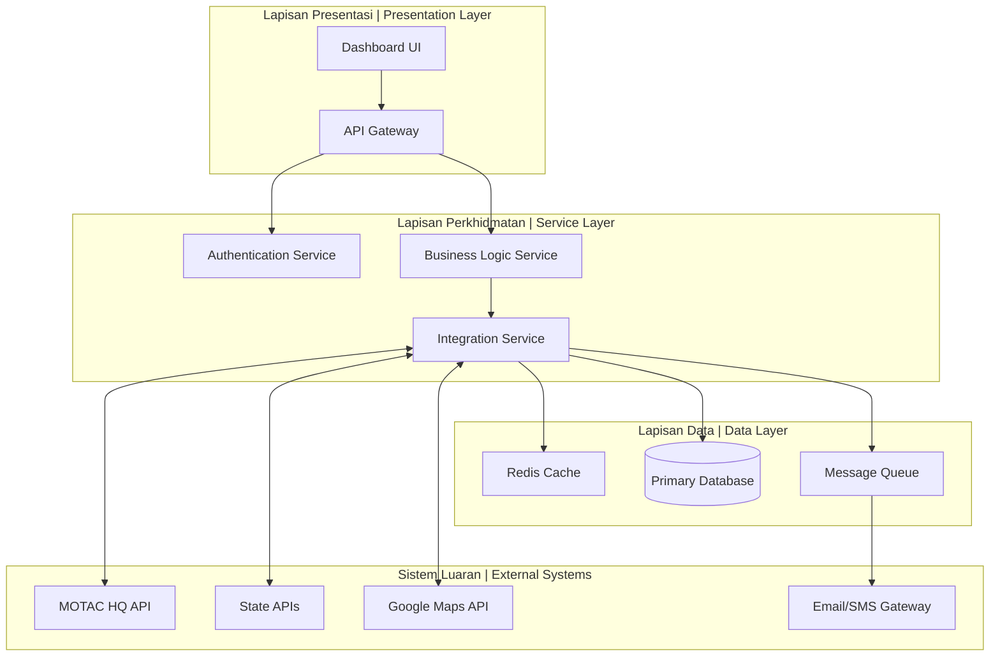

#### Senibina Fizikal | Physical Architecture

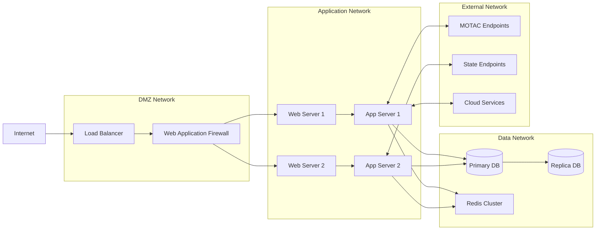

### 2.2 Lapisan Perkhidmatan API | API Service Layers

#### Layer 1: Gateway Layer

- **Tanggungjawab:** Rate limiting, authentication, request routing
- **Komponen:** Nginx/Apache, API Gateway (Laravel Sanctum)
- **Protokol:** HTTPS, WebSocket untuk real-time updates

#### Layer 2: Business Logic Layer

- **Tanggungjawab:** Data processing, business rules, workflow orchestration
- **Komponen:** Laravel Controllers, Services, Jobs
- **Pattern:** Repository pattern, Service layer pattern

#### Layer 3: Data Persistence Layer

- **Tanggungjawab:** Data storage, caching, message queuing
- **Komponen:** MySQL/PostgreSQL, Redis, Laravel Queue
- **Pattern:** Active Record (Eloquent), Cache-aside pattern

#### Layer 4: Integration Layer

- **Tanggungjawab:** External API communication, data transformation
- **Komponen:** Guzzle HTTP client, Laravel Http facade
- **Pattern:** Adapter pattern, Circuit breaker pattern

### 2.3 Hubungan Master-Slave | Master-Slave Relationships

**Sistem Sumber Kebenaran | System of Record:**

| Domain Data | Master System | Slave Systems | Sync Direction | Frequency |
|-------------|---------------|---------------|----------------|-----------|
| **Homestay Profiles** | MOTAC HQ Database | State Systems, Local DB | Bi-directional | Daily |
| **User Accounts** | MyGOV Identity Provider | Local User DB | One-way (Pull) | Real-time |
| **Performance Data** | State Systems | MOTAC HQ, Local DB | One-way (Push) | Daily |
| **Cooperative Data** | Local Database | MOTAC HQ | One-way (Push) | Real-time |
| **Geographic Data** | Google Maps API | Local Cache | One-way (Pull) | On-demand |
| **Audit Logs** | Local Database | MOTAC HQ | One-way (Push) | Real-time |

**Conflict Resolution Strategy:**

- **Last-Write-Wins:** Untuk non-critical data updates
- **Manual Review:** Untuk critical business data conflicts
- **Timestamp-based:** Menggunakan updated_at fields untuk version control
- **Event Sourcing:** Untuk audit trail dan data recovery

### 2.4 Aliran Rangkaian | Network Flow Description

#### Zona Dalaman | Internal Zone (Private Network)

- **CIDR:** 10.0.0.0/16
- **Komponen:** Application servers, databases, cache servers
- **Akses:** Restricted to authenticated services only
- **Monitoring:** Full traffic inspection dan logging

#### Zona DMZ | DMZ Zone (Semi-Public Network)  

- **CIDR:** 172.16.0.0/16
- **Komponen:** Load balancers, web servers, API gateways
- **Akses:** Public internet with firewall protection
- **Monitoring:** Real-time threat detection

#### Zona Luaran | External Zone (Public Internet)

- **Komponen:** MOTAC APIs, State APIs, Cloud services
- **Protokol:** HTTPS only, certificate pinning
- **Rate Limiting:** 1000 req/min per IP for public endpoints
- **Authentication:** OAuth2, JWT tokens with expiration

### 2.5 Diagram Aliran Data Terperinci | Detailed Data Flow Diagram

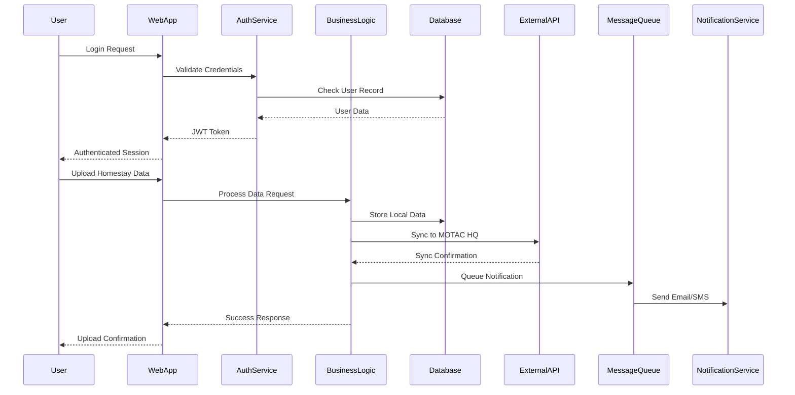

### 2.6 Pola Integrasi | Integration Patterns

#### 2.6.1 Synchronous Integration Patterns

- **Request-Response:** Untuk real-time data queries
- **API Gateway:** Centralized routing dan authentication
- **Circuit Breaker:** Fault tolerance untuk external API calls

#### 2.6.2 Asynchronous Integration Patterns  

- **Message Queue:** Untuk bulk data processing
- **Event-Driven:** Notification dan audit trail
- **Publish-Subscribe:** Real-time dashboard updates

#### 2.6.3 Data Integration Patterns

- **ETL (Extract-Transform-Load):** Daily data synchronization
- **CDC (Change Data Capture):** Real-time data streaming
- **API-First:** All data access through standardized APIs

---

---

## 3. Spesifikasi Titik Integrasi | Integration Points Specification

### 3.1 Matriks Titik Integrasi Lengkap | Complete Integration Points Matrix

| Modul/Sistem | Jenis | Protokol | Endpoint | Input Schema | Output Schema | Autentikasi | Kekerapan | Versi | Data Owner | Rate Limit |
|--------------|-------|----------|----------|---------------|---------------|-------------|-----------|-------|------------|------------|
| **MOTAC HQ API** | External | REST | `/api/v1/homestay` | homestay_sync.json | status_response.json | Bearer Token | Daily 02:00 | v1.2 | MOTAC HQ | 100/min |
| **State API** | External | REST | `/api/v1/state/{id}/data` | state_data.json | sync_status.json | OAuth2 | On-demand | v1.0 | State Office | 50/min |
| **Cooperative API** | External | REST | `/api/v1/coop/{id}/homestays` | coop_data.json | homestay_list.json | API Key | Weekly | v1.1 | Cooperative | 25/min |
| **Notification Queue** | Internal | Queue | `notifications` | notification.json | delivery_status.json | System Auth | Real-time | - | Local System | 1000/min |
| **Google Maps API** | External | REST | `maps.googleapis.com/v3/geocode` | location.json | geocode_result.json | API Key | On-request | v3 | Google | 100/day |
| **MyGOV Identity** | External | SAML/OAuth2 | `/auth/saml/callback` | saml_assertion.xml | user_profile.json | SAML Certificate | Per Login | v2.0 | MyGOV | 1000/hour |

### 3.2 Schema Terperinci & Kod Ralat | Detailed Schemas & Error Codes

#### 3.2.1 MOTAC HQ API Integration

**Request Schema (homestay_sync.json):**

```json
{
  "batch_id": "string (UUID)",
  "timestamp": "string (ISO8601)",
  "source_system": "string",
  "data": {
    "homestays": [
      {
        "homestay_id": "string (required, max:50)",
        "name": "string (required, max:255)",
        "state_code": "string (required, enum: MY-01 to MY-16)",
        "cooperative_id": "string (optional, max:50)",
        "location": {
          "latitude": "number (decimal, precision:8)",
          "longitude": "number (decimal, precision:8)",
          "address": "string (max:500)"
        },
        "capacity": {
          "rooms": "integer (min:1, max:50)",
          "guests": "integer (min:1, max:200)"
        },
        "status": "string (enum: active, inactive, suspended)",
        "last_updated": "string (ISO8601)"
      }
    ]
  }
}
```

**Response Schema (status_response.json):**

```json
{
  "status": "string (enum: success, partial, failed)",
  "batch_id": "string (UUID)",
  "processed_count": "integer",
  "failed_count": "integer",
  "errors": [
    {
      "record_id": "string",
      "error_code": "string",
      "message": "string",
      "field": "string (optional)"
    }
  ],
  "next_sync_window": "string (ISO8601)"
}
```

**Error Codes MOTAC API:**

| Code | HTTP Status | Description | Recovery Action |
|------|-------------|-------------|-----------------|
| **AUTH_001** | 401 | Invalid bearer token | Refresh token and retry |
| **RATE_001** | 429 | Rate limit exceeded | Wait 60s and retry |
| **DATA_001** | 400 | Invalid homestay_id format | Fix ID format and resubmit |
| **DATA_002** | 400 | State code not recognized | Use valid MY-XX format |
| **DATA_003** | 422 | Duplicate homestay record | Check existing records |
| **SYNC_001** | 409 | Sync window closed | Wait for next sync window |
| **SYS_001** | 500 | Internal server error | Log incident and retry in 5min |

#### 3.2.2 State API Integration

**Request Schema (state_data.json):**

```json
{
  "state_id": "string (required, MY-XX format)",
  "reporting_period": {
    "start_date": "string (ISO8601 date)",
    "end_date": "string (ISO8601 date)"
  },
  "performance_data": [
    {
      "homestay_id": "string (required)",
      "metrics": {
        "total_visitors": "integer (min:0)",
        "foreign_visitors": "integer (min:0)",
        "domestic_visitors": "integer (min:0)",
        "total_revenue": "number (decimal, min:0)",
        "occupancy_rate": "number (decimal, 0-100)",
        "average_stay": "number (decimal, min:0)"
      },
      "period": "string (YYYY-MM format)"
    }
  ]
}
```

### 3.3 Dasar Versioning API | API Versioning Policy

#### 3.3.1 Versioning Strategy

- **Semantic Versioning:** Major.Minor.Patch (e.g., v1.2.3)
- **URL Versioning:** `/api/v1/`, `/api/v2/` for major versions
- **Header Versioning:** `Accept: application/vnd.motac.v1+json` for minor versions
- **Backward Compatibility:** Minimum 12 months support for previous major version

#### 3.3.2 Deprecation Timeline

| Version | Release Date | Deprecation Date | End-of-Life Date | Migration Notes |
|---------|--------------|------------------|------------------|-----------------|
| **v1.0** | 2025-01-01 | 2025-12-31 | 2026-06-30 | Legacy state sync format |
| **v1.1** | 2025-06-01 | 2026-06-01 | 2026-12-31 | Added cooperative endpoints |
| **v1.2** | 2025-10-01 | 2026-10-01 | 2027-04-30 | Enhanced error handling |
| **v2.0** | 2026-01-01 | TBD | TBD | GraphQL support, real-time updates |

### 3.4 Kepemilikan Data & Autoriti | Data Ownership & Authority

#### 3.4.1 Data Domain Authority Matrix

| Data Domain | Create | Read | Update | Delete | Master System | Backup Systems |
|-------------|--------|------|---------|--------|---------------|----------------|
| **Homestay Profile** | MOTAC HQ | All Systems | MOTAC HQ | MOTAC HQ | MOTAC Central DB | State Offices |
| **Performance Metrics** | State/Coop | All Systems | State/Coop | State/Coop | State Systems | MOTAC HQ (Agg) |
| **User Accounts** | MyGOV | All Systems | MyGOV | MyGOV | MyGOV Identity | Local Cache |
| **Cooperative Data** | Local System | MOTAC HQ/States | Cooperative | MOTAC HQ | Local Database | MOTAC HQ |
| **Audit Logs** | All Systems | MOTAC HQ/Audit | System Generated | Never | Local Database | MOTAC Archive |
| **Geographic Data** | Google Maps | All Systems | Google Maps | Google Maps | Google Maps API | Local Cache |

#### 3.4.2 Data Conflict Resolution

**Priority Order (Highest to Lowest):**

1. **MOTAC HQ Manual Override** - Super admin changes
2. **MyGOV Identity Provider** - User authentication data  
3. **Source System Updates** - Updates from data owner
4. **Scheduled Sync** - Automated synchronization
5. **Cache/Local Copy** - Fallback data

**Conflict Resolution Workflow:**

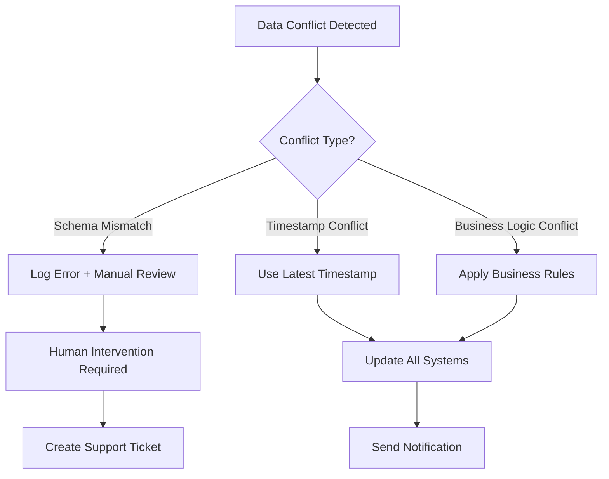

### 3.5 Interval Retry & Throttling | Retry Intervals & Throttling

#### 3.5.1 Retry Policy Configuration

| Endpoint Category | Initial Retry | Max Retries | Backoff Strategy | Circuit Breaker |
|------------------|---------------|-------------|------------------|-----------------|
| **Critical (MOTAC HQ)** | 1s | 5 | Exponential (2^n) | 5 failures in 60s |
| **Important (State APIs)** | 2s | 3 | Linear (+5s each) | 10 failures in 300s |
| **Standard (Notifications)** | 5s | 2 | Fixed interval | 20 failures in 600s |
| **External (Maps, etc.)** | 10s | 1 | No retry | 50 failures in 3600s |

#### 3.5.2 Rate Limiting Implementation

**Per-Endpoint Limits:**

```json
{
  "rate_limits": {
    "/api/v1/homestay/sync": {
      "requests_per_minute": 100,
      "burst_allowance": 10,
      "per_user_limit": 50
    },
    "/api/v1/dashboard/data": {
      "requests_per_minute": 500,
      "burst_allowance": 50,
      "per_user_limit": 100
    },
    "/api/v1/reports/generate": {
      "requests_per_minute": 10,
      "burst_allowance": 2,
      "per_user_limit": 5
    }
  }
}
```

**Rate Limit Headers:**

```http
X-RateLimit-Limit: 100
X-RateLimit-Remaining: 85
X-RateLimit-Reset: 1635724800
X-RateLimit-Retry-After: 60
```

### 3.6 API Lifecycle Management | API Lifecycle Management

#### 3.6.1 Development Stages

| Stage | Environment | Purpose | Access | Data |
|-------|-------------|---------|--------|------|
| **Development** | dev.homestay.local | Feature development | Internal team | Mock/test data |
| **Testing** | test.homestay.motac.gov.my | Integration testing | QA team + partners | Sanitized production data |
| **Staging** | staging.homestay.motac.gov.my | UAT and performance testing | Stakeholders | Near-production data |
| **Production** | homestay.motac.gov.my | Live system | Authorized users | Live production data |

#### 3.6.2 Change Management Process

**API Change Classification:**

- **Patch (x.x.1):** Bug fixes, security patches, documentation updates
- **Minor (x.1.x):** New optional fields, new endpoints, performance improvements
- **Major (1.x.x):** Breaking changes, schema modifications, endpoint removal

**Change Approval Matrix:**

| Change Type | Dev Team | QA Team | Business Owner | Security Team | Approval Required |
|-------------|----------|---------|----------------|---------------|-------------------|
| **Patch** | Required | Required | Informed | Informed | Dev Lead |
| **Minor** | Required | Required | Consulted | Consulted | Project Manager |
| **Major** | Required | Required | Required | Required | Steering Committee |

---

## 4. Pemetaan Data | Data Mapping Specification

### 4.1 Pemetaan Data Dwi-arah | Bidirectional Data Mapping

#### 4.1.1 Homestay Data Mapping

| Medan Sistem Tempatan | Medan API MOTAC | Jenis Data | Transformasi | Validasi | Nilai Default | Arah Sync |
|------------------------|-----------------|------------|--------------|----------|---------------|-----------|
| `homestays.nama` | `homestay_name` | String(255) | Capitalize, trim | Required, max:255 | null | ↕️ Bi-directional |
| `homestays.kod_negeri` | `state_code` | String(5) | MY-XX format | Enum validation | null | ← Pull from MOTAC |
| `performances.pelawat_asing` | `foreign_visitors` | Integer | Direct mapping | Min:0, Max:99999 | 0 | → Push to MOTAC |
| `performances.pendapatan` | `total_revenue` | Decimal(10,2) | Round to 2dp | Min:0 | 0.00 | → Push to MOTAC |
| `users.email` | `user_email` | String(255) | Lowercase, trim | Email format | null | ← Pull from MyGOV |
| `cooperatives.kod_koperasi` | `cooperative_code` | String(20) | Uppercase | Alphanumeric only | null | ↕️ Bi-directional |

#### 4.1.2 State Code Transformation Rules

```json
{
  "state_mapping": {
    "MY-01": {"code": "JHR", "name": "Johor", "name_ms": "Johor"},
    "MY-02": {"code": "KDH", "name": "Kedah", "name_ms": "Kedah"},
    "MY-03": {"code": "KTN", "name": "Kelantan", "name_ms": "Kelantan"},
    "MY-04": {"code": "MLK", "name": "Melaka", "name_ms": "Melaka"},
    "MY-05": {"code": "NSN", "name": "Negeri Sembilan", "name_ms": "Negeri Sembilan"},
    "MY-06": {"code": "PHG", "name": "Pahang", "name_ms": "Pahang"},
    "MY-07": {"code": "PNG", "name": "Penang", "name_ms": "Pulau Pinang"},
    "MY-08": {"code": "PRK", "name": "Perak", "name_ms": "Perak"},
    "MY-09": {"code": "PLS", "name": "Perlis", "name_ms": "Perlis"},
    "MY-10": {"code": "SGR", "name": "Selangor", "name_ms": "Selangor"},
    "MY-11": {"code": "TRG", "name": "Terengganu", "name_ms": "Terengganu"},
    "MY-12": {"code": "SBH", "name": "Sabah", "name_ms": "Sabah"},
    "MY-13": {"code": "SWK", "name": "Sarawak", "name_ms": "Sarawak"},
    "MY-14": {"code": "KUL", "name": "Kuala Lumpur", "name_ms": "Kuala Lumpur"},
    "MY-15": {"code": "LBN", "name": "Labuan", "name_ms": "Labuan"},
    "MY-16": {"code": "PJY", "name": "Putrajaya", "name_ms": "Putrajaya"}
  }
}
```

### 4.2 Peraturan Validasi Data | Data Validation Rules

#### 4.2.1 Field-Level Validation

| Field Category | Validation Rules | Error Code | Recovery Action |
|----------------|------------------|------------|-----------------|
| **Email Addresses** | RFC5322 format, max:255 chars | VAL_001 | Request user re-entry |
| **Phone Numbers** | Malaysian format (+60x-xxx-xxxx) | VAL_002 | Auto-format or request correction |
| **Postal Codes** | 5-digit Malaysian postcode | VAL_003 | Lookup valid postcode for area |
| **Coordinates** | Latitude: -90 to 90, Longitude: -180 to 180 | VAL_004 | Use Google Maps geocoding |
| **Currency** | RM format, 2 decimal places, max: 999,999.99 | VAL_005 | Round to nearest cent |
| **Dates** | ISO8601 format (YYYY-MM-DD) | VAL_006 | Convert from common formats |
| **Enum Values** | Predefined lists (status, categories) | VAL_007 | Use default or request selection |

#### 4.2.2 Business Logic Validation

```php
// Example Laravel Validation Rules
$rules = [
    'homestay_name' => ['required', 'string', 'max:255', 'unique:homestays,nama'],
    'state_code' => ['required', 'string', 'exists:states,code'],
    'capacity.rooms' => ['required', 'integer', 'min:1', 'max:50'],
    'capacity.guests' => ['required', 'integer', 'min:1', 'lte:capacity.rooms*4'],
    'coordinates.latitude' => ['required', 'numeric', 'between:-90,90'],
    'coordinates.longitude' => ['required', 'numeric', 'between:-180,180'],
    'performance.occupancy_rate' => ['numeric', 'between:0,100'],
    'cooperative_id' => ['nullable', 'exists:cooperatives,id']
];
```

### 4.3 Normalisasi & Denormalisasi | Normalization & Denormalization

#### 4.3.1 Database Normalization Strategy

**Third Normal Form (3NF) Tables:**

- `homestays` - Core homestay information
- `states` - State reference data
- `cooperatives` - Cooperative master data  
- `users` - User account information
- `performances` - Time-series performance data

**Denormalized Views for Performance:**

- `homestay_summary_view` - Aggregated statistics per homestay
- `state_performance_view` - State-level KPI dashboard data
- `monthly_trends_view` - Time-series data for charts

#### 4.3.2 Data Aggregation Points

| Aggregation Level | Source Tables | Update Frequency | Storage Method |
|-------------------|---------------|------------------|----------------|
| **Homestay Daily Summary** | performances, bookings | Nightly batch | Materialized view |
| **Cooperative Monthly KPI** | homestay summaries | Monthly cron | Cached table |
| **State Quarterly Report** | cooperative KPIs | Quarterly batch | Report snapshot |
| **National Annual Stats** | state reports | Annual process | Data warehouse |

### 4.4 Pengendalian Data Hilang | Missing Data Handling

#### 4.4.1 Fallback Value Strategy

| Data Type | Missing Value Handling | Fallback Source | Business Impact |
|-----------|------------------------|-----------------|-----------------|
| **Homestay Name** | Error - Required field | Manual entry required | High - Core identity |
| **Contact Phone** | Use cooperative contact | Cooperative record | Medium - Communication |
| **GPS Coordinates** | Geocode from address | Google Maps API | Low - Display only |
| **Performance Metrics** | Use previous month's data | Historical average | Medium - Reporting |
| **Occupancy Rate** | Calculate from bookings | Revenue/capacity ratio | Low - Derived metric |
| **Revenue Data** | Zero value with flag | Flag as "No Data" | High - Financial reporting |

#### 4.4.2 Data Quality Scoring

```sql
-- Data Quality Score Calculation
SELECT 
    homestay_id,
    (
        CASE WHEN nama IS NOT NULL THEN 25 ELSE 0 END +
        CASE WHEN phone IS NOT NULL THEN 15 ELSE 0 END +
        CASE WHEN coordinates_valid = 1 THEN 20 ELSE 0 END +
        CASE WHEN has_recent_performance = 1 THEN 25 ELSE 0 END +
        CASE WHEN cooperative_id IS NOT NULL THEN 15 ELSE 0 END
    ) as quality_score
FROM homestay_quality_view;
```

### 4.5 Penyelarasan Data Mismatch | Data Mismatch Reconciliation

#### 4.5.1 Conflict Detection Algorithm

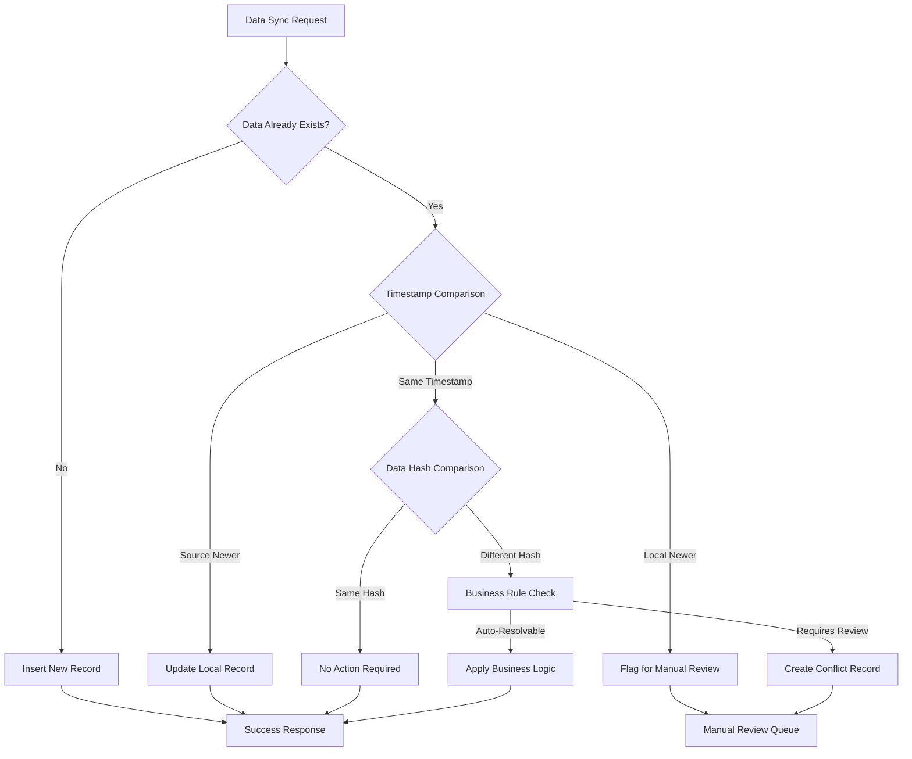

#### 4.5.2 Automatic Resolution Rules

| Conflict Type | Resolution Strategy | Authority Source | Notification Required |
|---------------|---------------------|------------------|-----------------------|
| **Name Variations** | Use MOTAC HQ version | MOTAC Central DB | No |
| **Contact Updates** | Use newest timestamp | Source system | Email to admin |
| **Performance Data** | Sum values if aggregatable | Source system | Log for audit |
| **Status Changes** | Manual review required | Business owner | Email + SMS |
| **Location Updates** | Use coordinates with highest precision | GPS source | Log change |

### 4.6 Format Penyeragaman | Data Format Standardization

#### 4.6.1 Standard Format Definitions

```json
{
  "data_formats": {
    "dates": {
      "format": "ISO8601",
      "pattern": "YYYY-MM-DD",
      "timezone": "Asia/Kuala_Lumpur",
      "examples": ["2025-10-12", "2025-12-31"]
    },
    "currency": {
      "format": "Malaysian Ringgit",
      "pattern": "999999.99",
      "symbol": "RM",
      "decimal_places": 2
    },
    "phone_numbers": {
      "format": "E.164 International",
      "pattern": "+60X-XXXX-XXXX",
      "validation": "^\\+60[0-9]-[0-9]{4}-[0-9]{4}$"
    },
    "addresses": {
      "components": ["street", "city", "state", "postcode", "country"],
      "country_default": "Malaysia",
      "encoding": "UTF-8"
    }
  }
}
```

#### 4.6.2 Character Encoding & Language Support

**Encoding Standards:**

- **Database:** UTF-8 (utf8mb4 collation)
- **API Communication:** UTF-8 with BOM
- **File Exports:** UTF-8 CSV, Excel Unicode
- **Email Content:** UTF-8 with quoted-printable encoding

**Language Support:**

- **Primary:** Bahasa Malaysia (ms-MY)
- **Secondary:** English (en-US)  
- **Special Characters:** Arabic numerals, Jawi script support
- **Sorting:** Locale-aware collation for Malaysian names

---

## 5. Protokol & Kaedah Integrasi | Integration Protocols & Communication Methods

### 5.1 Protokol Komunikasi | Communication Protocols

#### 5.1.1 HTTP/HTTPS Configuration

**Protocol Standards:**

- **Version:** HTTP/2 with HTTP/1.1 fallback
- **Encryption:** TLS 1.3 (minimum TLS 1.2)
- **Certificate:** Wildcard SSL certificate for *.motac.gov.my
- **HSTS:** Strict-Transport-Security header enforced
- **Compression:** Gzip/Brotli encoding enabled

**Headers Configuration:**

```http
# Security Headers
Strict-Transport-Security: max-age=31536000; includeSubDomains
X-Content-Type-Options: nosniff
X-Frame-Options: DENY
X-XSS-Protection: 1; mode=block
Content-Security-Policy: default-src 'self'

# API Headers
Content-Type: application/json; charset=utf-8
Accept: application/json
User-Agent: MOTAC-Homestay-API/1.1
X-Request-ID: uuid-v4-format
X-Correlation-ID: business-transaction-id
```

#### 5.1.2 WebSocket for Real-time Updates

**Use Cases:**

- Live dashboard updates (performance metrics)
- Real-time notification delivery
- System status monitoring
- Chat support integration

**WebSocket Configuration:**

```javascript
// WebSocket Connection Setup
const wsConfig = {
    url: 'wss://homestay.motac.gov.my/ws',
    protocols: ['motac-v1'],
    heartbeat_interval: 30000, // 30 seconds
    reconnect_attempts: 5,
    auth_token: 'Bearer {jwt_token}'
};

// Message Format
{
    "type": "dashboard_update",
    "timestamp": "2025-10-12T10:30:00Z",
    "payload": {
        "homestay_id": "HS001",
        "metric": "occupancy_rate",
        "value": 75.5,
        "change": "+2.3%"
    }
}
```

### 5.2 Kekerapan & Penjadualan Integrasi | Integration Frequency & Scheduling

#### 5.2.1 Scheduled Integration Matrix

| Integration Type | Frequency | Schedule (MYT) | Timeout | Retry Policy | Business Window |
|------------------|-----------|----------------|---------|--------------|-----------------|
| **MOTAC HQ Sync** | Daily | 02:00 AM | 30 min | 3x with backoff | 02:00-04:00 AM |
| **State Data Push** | Daily | 06:00 AM | 15 min | 2x linear retry | 06:00-08:00 AM |
| **Performance Reports** | Weekly | Sunday 01:00 AM | 60 min | 5x exponential | Sunday 01:00-05:00 AM |
| **User Directory Sync** | Hourly | Every hour :00 | 5 min | 3x immediate | 24/7 except maintenance |
| **Notification Queue** | Real-time | Continuous | 10 sec | No retry (DLQ) | 24/7 |
| **Backup Sync** | Daily | 23:00 PM | 120 min | 1x retry | 23:00-01:00 AM |

#### 5.2.2 Cron Job Configuration

```bash
# /etc/crontab - Integration Scheduling

# MOTAC HQ Daily Sync
0 2 * * * www-data php /var/www/homestay/artisan sync:motac-hq >> /var/log/homestay/sync.log 2>&1

# State Performance Data Push  
0 6 * * * www-data php /var/www/homestay/artisan sync:state-data >> /var/log/homestay/state.log 2>&1

# Weekly Performance Reports
0 1 * * 0 www-data php /var/www/homestay/artisan reports:weekly >> /var/log/homestay/reports.log 2>&1

# Hourly User Directory Sync
0 * * * * www-data php /var/www/homestay/artisan sync:users >> /var/log/homestay/users.log 2>&1

# Health Check Every 5 Minutes
*/5 * * * * www-data php /var/www/homestay/artisan health:check >> /var/log/homestay/health.log 2>&1
```

### 5.3 Message Queue & Asynchronous Processing | Message Queue & Asynchronous Processing

#### 5.3.1 Queue Architecture

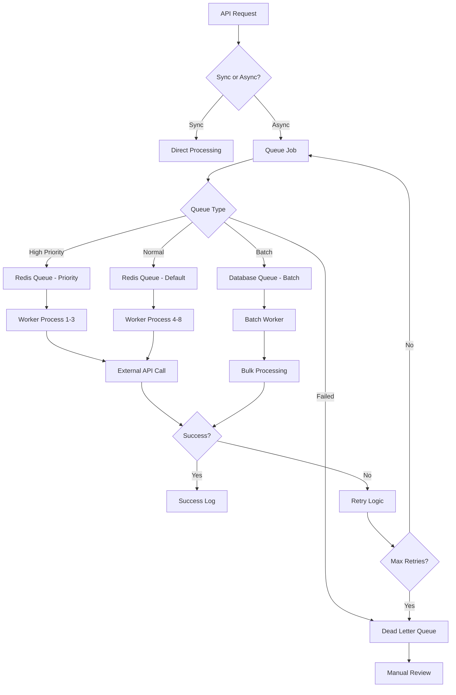

#### 5.3.2 Queue Configuration

**Laravel Queue Configuration:**

```php
// config/queue.php
'connections' => [
    'redis' => [
        'driver' => 'redis',
        'connection' => 'default',
        'queue' => env('REDIS_QUEUE', 'default'),
        'retry_after' => 600,
        'block_for' => 5,
    ],
    'database' => [
        'driver' => 'database',
        'table' => 'jobs',
        'queue' => 'batch_processing',
        'retry_after' => 1800,
    ],
],

'failed' => [
    'driver' => 'database',
    'database' => env('DB_CONNECTION', 'mysql'),
    'table' => 'failed_jobs',
],
```

**Queue Priority Levels:**

```php
// Job Priority Classes
class CriticalIntegrationJob implements ShouldQueue
{
    public $queue = 'critical';    // Priority: Immediate
    public $tries = 5;
    public $backoff = [60, 180, 600, 1800]; // Exponential backoff
}

class StandardIntegrationJob implements ShouldQueue  
{
    public $queue = 'default';     // Priority: Normal
    public $tries = 3;
    public $backoff = 300;         // Fixed 5-minute backoff
}

class BulkProcessingJob implements ShouldQueue
{
    public $queue = 'batch';       // Priority: Low
    public $tries = 1;
    public $timeout = 3600;        // 1-hour timeout
}
```

### 5.4 Batch Processing & Pagination | Batch Processing & Pagination

#### 5.4.1 Batch Size Configuration

| Data Type | Batch Size | Memory Limit | Processing Time | Pagination Method |
|-----------|------------|--------------|-----------------|-------------------|
| **Homestay Records** | 100 records | 256MB | ~30 seconds | Cursor-based |
| **Performance Data** | 500 records | 512MB | ~60 seconds | Offset-based |
| **User Accounts** | 50 records | 128MB | ~15 seconds | Token-based |
| **Audit Logs** | 1000 records | 1GB | ~120 seconds | Timestamp-based |
| **File Exports** | 10,000 records | 2GB | ~300 seconds | Stream-based |

#### 5.4.2 Pagination Implementation

**Cursor-Based Pagination (Recommended):**

```json
{
  "data": [...],
  "pagination": {
    "next_cursor": "eyJpZCI6MTIzNCwiY3JlYXRlZF9hdCI6IjIwMjUtMTAtMTIifQ==",
    "has_more": true,
    "total_count": 15000,
    "per_page": 100
  }
}
```

**Offset-Based Pagination (Legacy Support):**

```json
{
  "data": [...],
  "pagination": {
    "current_page": 5,
    "last_page": 150,
    "per_page": 100,
    "total": 15000,
    "from": 401,
    "to": 500
  }
}
```

### 5.5 Serialization & Data Format | Serialization & Data Format

#### 5.5.1 JSON Serialization Standards

**Naming Convention:**

- **snake_case** for API field names
- **camelCase** for JavaScript frontend
- **PascalCase** for C# integrations (if any)

**Date/Time Serialization:**

```json
{
  "created_at": "2025-10-12T10:30:00.000Z",
  "updated_at": "2025-10-12T15:45:30.123Z",
  "reporting_period": {
    "start_date": "2025-10-01",
    "end_date": "2025-10-31"
  },
  "timezone": "Asia/Kuala_Lumpur"
}
```

**Decimal/Currency Serialization:**

```json
{
  "revenue": {
    "amount": "12345.67",
    "currency": "MYR",
    "formatted": "RM 12,345.67"
  },
  "occupancy_rate": {
    "value": 75.5,
    "unit": "percent",
    "formatted": "75.5%"
  }
}
```

#### 5.5.2 Message Compression & Encoding

**Compression Strategy:**

- **Small payloads (<1KB):** No compression
- **Medium payloads (1KB-100KB):** Gzip compression
- **Large payloads (>100KB):** Brotli compression + chunking

**Binary Data Handling:**

```php
// File Upload Encoding
$fileData = [
    'filename' => 'homestay_data.xlsx',
    'content_type' => 'application/vnd.openxmlformats-officedocument.spreadsheetml.sheet',
    'content' => base64_encode($fileContent),
    'size' => strlen($fileContent),
    'checksum' => hash('sha256', $fileContent)
];
```

### 5.6 Timeout & Circuit Breaker Policies | Timeout & Circuit Breaker Policies

#### 5.6.1 Timeout Configuration Matrix

| Service Category | Connection Timeout | Read Timeout | Total Timeout | Circuit Breaker Threshold |
|------------------|-------------------|--------------|---------------|---------------------------|
| **Critical APIs (MOTAC HQ)** | 5s | 30s | 60s | 5 failures in 60s |
| **State APIs** | 3s | 20s | 45s | 10 failures in 300s |
| **External APIs (Maps, etc.)** | 10s | 15s | 30s | 20 failures in 600s |
| **Database Queries** | 2s | 10s | 15s | 3 failures in 30s |
| **File Operations** | 5s | 60s | 120s | No circuit breaker |

#### 5.6.2 Circuit Breaker Implementation

```php
// Circuit Breaker Pattern Implementation
class CircuitBreaker
{
    private $failureThreshold = 5;
    private $recoveryTimeout = 60; // seconds
    private $monitoringPeriod = 300; // 5 minutes
    
    public function call(callable $operation, string $serviceName)
    {
        $state = $this->getState($serviceName);
        
        switch ($state) {
            case 'CLOSED':
                return $this->executeCall($operation, $serviceName);
                
            case 'OPEN':
                if ($this->shouldAttemptReset($serviceName)) {
                    $this->setState($serviceName, 'HALF_OPEN');
                    return $this->executeCall($operation, $serviceName);
                }
                throw new CircuitBreakerOpenException($serviceName);
                
            case 'HALF_OPEN':
                return $this->executeCall($operation, $serviceName);
        }
    }
    
    private function executeCall(callable $operation, string $serviceName)
    {
        try {
            $result = $operation();
            $this->recordSuccess($serviceName);
            return $result;
        } catch (Exception $e) {
            $this->recordFailure($serviceName);
            throw $e;
        }
    }
}
```

### 5.7 Event-Driven Architecture | Event-Driven Architecture

#### 5.7.1 Event Types & Handlers

| Event Type | Trigger | Payload | Handlers | Async Processing |
|------------|---------|---------|----------|------------------|
| **HomestayCreated** | New homestay registration | Homestay data | Email notification, MOTAC sync | Yes |
| **PerformanceUpdated** | Monthly data upload | Performance metrics | Dashboard refresh, report gen | Yes |
| **UserLoggedIn** | Successful authentication | User session data | Audit log, activity tracking | No |
| **DataSyncFailed** | Integration error | Error details | Alert notification, retry queue | Yes |
| **ReportGenerated** | Scheduled report | Report metadata | Email delivery, archive storage | Yes |

#### 5.7.2 Event Schema Definition

```json
{
  "event_schema": {
    "event_id": "uuid-v4",
    "event_type": "HomestayCreated",
    "event_version": "1.0",
    "timestamp": "2025-10-12T10:30:00.000Z",
    "source": "homestay-management-system",
    "correlation_id": "business-transaction-uuid",
    "payload": {
      "homestay_id": "HS001",
      "homestay_data": {...},
      "created_by": "user_id",
      "metadata": {...}
    },
    "routing_key": "homestay.created.v1"
  }
}
```

---

## 6. Autentikasi & Kawalan Akses | Authentication & Access Control

### 6.1 Jenis Autentikasi | Authentication Types

#### 6.1.1 Multi-Factor Authentication Strategy

| User Category | Primary Auth | Secondary Auth | Session Duration | MFA Required |
|---------------|--------------|----------------|------------------|--------------|
| **Super Admin** | LDAP/AD | TOTP + SMS | 4 hours | Always |
| **MOTAC HQ Staff** | MyGOV SSO | TOTP | 8 hours | For sensitive ops |
| **State Officers** | Email/Password | SMS | 12 hours | Monthly |
| **Cooperative Users** | Email/Password | Email OTP | 24 hours | No |
| **API Consumers** | OAuth2 Client | API Key | 30 days | No |
| **System Services** | Service Account | Certificate | 90 days | No |

#### 6.1.2 Token Management Policy

**JWT Token Configuration:**

```json
{
  "jwt_config": {
    "algorithm": "RS256",
    "issuer": "https://homestay.motac.gov.my",
    "audience": ["homestay-api", "dashboard-app"],
    "access_token_ttl": 3600,
    "refresh_token_ttl": 86400,
    "max_refresh_count": 10,
    "key_rotation_days": 90
  }
}
```

**Token Refresh Strategy:**

- **Automatic:** Refresh 5 minutes before expiry
- **Sliding Window:** Extend session on active use
- **Security:** New refresh token issued with each refresh
- **Revocation:** Immediate invalidation on logout/security event

### 6.2 Matriks RBAC | Role-Based Access Control Matrix

#### 6.2.1 Role Definition & Permissions

| Role | API Endpoints | Data Access | Operations | Integration Scope |
|------|---------------|-------------|------------|-------------------|
| **super_admin** | All endpoints | National data | CRUD + Execute | All systems |
| **motac_hq_admin** | Management APIs | National read, HQ write | CRUD | MOTAC systems |
| **motac_hq_analyst** | Analytics APIs | National read-only | Read + Export | MOTAC + State |
| **state_admin** | State APIs | State data only | CRUD (own state) | State systems |
| **state_officer** | Data entry APIs | State read-only | Create + Update | Limited |
| **cooperative_admin** | Coop APIs | Cooperative data | CRUD (own coop) | Cooperative only |
| **cooperative_user** | Basic APIs | Own homestays only | Read + Update | None |
| **api_consumer** | Integration APIs | Authorized data | Read (API limits) | External systems |

#### 6.2.2 Endpoint-Level Access Control

```php
// Laravel Route Middleware Configuration
Route::middleware(['auth:sanctum', 'role:super_admin,motac_hq_admin'])->group(function () {
    Route::get('/api/v1/admin/users', [UserController::class, 'index']);
    Route::post('/api/v1/admin/users', [UserController::class, 'store']);
});

Route::middleware(['auth:sanctum', 'role:state_admin', 'scope:state'])->group(function () {
    Route::get('/api/v1/state/{state}/homestays', [HomestayController::class, 'index']);
    Route::put('/api/v1/state/{state}/homestays/{id}', [HomestayController::class, 'update']);
});

Route::middleware(['auth:api', 'throttle:100,1', 'scope:read'])->group(function () {
    Route::get('/api/v1/public/homestays', [PublicController::class, 'homestays']);
    Route::get('/api/v1/public/statistics', [PublicController::class, 'statistics']);
});
```

### 6.3 Kawalan Akses Berdasarkan Persekitaran | Environment-Based Access Control

#### 6.3.1 Environment Security Levels

| Environment | Access Method | IP Restrictions | Certificate Requirements | Monitoring Level |
|-------------|---------------|-----------------|-------------------------|------------------|
| **Production** | VPN + MFA | Whitelist only | Client cert required | Full logging |
| **Staging** | VPN required | Office networks only | Server cert only | Standard logging |
| **Testing** | Basic auth | Internal networks | Self-signed OK | Basic logging |
| **Development** | No restrictions | No restrictions | No requirements | Debug logging |

#### 6.3.2 Network Access Control Lists

```yaml
# Network ACL Configuration
acl_rules:
  production:
    allowed_networks:
      - "10.0.0.0/8"          # MOTAC Internal
      - "172.16.0.0/12"       # Government Networks  
      - "203.218.x.x/24"      # MOTAC Public IPs
    blocked_networks:
      - "192.168.0.0/16"      # Private networks
      - "169.254.0.0/16"      # Link-local
    
  api_consumers:
    rate_limits:
      default: "100/minute"
      premium: "1000/minute"
      internal: "unlimited"
    
  geographic_restrictions:
    allowed_countries: ["MY", "SG", "BN"]  # Malaysia, Singapore, Brunei
    blocked_countries: ["CN", "RU", "KP"]  # High-risk countries
```

### 6.4 Direktori Pengguna API | API Consumer Registry

#### 6.4.1 Registered API Consumers

| Consumer ID | Organization | Environment | Access Level | Rate Limit | Expiry Date |
|-------------|--------------|-------------|--------------|------------|-------------|
| **motac-hq-prod** | MOTAC Headquarters | Production | Full Access | 1000/min | 2026-12-31 |
| **tourism-my-api** | Tourism Malaysia | Production | Read + Analytics | 500/min | 2026-06-30 |
| **state-johor-api** | Johor State Office | Production | State Data Only | 200/min | 2026-12-31 |
| **coop-network-api** | Cooperative Network | Staging | Cooperative Data | 100/min | 2025-12-31 |
| **research-partner** | University Research | Testing | Anonymized Data | 50/min | 2025-11-30 |
| **mobile-app-dev** | Mobile Development | Development | Test Data Only | 25/min | 2025-10-31 |

#### 6.4.2 API Key Management

```php
// API Key Generation & Management
class ApiKeyManager
{
    public function generateApiKey(string $consumerId, array $scopes): string
    {
        $prefix = 'hmsk_'; // Homestay API Key prefix
        $random = Str::random(32);
        $checksum = hash('crc32', $consumerId . $random);
        
        return $prefix . base64_encode($consumerId . ':' . $random . ':' . $checksum);
    }
    
    public function validateApiKey(string $apiKey): bool
    {
        // Validate format, checksum, expiry, and active status
        return $this->validateFormat($apiKey) 
            && $this->validateChecksum($apiKey)
            && $this->isActive($apiKey)
            && !$this->isExpired($apiKey);
    }
    
    public function rotateApiKey(string $consumerId): string
    {
        // Deactivate old key with 30-day grace period
        $this->deactivateApiKey($consumerId, gracePeriod: 30);
        
        // Generate new key with same permissions
        return $this->generateApiKey($consumerId, $this->getConsumerScopes($consumerId));
    }
}
```

### 6.5 Dasar Pembaharuan Token | Token Rotation Policy

#### 6.5.1 Token Lifecycle Management

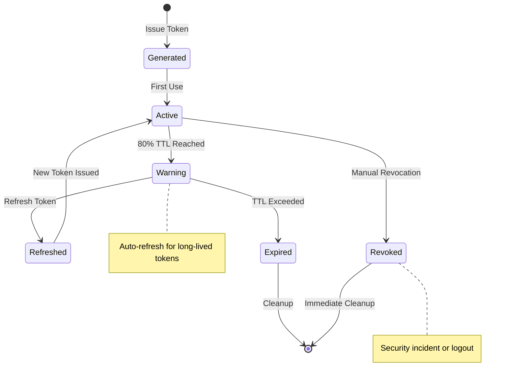

#### 6.5.2 Automated Token Rotation

```php
// Scheduled Token Rotation Job
class TokenRotationJob implements ShouldQueue
{
    public function handle(): void
    {
        // Rotate tokens expiring within 7 days
        $expiringTokens = PersonalAccessToken::where('expires_at', '<=', now()->addDays(7))
            ->where('can_rotate', true)
            ->get();
            
        foreach ($expiringTokens as $token) {
            if ($token->last_used_at >= now()->subDays(30)) {
                // Token actively used - auto-rotate
                $this->rotateToken($token);
                $this->notifyConsumer($token);
            } else {
                // Inactive token - schedule for deletion
                $this->scheduleTokenDeletion($token);
            }
        }
    }
    
    private function rotateToken(PersonalAccessToken $token): void
    {
        $newToken = $token->user->createToken(
            $token->name, 
            $token->abilities,
            now()->addDays(90)
        );
        
        // Provide 48-hour overlap for smooth transition
        $token->update(['expires_at' => now()->addHours(48)]);
        
        event(new TokenRotatedEvent($token, $newToken));
    }
}
```

### 6.6 Kawalan Akses Sistem Luaran | External System Access Control

#### 6.6.1 OAuth2 Client Configuration

```json
{
  "oauth2_clients": {
    "motac_hq_client": {
      "client_id": "motac-hq-homestay-api",
      "client_secret": "********",
      "grant_types": ["authorization_code", "refresh_token"],
      "scopes": ["read:all", "write:homestays", "admin:users"],
      "redirect_uris": ["https://hq.motac.gov.my/oauth/callback"],
      "token_ttl": 3600,
      "refresh_ttl": 86400
    },
    "tourism_malaysia_client": {
      "client_id": "tourism-malaysia-analytics",
      "client_secret": "********", 
      "grant_types": ["client_credentials"],
      "scopes": ["read:analytics", "read:public"],
      "redirect_uris": [],
      "token_ttl": 7200,
      "refresh_ttl": 0
    }
  }
}
```

#### 6.6.2 SAML Integration with MyGOV

```xml
<!-- SAML SP Configuration -->
<EntityDescriptor entityID="https://homestay.motac.gov.my/saml">
  <SPSSODescriptor protocolSupportEnumeration="urn:oasis:names:tc:SAML:2.0:protocol">
    <KeyDescriptor use="signing">
      <KeyInfo xmlns="http://www.w3.org/2000/09/xmldsig#">
        <X509Data>
          <X509Certificate>MIICertificateDataHere</X509Certificate>
        </X509Data>
      </KeyInfo>
    </KeyDescriptor>
    
    <AssertionConsumerService 
      Binding="urn:oasis:names:tc:SAML:2.0:bindings:HTTP-POST"
      Location="https://homestay.motac.gov.my/saml/acs"
      index="0"/>
      
    <AttributeConsumingService index="0">
      <RequestedAttribute Name="http://schemas.xmlsoap.org/ws/2005/05/identity/claims/emailaddress"/>
      <RequestedAttribute Name="http://schemas.xmlsoap.org/ws/2005/05/identity/claims/name"/>
      <RequestedAttribute Name="http://schemas.xmlsoap.org/ws/2005/05/identity/claims/nameidentifier"/>
    </AttributeConsumingService>
  </SPSSODescriptor>
</EntityDescriptor>
```

---

## 7. Keselamatan Data | Data Security

### 7.1 Penyulitan Data | Data Encryption

#### 7.1.1 Encryption at Rest

**Database Encryption:**

- **Algorithm:** AES-256-GCM for sensitive data fields
- **Key Management:** AWS KMS / Azure Key Vault integration
- **Transparent Data Encryption (TDE):** Enabled for entire database
- **Column-Level Encryption:** PII data (email, phone, address)

```sql
-- Example of encrypted column definition
CREATE TABLE users (
    id BIGINT PRIMARY KEY,
    name VARCHAR(255),
    email VARBINARY(255),  -- AES encrypted
    phone VARBINARY(100),  -- AES encrypted
    created_at TIMESTAMP,
    encryption_key_id VARCHAR(50)
);
```

**File Storage Encryption:**

- **Documents:** AES-256-CBC encryption before S3/local storage
- **Reports:** Encrypted PDF generation with password protection
- **Backups:** Full encryption using GPG with 4096-bit keys
- **Temporary Files:** Automatic encryption + deletion after 24 hours

#### 7.1.2 Encryption in Transit

**API Communication:**

```nginx
# Nginx SSL Configuration
ssl_protocols TLSv1.2 TLSv1.3;
ssl_ciphers ECDHE-RSA-AES256-GCM-SHA512:DHE-RSA-AES256-GCM-SHA512:ECDHE-RSA-AES256-GCM-SHA384;
ssl_prefer_server_ciphers on;
ssl_session_cache shared:SSL:10m;
ssl_session_timeout 10m;
ssl_stapling on;
ssl_stapling_verify on;

# HSTS Header
add_header Strict-Transport-Security "max-age=31536000; includeSubDomains" always;
```

**Database Connections:**

```php
// Laravel Database SSL Configuration
'mysql' => [
    'driver' => 'mysql',
    'host' => env('DB_HOST', '127.0.0.1'),
    'port' => env('DB_PORT', '3306'),
    'database' => env('DB_DATABASE', 'homestay'),
    'username' => env('DB_USERNAME', 'forge'),
    'password' => env('DB_PASSWORD', ''),
    'options' => [
        PDO::MYSQL_ATTR_SSL_CA => env('DB_SSL_CA'),
        PDO::MYSQL_ATTR_SSL_CERT => env('DB_SSL_CERT'),
        PDO::MYSQL_ATTR_SSL_KEY => env('DB_SSL_KEY'),
        PDO::MYSQL_ATTR_SSL_VERIFY_SERVER_CERT => true,
    ],
],
```

### 7.2 PDPA 2010 Compliance | PDPA 2010 Compliance

#### 7.2.1 Personal Data Classification

| Data Category | Examples | Storage Duration | Access Level | Encryption Required |
|---------------|----------|------------------|--------------|-------------------|
| **Highly Sensitive** | IC Number, Bank Details | 7 years | Super Admin only | AES-256 + Column-level |
| **Sensitive** | Email, Phone, Address | 5 years | Admin + Data Owner | AES-256 |
| **Internal** | User Preferences, Session Data | 1 year | Role-based | TLS in transit |
| **Public** | Homestay Names, Locations | Indefinite | Public access | No encryption required |

#### 7.2.1 Data Subject Rights Implementation

```php
// PDPA Rights Implementation
class PdpaComplianceService
{
    public function handleDataPortabilityRequest(string $userId): array
    {
        return [
            'personal_data' => $this->exportPersonalData($userId),
            'homestay_data' => $this->exportHomestayData($userId),
            'performance_data' => $this->exportPerformanceData($userId),
            'export_timestamp' => now()->toISOString(),
            'format' => 'JSON',
            'retention_notice' => 'Data exported as of request date. May not reflect real-time changes.'
        ];
    }
    
    public function handleDataErasureRequest(string $userId): bool
    {
        DB::transaction(function () use ($userId) {
            // Anonymize rather than delete for audit trail
            User::where('id', $userId)->update([
                'email' => 'anonymized_' . Str::random(8) . '@deleted.local',
                'name' => 'Anonymized User',
                'phone' => null,
                'address' => null,
                'deleted_at' => now(),
                'anonymized_at' => now(),
            ]);
            
            // Log the erasure for compliance
            AuditLog::create([
                'action' => 'DATA_ERASURE',
                'user_id' => $userId,
                'timestamp' => now(),
                'compliance_basis' => 'PDPA_2010_SECTION_30'
            ]);
        });
        
        return true;
    }
}
```

### 7.3 Pengendalian Insiden Keselamatan | Security Incident Handling

#### 7.3.1 Incident Response Workflow

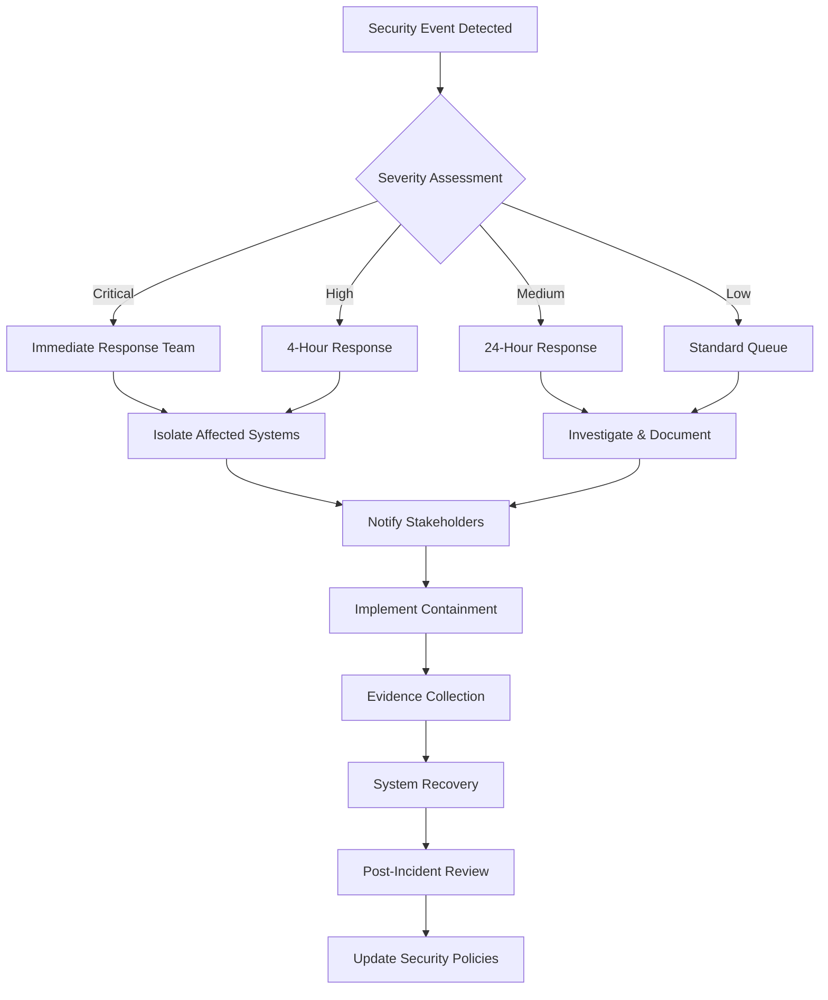

#### 7.3.2 Incident Classification & Response Times

| Severity | Impact | Response Time | Notification Required | Escalation Level |
|----------|--------|---------------|----------------------|------------------|
| **Critical** | Data breach, system compromise | 1 hour | MOTAC HQ, PDPA Authority | Director General |
| **High** | Unauthorized access, service outage | 4 hours | MOTAC HQ, IT Security | IT Director |
| **Medium** | Failed login attempts, minor vulnerabilities | 24 hours | IT Security Team | IT Manager |
| **Low** | Security warnings, policy violations | 72 hours | System Administrator | Team Lead |

### 7.4 Dasar Sanitisasi Data | Data Sanitization Policy

#### 7.4.1 Log Sanitization Rules

```php
// Log Sanitization Implementation
class LogSanitizer
{
    private $sensitivePatterns = [
        'password' => '/password["\']?\s*[:=]\s*["\']?([^"\'\s,}]+)/i',
        'token' => '/(?:token|bearer)["\']?\s*[:=]\s*["\']?([a-zA-Z0-9._-]+)/i',
        'email' => '/([a-zA-Z0-9._%+-]+@[a-zA-Z0-9.-]+\.[a-zA-Z]{2,})/i',
        'ic_number' => '/\b\d{6}-\d{2}-\d{4}\b/',
        'phone' => '/\+?6(?:01[02-46-9]|03|0[4-9]|1[1-9])\d{7,8}/',
    ];
    
    public function sanitize(string $logMessage): string
    {
        foreach ($this->sensitivePatterns as $type => $pattern) {
            $logMessage = preg_replace($pattern, $this->getReplacementMask($type), $logMessage);
        }
        
        return $logMessage;
    }
    
    private function getReplacementMask(string $type): string
    {
        return match($type) {
            'password' => 'password=***REDACTED***',
            'token' => 'token=***REDACTED***',
            'email' => '***EMAIL***',
            'ic_number' => '***IC***',
            'phone' => '***PHONE***',
            default => '***REDACTED***'
        };
    }
}
```

## 8. Prestasi & Keandalan | Performance & Reliability

### 8.1 Metrik Prestasi | Performance Metrics

#### 8.1.1 Service Level Objectives (SLO)

| Metric | Target | Measurement Method | Alert Threshold | Business Impact |
|--------|--------|-------------------|-----------------|-----------------|
| **API Response Time** | 95% < 2s | Application monitoring | >3s for 5 min | User experience degraded |
| **Database Query Time** | 99% < 500ms | Query profiling | >1s for queries | Dashboard slowdown |
| **File Upload Speed** | 10MB/min minimum | Transfer monitoring | <5MB/min | Data entry blocked |
| **Report Generation** | <30s for standard reports | Job queue monitoring | >60s | Business reporting delayed |
| **System Uptime** | 99.5% monthly | Infrastructure monitoring | <99% | Service unavailable |
| **Data Accuracy** | 99.9% | Data validation checks | <99.5% | Decision making impacted |

#### 8.1.2 Throughput & Concurrency Limits

```yaml
# Performance Configuration
performance_limits:
  api_endpoints:
    concurrent_requests: 200
    max_requests_per_second: 1000
    connection_pool_size: 50
    
  database:
    max_connections: 100
    connection_timeout: 30s
    query_timeout: 60s
    
  file_processing:
    max_file_size: "10MB"
    concurrent_uploads: 10
    processing_timeout: "5min"
    
  memory_limits:
    application: "512MB"
    background_jobs: "1GB"
    report_generation: "2GB"
```

### 8.2 Ujian Beban & Ketahanan | Load & Resilience Testing

#### 8.2.1 Load Testing Scenarios

| Test Scenario | Virtual Users | Duration | Success Criteria | Tools |
|---------------|---------------|----------|------------------|-------|
| **Normal Load** | 50 concurrent | 30 min | <2s response time | Artillery.js |
| **Peak Load** | 200 concurrent | 60 min | <5s response time | k6 |
| **Stress Test** | 500 concurrent | 15 min | System remains stable | JMeter |
| **Spike Test** | 0→300→0 users | 10 min | Graceful degradation | k6 |
| **Endurance Test** | 100 concurrent | 24 hours | No memory leaks | Custom scripts |

#### 8.2.2 Resilience Testing Implementation

```javascript
// k6 Load Testing Script
import http from 'k6/http';
import { check, sleep } from 'k6';

export let options = {
    stages: [
        { duration: '5m', target: 50 },   // Ramp up
        { duration: '10m', target: 100 }, // Stay at 100 users
        { duration: '5m', target: 200 },  // Ramp to 200 users
        { duration: '10m', target: 200 }, // Stay at 200 users
        { duration: '5m', target: 0 },    // Ramp down
    ],
    thresholds: {
        http_req_duration: ['p(95)<2000'], // 95% of requests under 2s
        http_req_failed: ['rate<0.01'],    // Error rate under 1%
    },
};

export default function() {
    let response = http.get('https://homestay.motac.gov.my/api/v1/homestays');
    
    check(response, {
        'status is 200': (r) => r.status === 200,
        'response time < 2s': (r) => r.timings.duration < 2000,
        'response size > 0': (r) => r.body.length > 0,
    });
    
    sleep(1);
}
```

### 8.3 Service Level Agreements | Service Level Agreements

#### 8.3.1 SLA Targets by Service Tier

| Service Tier | Uptime SLA | Response Time SLA | Support SLA | Compensation |
|--------------|------------|-------------------|-------------|--------------|
| **Critical (MOTAC HQ)** | 99.9% | <1s (95%ile) | 1-hour response | Service credits |
| **High (State Offices)** | 99.5% | <2s (95%ile) | 4-hour response | Priority support |
| **Standard (Cooperatives)** | 99.0% | <5s (95%ile) | 24-hour response | Standard support |
| **Public APIs** | 98.0% | <10s (95%ile) | Best effort | Community support |

#### 8.3.2 SLA Monitoring & Reporting

```php
// SLA Monitoring Service
class SlaMonitor
{
    public function calculateUptime(Carbon $start, Carbon $end): float
    {
        $totalMinutes = $start->diffInMinutes($end);
        $downtimeMinutes = $this->getDowntimeMinutes($start, $end);
        
        return (($totalMinutes - $downtimeMinutes) / $totalMinutes) * 100;
    }
    
    public function generateSlaReport(string $period): array
    {
        $start = Carbon::parse($period)->startOfMonth();
        $end = Carbon::parse($period)->endOfMonth();
        
        return [
            'period' => $period,
            'uptime_percentage' => $this->calculateUptime($start, $end),
            'average_response_time' => $this->getAverageResponseTime($start, $end),
            'total_requests' => $this->getTotalRequests($start, $end),
            'error_rate' => $this->getErrorRate($start, $end),
            'sla_breaches' => $this->getSlaBreaches($start, $end),
            'credits_owed' => $this->calculateServiceCredits($start, $end),
        ];
    }
}
```

## 9. Pemantauan & Audit | Monitoring & Audit

### 9.1 Pemantauan Kesihatan Sistem | System Health Monitoring

#### 9.1.1 Health Check Endpoints

```php
// Health Check Controller
class HealthController extends Controller
{
    public function basic(): JsonResponse
    {
        return response()->json([
            'status' => 'healthy',
            'timestamp' => now()->toISOString(),
            'version' => config('app.version'),
            'environment' => config('app.env'),
        ]);
    }
    
    public function detailed(): JsonResponse
    {
        $checks = [
            'database' => $this->checkDatabase(),
            'redis' => $this->checkRedis(),
            'storage' => $this->checkStorage(),
            'external_apis' => $this->checkExternalApis(),
            'queue' => $this->checkQueue(),
        ];
        
        $overall = collect($checks)->every(fn($check) => $check['status'] === 'healthy');
        
        return response()->json([
            'status' => $overall ? 'healthy' : 'degraded',
            'timestamp' => now()->toISOString(),
            'checks' => $checks,
        ], $overall ? 200 : 503);
    }
    
    private function checkDatabase(): array
    {
        try {
            DB::select('SELECT 1');
            $responseTime = DB::getQueryLog()[0]['time'] ?? 0;
            
            return [
                'status' => 'healthy',
                'response_time_ms' => $responseTime,
                'connection_count' => DB::select('SHOW STATUS LIKE "Threads_connected"')[0]->Value ?? 0,
            ];
        } catch (Exception $e) {
            return [
                'status' => 'unhealthy',
                'error' => $e->getMessage(),
            ];
        }
    }
}
```

#### 9.1.2 Monitoring Tools Configuration

```yaml
# Prometheus Configuration
global:
  scrape_interval: 15s
  evaluation_interval: 15s

scrape_configs:
  - job_name: 'homestay-api'
    static_configs:
      - targets: ['homestay.motac.gov.my:9090']
    metrics_path: '/metrics'
    scrape_interval: 30s
    
  - job_name: 'mysql'
    static_configs:
      - targets: ['mysql-exporter:9104']
      
  - job_name: 'redis'
    static_configs:
      - targets: ['redis-exporter:9121']

rule_files:
  - "homestay_alerts.yml"

alerting:
  alertmanagers:
    - static_configs:
        - targets: ['alertmanager:9093']
```

### 9.2 Dasar Penyimpanan Log | Log Retention Policy

#### 9.2.1 Log Categories & Retention

| Log Category | Retention Period | Storage Location | Access Level | Compression |
|--------------|------------------|------------------|--------------|-------------|
| **Security Logs** | 7 years | Encrypted archive | Security team only | GZIP after 30 days |
| **Audit Logs** | 7 years | WORM storage | Audit + Management | GZIP after 90 days |
| **Application Logs** | 1 year | Standard storage | Development team | GZIP after 7 days |
| **Performance Logs** | 6 months | Time-series DB | Operations team | Aggregated after 30 days |
| **Debug Logs** | 30 days | Local storage | Development only | No compression |
| **Access Logs** | 2 years | Standard storage | Operations team | GZIP after 30 days |

#### 9.2.2 Structured Logging Implementation

```php
// Structured Logging Service
class StructuredLogger
{
    public function logIntegrationEvent(string $event, array $context = []): void
    {
        Log::channel('integration')->info($event, [
            'timestamp' => now()->toISOString(),
            'correlation_id' => request()->header('X-Correlation-ID'),
            'user_id' => auth()->id(),
            'ip_address' => request()->ip(),
            'user_agent' => request()->userAgent(),
            'endpoint' => request()->fullUrl(),
            'method' => request()->method(),
            'response_time_ms' => $this->getResponseTime(),
            'memory_usage_mb' => memory_get_peak_usage(true) / 1024 / 1024,
            'context' => $context,
        ]);
    }
    
    public function logSecurityEvent(string $event, string $severity = 'info'): void
    {
        Log::channel('security')->log($severity, $event, [
            'timestamp' => now()->toISOString(),
            'session_id' => session()->getId(),
            'user_id' => auth()->id() ?? 'anonymous',
            'ip_address' => request()->ip(),
            'country' => $this->getCountryFromIp(request()->ip()),
            'threat_level' => $this->calculateThreatLevel($event),
            'stack_trace' => debug_backtrace(DEBUG_BACKTRACE_IGNORE_ARGS),
        ]);
    }
}
```

### 9.3 Hierarki Amaran | Alert Hierarchy

#### 9.3.1 Alert Escalation Matrix

| Alert Level | Initial Response | Escalation Time | Escalation Target | Communication Method |
|-------------|------------------|-----------------|-------------------|----------------------|
| **P1 - Critical** | On-call engineer | 15 minutes | Technical Lead | Phone + SMS + Email |
| **P2 - High** | DevOps team | 1 hour | Engineering Manager | Slack + Email |
| **P3 - Medium** | Support team | 4 hours | Team Lead | Email |
| **P4 - Low** | System notification | 24 hours | Daily standup | Email summary |

#### 9.3.2 Alert Configuration

```yaml
# Alertmanager Configuration
groups:
  - name: homestay.rules
    rules:
    - alert: HighErrorRate
      expr: rate(http_requests_total{status=~"5.."}[5m]) > 0.05
      for: 5m
      labels:
        severity: critical
      annotations:
        summary: "High error rate detected"
        description: "Error rate is {{ $value | humanizePercentage }}"
        
    - alert: DatabaseConnectionFailed
      expr: mysql_up == 0
      for: 1m
      labels:
        severity: critical
      annotations:
        summary: "Database connection failed"
        
    - alert: ApiResponseTimeSlow
      expr: histogram_quantile(0.95, rate(http_request_duration_seconds_bucket[5m])) > 2
      for: 10m
      labels:
        severity: warning
      annotations:
        summary: "API response time is slow"
```

## 10. Prosedur Ujian Integrasi | Integration Testing Procedures

### 10.1 Kriteria Penerimaan UAT | UAT Acceptance Criteria

#### 10.1.1 Functional Test Scenarios

| Test Category | Test Scenarios | Success Criteria | Responsible Party | Sign-off Required |
|---------------|----------------|------------------|-------------------|-------------------|
| **Authentication** | SSO login, token refresh, logout | 100% success rate | QA Team | Security Officer |
| **Data Sync** | MOTAC→Local, Local→MOTAC, conflict resolution | 99%+ accuracy | Business Analyst | Data Steward |
| **API Integration** | All external APIs, error handling, timeouts | <1% failure rate | Integration Team | Technical Lead |
| **Performance** | Load testing, stress testing, endurance | Meet SLA targets | DevOps Team | Infrastructure Manager |
| **Security** | Penetration testing, vulnerability scanning | Zero critical issues | Security Team | CISO |
| **Business Logic** | End-to-end workflows, reporting, calculations | 100% accuracy | Business Users | Business Owner |
| **Accessibility - Keyboard** | Complete import workflow (upload, mapping, validation, finalize) using keyboard-only (no mouse) | All steps operable via keyboard; no blockers | QA / Accessibility Specialist | QA Lead |
| **Accessibility - Screen Reader** | Dashboard chart accessibility: provide data summary/table and ensure screen reader reads summary | Screen reader presents summary; interactive chart controls labelled | QA / Accessibility Specialist | QA Lead |
| **Accessibility - Forms & Errors** | Form fields (import/filters/settings) have programmatic labels and errors linked via aria-describedby | Screen reader announces labels and errors; errors focusable and linked | QA / Accessibility Specialist | QA Lead |
| **Accessibility - MyGOV Identity** | Verify MyGOV Identity (SAML/OAuth2) authentication UI is fully keyboard accessible and conforms to `WCAG 2.1 AA` | Keyboard tab order logical; visible focus; errors announced via ARIA; no critical axe violations | QA / Accessibility Specialist | Security Officer |

#### 10.1.2 UAT Sign-off Process

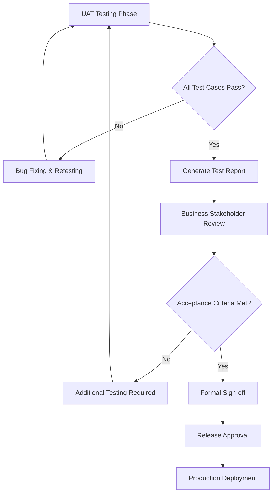

### 10.2 Cakupan Ujian Regresi | Regression Test Coverage

#### 10.2.1 Automated Test Suite

```php
// PHPUnit Integration Test Example
class IntegrationTestCase extends TestCase
{
    use RefreshDatabase;
    
    public function test_motac_api_sync_integration(): void
    {
        // Arrange
        $homestayData = factory(Homestay::class)->make()->toArray();
        Http::fake([
            'api.motac.gov.my/*' => Http::response(['status' => 'success'], 200)
        ]);
        
        // Act
        $response = $this->postJson('/api/v1/sync/motac', $homestayData);
        
        // Assert
        $response->assertStatus(200);
        $this->assertDatabaseHas('homestays', ['name' => $homestayData['name']]);
        Http::assertSent(function ($request) {
            return $request->url() === 'https://api.motac.gov.my/v1/homestays';
        });
    }
    
    public function test_state_api_error_handling(): void
    {
        // Test API timeout and retry mechanism
        Http::fake([
            'api.state.gov.my/*' => Http::sequence()
                ->push('', 500)  // First call fails
                ->push('', 500)  // Second call fails
                ->push(['status' => 'success'], 200)  // Third call succeeds
        ]);
        
        $response = $this->postJson('/api/v1/sync/state', ['state_id' => 'MY-01']);
        
        $response->assertStatus(200);
        Http::assertSentCount(3); // Verify retry mechanism
    }
}
```

#### 10.2.2 Test Data Management

```php
// Test Data Factory
class TestDataFactory
{
    public function createCompleteHomestayDataset(): array
    {
        return [
            'homestays' => factory(Homestay::class, 50)->create(),
            'cooperatives' => factory(Cooperative::class, 10)->create(),
            'performances' => factory(Performance::class, 200)->create(),
            'users' => factory(User::class, 20)->create(),
        ];
    }
    
    public function createEdgeCaseScenarios(): array
    {
        return [
            'invalid_state_codes' => ['XX-99', '', null],
            'boundary_values' => [
                'occupancy_rate' => [0, 100, 100.1, -1],
                'revenue' => [0, 999999.99, 1000000.00],
            ],
            'unicode_data' => [
                'names' => ['Test Homestay', 'Rumah Tamu صباح', '测试民宿'],
            ],
        ];
    }
}
```

### 10.3 Automasi Ujian | Test Automation

#### 10.3.1 CI/CD Pipeline Integration

```yaml
# GitHub Actions Workflow
name: Integration Tests
on: [push, pull_request]

jobs:
  integration-tests:
    runs-on: ubuntu-latest
    
    services:
      mysql:
        image: mysql:8.0
        env:
          MYSQL_ROOT_PASSWORD: password
          MYSQL_DATABASE: homestay_test
        ports:
          - 3306:3306
          
      redis:
        image: redis:6.2
        ports:
          - 6379:6379
    
    steps:
    - uses: actions/checkout@v2
    
    - name: Setup PHP
      uses: shivammathur/setup-php@v2
      with:
        php-version: 8.1
        extensions: pdo, mysql, redis
        
    - name: Install Dependencies
      run: composer install --no-progress --no-suggest --prefer-dist --optimize-autoloader
      
    - name: Setup Environment
      run: |
        cp .env.testing .env
        php artisan key:generate
        php artisan migrate --force
        
    - name: Run Integration Tests
      run: |
        php artisan test --testsuite=Integration --coverage-clover=coverage.xml
        
    - name: Run API Tests (Postman/Newman)
      run: |
        npm install -g newman
        newman run tests/postman/integration-tests.json \
          --environment tests/postman/test-environment.json \
          --reporters cli,json \
          --reporter-json-export test-results.json
          
    - name: Upload Test Results
      uses: actions/upload-artifact@v2
      with:
        name: test-results
        path: |
          coverage.xml
          test-results.json
```

#### 10.3.2 Postman/Newman API Testing

```json
{
  "info": {
    "name": "Homestay Integration Tests",
    "schema": "https://schema.getpostman.com/json/collection/v2.1.0/collection.json"
  },
  "item": [
    {
      "name": "Authentication Flow",
      "item": [
        {
          "name": "Login with Valid Credentials",
          "request": {
            "method": "POST",
            "url": "{{base_url}}/api/auth/login",
            "body": {
              "mode": "raw",
              "raw": "{\n  \"email\": \"{{test_email}}\",\n  \"password\": \"{{test_password}}\"\n}"
            }
          },
          "test": [
            "pm.test(\"Status code is 200\", function () {",
            "    pm.response.to.have.status(200);",
            "});",
            "pm.test(\"Response contains token\", function () {",
            "    var jsonData = pm.response.json();",
            "    pm.expect(jsonData.token).to.be.a('string');",
            "    pm.environment.set('auth_token', jsonData.token);",
            "});"
          ]
        }
      ]
    },
    {
      "name": "Data Synchronization",
      "item": [
        {
          "name": "Sync Homestay Data to MOTAC",
          "request": {
            "method": "POST",
            "url": "{{base_url}}/api/v1/sync/motac",
            "header": [
              {
                "key": "Authorization",
                "value": "Bearer {{auth_token}}"
              }
            ]
          },
          "test": [
            "pm.test(\"Sync successful\", function () {",
            "    pm.response.to.have.status(200);",
            "    var jsonData = pm.response.json();",
            "    pm.expect(jsonData.status).to.eql('success');",
            "});"
          ]
        }
      ]
    }
  ]
}
```

## 11. Risiko & Pelan Mitigasi | Risk & Mitigation Plan

### 11.1 Matriks Risiko Lengkap | Comprehensive Risk Matrix

| Risiko | Kebarangkalian | Impak | Skor Risiko | Pemilik PIC | Pelan Kontingensi | Status Pemantauan |
|--------|----------------|-------|-------------|-------------|------------------|-------------------|
| **Sambungan gagal ke API MOTAC** | Medium | High | 15 | DevOps Lead | Retry logic + fallback endpoint + alert | Active monitoring |
| **Format data berubah tanpa notis** | Low | Critical | 20 | Integration Team | API versioning + auto-detect + manual review | Quarterly review |
| **Beban server tinggi masa puncak** | High | Medium | 12 | Infrastructure Team | Auto-scaling + throttling + cache optimization | Real-time monitoring |
| **Data mismatch/sync error** | Medium | Medium | 9 | Data Steward | Conflict resolution + manual review + auto-retry | Daily validation |
| **Security breach/unauthorized access** | Low | Critical | 20 | Security Team | Incident response + access revocation + audit | 24/7 monitoring |
| **Database corruption** | Very Low | Critical | 15 | DBA Team | Backup restoration + data integrity checks | Automated backups |
| **API version deprecation** | Medium | High | 15 | Development Team | Version migration plan + testing + stakeholder communication | Version tracking |
| **Network connectivity issues** | High | Medium | 12 | Network Team | Multiple ISPs + VPN fallback + monitoring | Network monitoring |
| **Third-party service outage** | Medium | Medium | 9 | Vendor Management | Alternative providers + service redundancy | SLA monitoring |
| **Data compliance violation** | Low | Critical | 20 | Compliance Officer | PDPA audit + corrective action + training | Compliance audits |

### 11.2 Pelan Mitigasi Terperinci | Detailed Mitigation Plans

#### 11.2.1 API Connectivity Failures

**Primary Mitigation:**

```php
// Circuit Breaker with Fallback
class MotacApiService
{
    public function syncHomestayData(array $data): array
    {
        return $this->circuitBreaker->call(function() use ($data) {
            return $this->httpClient->post('/api/homestay', $data);
        }, 'motac-api')
        ->onFailure(function($exception) {
            // Fallback to local queue for later retry
            dispatch(new RetryMotacSyncJob($data))->delay(now()->addMinutes(5));
            return ['status' => 'queued_for_retry'];
        })
        ->onOpen(function() {
            // Alert operations team
            Notification::send(
                User::role('operations'),
                new ApiCircuitBreakerOpenNotification('motac-api')
            );
        });
    }
}
```

**Secondary Mitigation:**

- Maintain local data cache with 24-hour validity
- Implement batch retry mechanism during maintenance windows  
- Establish alternative communication channel (email/phone) for critical updates

#### 11.2.2 Data Format Changes

**Detection Mechanism:**

```php
class SchemaValidationService
{
    public function validateApiResponse(array $response, string $expectedSchema): bool
    {
        $validator = new JsonSchemaValidator();
        $result = $validator->validate($response, $expectedSchema);
        
        if (!$result->isValid()) {
            // Log schema mismatch with detailed information
            Log::critical('API Schema Mismatch Detected', [
                'expected_schema' => $expectedSchema,
                'actual_response' => $response,
                'validation_errors' => $result->getErrors(),
                'api_endpoint' => request()->url(),
                'timestamp' => now(),
            ]);
            
            // Send immediate alert to integration team
            Alert::send('integration-team', 'schema-mismatch', [
                'severity' => 'critical',
                'api' => $this->getApiName(),
                'errors' => $result->getErrors(),
            ]);
            
            return false;
        }
        
        return true;
    }
}
```

### 11.3 Pelan Pemulihan Bencana | Disaster Recovery Plan

#### 11.3.1 Senario Pemulihan | Recovery Scenarios

| Senario Bencana | RTO (Recovery Time) | RPO (Recovery Point) | Prosedur Pemulihan | Ujian Berkala |
|-----------------|---------------------|----------------------|-------------------|---------------|
| **Database corruption** | 4 hours | 1 hour | Restore from backup, validate data integrity | Monthly |
| **Application server failure** | 30 minutes | 0 minutes | Failover to secondary server | Weekly |
| **Data center outage** | 8 hours | 4 hours | Activate DR site, restore from backups | Quarterly |
| **Cyber attack** | 24 hours | 24 hours | Isolate systems, forensic analysis, rebuild | Semi-annually |
| **Network partition** | 1 hour | 0 minutes | Activate backup network, reroute traffic | Monthly |

#### 11.3.2 Recovery Procedures

```bash
#!/bin/bash
# Disaster Recovery Script
BACKUP_LOCATION="/mnt/backup"
DR_SITE="dr.homestay.motac.gov.my"
LOG_FILE="/var/log/disaster-recovery.log"

function log_event() {
    echo "$(date '+%Y-%m-%d %H:%M:%S') - $1" >> $LOG_FILE
}

function activate_dr_site() {
    log_event "Starting disaster recovery activation"
    
    # 1. Update DNS to point to DR site
    log_event "Updating DNS records"
    aws route53 change-resource-record-sets --hosted-zone-id Z123456 \
        --change-batch file://dr-dns-change.json
    
    # 2. Restore latest database backup
    log_event "Restoring database from backup"
    mysql -h $DR_SITE -u root -p$DB_PASSWORD < $BACKUP_LOCATION/latest-backup.sql
    
    # 3. Start application services
    log_event "Starting application services"
    ssh $DR_SITE "sudo systemctl start nginx php-fpm mysql redis"
    
    # 4. Run health checks
    log_event "Running health checks"
    curl -f http://$DR_SITE/health || exit 1
    
    # 5. Notify stakeholders
    log_event "Notifying stakeholders"
    php artisan notification:send --type=disaster-recovery-activated
    
    log_event "Disaster recovery activation completed"
}
```

## 12. Pelan Pemulihan | Recovery Plan

### 12.1 Trigger Kondisi Rollback | Rollback Trigger Conditions

#### 12.1.1 Automatic Rollback Triggers

| Trigger Condition | Threshold | Detection Time | Rollback Type | Approval Required |
|-------------------|-----------|----------------|---------------|-------------------|
| **Error Rate Spike** | >5% for 5 minutes | Real-time | Automatic | No |
| **Response Time Degradation** | >10s for 95%ile | 2 minutes | Automatic | No |
| **Database Connection Failures** | >50% failures | 1 minute | Automatic | No |
| **Integration API Failures** | >10% failures for 10 min | 5 minutes | Manual | Technical Lead |
| **Security Alert** | Critical vulnerability detected | Immediate | Manual | CISO |
| **Data Integrity Issues** | Data corruption detected | Variable | Manual | Data Steward |

#### 12.1.2 Rollback Decision Matrix

```php
class RollbackDecisionEngine
{
    public function shouldRollback(array $metrics): array
    {
        $score = 0;
        $reasons = [];
        
        // Check error rate
        if ($metrics['error_rate'] > 0.05) {
            $score += 40;
            $reasons[] = "High error rate: {$metrics['error_rate']}";
        }
        
        // Check response time
        if ($metrics['p95_response_time'] > 10000) {
            $score += 30;
            $reasons[] = "Slow response time: {$metrics['p95_response_time']}ms";
        }
        
        // Check integration health
        if ($metrics['integration_failure_rate'] > 0.1) {
            $score += 20;
            $reasons[] = "Integration failures: {$metrics['integration_failure_rate']}";
        }
        
        // Check user complaints
        if ($metrics['user_complaints'] > 10) {
            $score += 10;
            $reasons[] = "User complaints: {$metrics['user_complaints']}";
        }
        
        return [
            'should_rollback' => $score >= 70,
            'confidence_score' => min($score, 100),
            'reasons' => $reasons,
            'recommendation' => $this->getRecommendation($score),
        ];
    }
    
    private function getRecommendation(int $score): string
    {
        return match (true) {
            $score >= 90 => 'Immediate rollback required',
            $score >= 70 => 'Rollback recommended',
            $score >= 50 => 'Monitor closely, prepare for rollback',
            default => 'Continue monitoring'
        };
    }
}
```

### 12.2 Recovery Time & Point Objectives | Recovery Time & Point Objectives

#### 12.2.1 RTO/RPO Targets by Service Level

| Service Component | RTO Target | RPO Target | Backup Frequency | Testing Frequency |
|-------------------|------------|------------|------------------|-------------------|
| **Critical APIs** | 15 minutes | 5 minutes | Real-time replication | Daily |
| **Database** | 1 hour | 15 minutes | Every 15 minutes | Weekly |
| **Application Services** | 30 minutes | 1 hour | Hourly | Weekly |
| **File Storage** | 2 hours | 4 hours | Daily | Monthly |
| **Configuration** | 5 minutes | 0 minutes | Git-based versioning | On-demand |
| **Integration Configs** | 10 minutes | 5 minutes | Every 5 minutes | Daily |

#### 12.2.2 Recovery Process Automation

```yaml
# Ansible Rollback Playbook
- name: Application Rollback Procedure
  hosts: app_servers
  become: yes
  
  vars:
    rollback_version: "{{ previous_stable_version }}"
    backup_timestamp: "{{ ansible_date_time.epoch }}"
    
  tasks:
    - name: Create rollback checkpoint
      command: mysqldump --single-transaction homestay > /backup/pre-rollback-{{ backup_timestamp }}.sql
      
    - name: Stop application services
      systemd:
        name: "{{ item }}"
        state: stopped
      loop:
        - php-fpm
        - nginx
        - queue-worker
        
    - name: Rollback application code
      git:
        repo: https://github.com/motac/homestay-system.git
        dest: /var/www/homestay
        version: "{{ rollback_version }}"
        force: yes
        
    - name: Restore database to previous state
      mysql_db:
        name: homestay
        state: import
        target: "/backup/stable-{{ rollback_version }}.sql"
        
    - name: Clear application cache
      command: "{{ item }}"
      loop:
        - php artisan cache:clear
        - php artisan config:clear
        - php artisan route:clear
        
    - name: Start application services
      systemd:
        name: "{{ item }}"
        state: started
        enabled: yes
      loop:
        - mysql
        - redis
        - php-fpm
        - nginx
        - queue-worker
        
    - name: Run health checks
      uri:
        url: "http://{{ inventory_hostname }}/health"
        method: GET
        status_code: 200
      retries: 5
      delay: 10
```

### 12.3 Proses Penyelarasan Data | Data Reconciliation Process

#### 12.3.1 Post-Rollback Data Reconciliation

```php
class DataReconciliationService
{
    public function reconcileAfterRollback(Carbon $rollbackTime): array
    {
        $reconciliationReport = [
            'rollback_timestamp' => $rollbackTime,
            'data_loss_analysis' => $this->analyzeDataLoss($rollbackTime),
            'conflicts_detected' => $this->detectConflicts($rollbackTime),
            'recovery_actions' => $this->planRecoveryActions($rollbackTime),
        ];
        
        // Log the reconciliation process
        Log::info('Data reconciliation started', $reconciliationReport);
        
        return $reconciliationReport;
    }
    
    private function analyzeDataLoss(Carbon $rollbackTime): array
    {
        return [
            'homestays_lost' => Homestay::where('created_at', '>', $rollbackTime)->count(),
            'performances_lost' => Performance::where('created_at', '>', $rollbackTime)->count(),
            'users_lost' => User::where('created_at', '>', $rollbackTime)->count(),
            'total_transactions_lost' => $this->countTransactionsSince($rollbackTime),
        ];
    }
    
    private function detectConflicts(Carbon $rollbackTime): array
    {
        // Detect conflicts between rollback state and external systems
        return [
            'motac_api_conflicts' => $this->checkMotacApiConflicts($rollbackTime),
            'state_api_conflicts' => $this->checkStateApiConflicts($rollbackTime),
            'user_session_conflicts' => $this->checkUserSessionConflicts($rollbackTime),
        ];
    }
    
    private function planRecoveryActions(Carbon $rollbackTime): array
    {
        return [
            'immediate_actions' => [
                'Notify affected users of temporary data loss',
                'Queue data re-import from external sources',
                'Verify system integrity',
            ],
            'short_term_actions' => [
                'Manual data recovery for critical records',
                'Incremental sync with external APIs',
                'User notification of service restoration',
            ],
            'long_term_actions' => [
                'Review rollback procedures',
                'Improve backup frequency',
                'Enhance monitoring and alerting',
            ],
        ];
    }
}
```

## 13. Lampiran | Appendices

### 13.1 Contoh Spesifikasi API | API Specification Examples

#### 13.1.1 OpenAPI (Swagger) Specification Sample

```yaml
openapi: 3.0.3
info:
  title: Homestay Management API
  description: Integration API for MOTAC Homestay Management System
  version: 1.2.0
  contact:
    name: MOTAC IT Support
    email: it-support@motac.gov.my
    url: https://homestay.motac.gov.my/support
  license:
    name: Government of Malaysia
    
servers:
  - url: https://homestay.motac.gov.my/api/v1
    description: Production server
  - url: https://staging.homestay.motac.gov.my/api/v1
    description: Staging server
    
security:
  - BearerAuth: []
  - ApiKeyAuth: []
  
paths:
  /homestays:
    get:
      summary: List all homestays
      description: Retrieve a paginated list of homestays with filtering options
      tags:
        - Homestays
      parameters:
        - name: state_code
          in: query
          description: Filter by state code (MY-01 to MY-16)
          schema:
            type: string
            pattern: '^MY-[0-1][0-6]$'
        - name: page
          in: query
          description: Page number for pagination
          schema:
            type: integer
            minimum: 1
            default: 1
        - name: per_page
          in: query
          description: Number of items per page
          schema:
            type: integer
            minimum: 1
            maximum: 100
            default: 20
      responses:
        '200':
          description: Successful response
          content:
            application/json:
              schema:
                type: object
                properties:
                  data:
                    type: array
                    items:
                      $ref: '#/components/schemas/Homestay'
                  meta:
                    $ref: '#/components/schemas/PaginationMeta'
        '400':
          $ref: '#/components/responses/BadRequest'
        '401':
          $ref: '#/components/responses/Unauthorized'
        '429':
          $ref: '#/components/responses/RateLimited'
          
    post:
      summary: Create new homestay
      description: Create a new homestay record
      tags:
        - Homestays
      requestBody:
        required: true
        content:
          application/json:
            schema:
              $ref: '#/components/schemas/HomestayCreate'
      responses:
        '201':
          description: Homestay created successfully
          content:
            application/json:
              schema:
                $ref: '#/components/schemas/Homestay'
        '400':
          $ref: '#/components/responses/BadRequest'
        '422':
          $ref: '#/components/responses/ValidationError'

components:
  schemas:
    Homestay:
      type: object
      properties:
        id:
          type: string
          example: "HS001"
        name:
          type: string
          example: "Rumah Tamu Kampung Indah"
        state_code:
          type: string
          pattern: '^MY-[0-1][0-6]$'
          example: "MY-01"
        cooperative_id:
          type: string
          nullable: true
          example: "COOP001"
        location:
          $ref: '#/components/schemas/Location'
        capacity:
          $ref: '#/components/schemas/Capacity'
        status:
          type: string
          enum: [active, inactive, suspended]
        created_at:
          type: string
          format: date-time
        updated_at:
          type: string
          format: date-time
      required:
        - id
        - name
        - state_code
        - location
        - capacity
        - status
        
  securitySchemes:
    BearerAuth:
      type: http
      scheme: bearer
      bearerFormat: JWT
    ApiKeyAuth:
      type: apiKey
      in: header
      name: X-API-Key
      
  responses:
    BadRequest:
      description: Bad request - invalid parameters
      content:
        application/json:
          schema:
            $ref: '#/components/schemas/Error'
            
    Unauthorized:
      description: Unauthorized - invalid or missing authentication
      content:
        application/json:
          schema:
            $ref: '#/components/schemas/Error'
```

### 13.2 Diagram Urutan Integrasi | Integration Sequence Diagrams

#### 13.2.1 Homestay Data Sync Flow

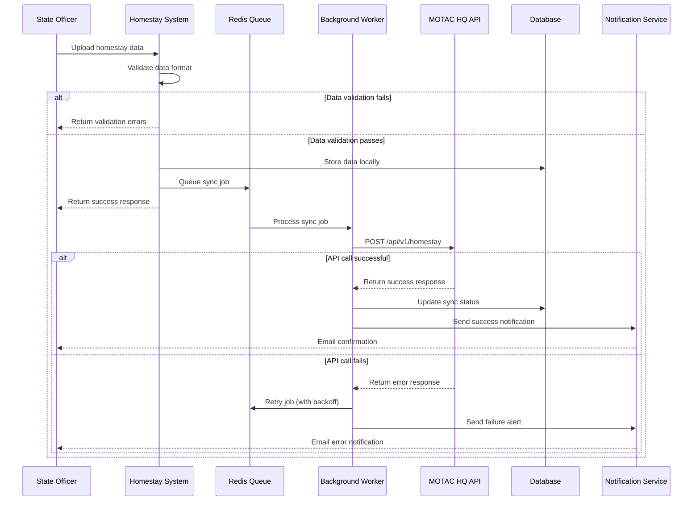

#### 13.2.2 Real-time Dashboard Update Flow

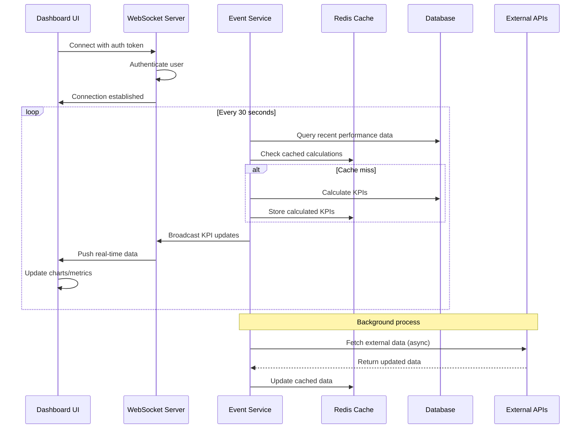

### 13.3 Senarai Semak Kesiapan Integrasi | Integration Readiness Checklist

#### 13.3.1 Pre-Integration Checklist

```markdown
## Technical Readiness
- [ ] API documentation complete and reviewed
- [ ] OpenAPI specification validated
- [ ] Authentication mechanism implemented and tested
- [ ] Rate limiting configured and tested
- [ ] Error handling implemented for all endpoints
- [ ] Input validation rules defined and implemented
- [ ] Output schema validation implemented
- [ ] Logging and monitoring configured
- [ ] Health check endpoints implemented
- [ ] Circuit breaker pattern implemented

## Security Readiness
- [ ] Security review completed
- [ ] Penetration testing performed
- [ ] PDPA compliance assessment passed
- [ ] Data encryption implemented (at rest and in transit)
- [ ] Access control matrix defined and implemented
- [ ] API keys generated and securely distributed
- [ ] SSL certificates installed and verified
- [ ] Security headers configured
- [ ] Audit logging implemented
- [ ] Incident response plan activated

## Operational Readiness  
- [ ] Monitoring dashboards configured
- [ ] Alerting rules defined and tested
- [ ] Backup procedures verified
- [ ] Disaster recovery plan tested
- [ ] Performance baselines established
- [ ] Load testing completed
- [ ] Capacity planning reviewed
- [ ] Support documentation prepared
- [ ] Escalation procedures defined
- [ ] Change management process established

## Business Readiness
- [ ] UAT scenarios defined and tested
- [ ] Business stakeholder sign-off obtained
- [ ] Training materials prepared
- [ ] User communication plan executed
- [ ] Go-live checklist prepared
- [ ] Rollback procedures tested
- [ ] Success criteria defined
- [ ] Post-implementation review scheduled
```

### 13.4 Template Laporan Ujian Integrasi | Integration Test Report Template

```markdown
# Integration Test Report
**Project:** Homestay Management System Integration  
**Test Period:** [Start Date] to [End Date]  
**Report Date:** [Report Date]  
**Prepared By:** [QA Team Name]

## Executive Summary
- **Overall Status:** [PASS/FAIL/CONDITIONAL PASS]
- **Test Completion Rate:** [X%]
- **Defect Summary:** [X Critical, Y High, Z Medium, W Low]
- **Recommendation:** [GO/NO-GO for production]

## Test Scope
### In-Scope Integrations
- [ ] MOTAC HQ API Integration
- [ ] State Office APIs
- [ ] MyGOV Identity Provider
- [ ] Google Maps API
- [ ] Email/SMS Gateway
- [ ] Internal Module Integrations

### Test Categories
- [ ] Functional Testing
- [ ] Performance Testing  
- [ ] Security Testing
- [ ] Error Handling Testing
- [ ] Data Integrity Testing
- [ ] Compliance Testing

## Test Results Summary
| Test Category | Total Tests | Passed | Failed | Blocked | Pass Rate |
|---------------|-------------|--------|--------|---------|-----------|
| Functional | 125 | 120 | 3 | 2 | 96% |
| Performance | 45 | 42 | 2 | 1 | 93% |
| Security | 35 | 33 | 1 | 1 | 94% |
| Integration | 85 | 80 | 4 | 1 | 94% |
| **TOTAL** | **290** | **275** | **10** | **5** | **95%** |

## Detailed Test Results
### Critical Defects
1. **DEF-001:** Authentication token expires during long-running operations
   - **Severity:** Critical
   - **Status:** Open
   - **Impact:** Users forced to re-login during data uploads
   - **Workaround:** Implement auto-refresh mechanism

### High Priority Defects
1. **DEF-002:** Rate limiting too aggressive for bulk operations
   - **Severity:** High  
   - **Status:** Fixed
   - **Impact:** Bulk data sync operations fail
   - **Resolution:** Increased rate limits for authenticated bulk operations

## Performance Test Results
- **Average Response Time:** 1.2 seconds (Target: <2s) ✅
- **95th Percentile Response Time:** 3.1 seconds (Target: <5s) ✅
- **Throughput:** 850 requests/minute (Target: >500/min) ✅
- **Concurrent Users:** 150 (Target: >100) ✅
- **Error Rate:** 0.8% (Target: <1%) ✅

## Security Test Results
- **Vulnerability Scan:** No critical vulnerabilities found
- **Penetration Test:** Passed with minor recommendations
- **PDPA Compliance:** Compliant with all requirements
- **Data Encryption:** All sensitive data properly encrypted
- **Access Control:** RBAC properly implemented and tested

## Recommendations
### For Production Release
1. Fix critical defect DEF-001 before go-live
2. Monitor authentication token refresh mechanism
3. Implement additional monitoring for bulk operations
4. Conduct final security review

### Post-Release Monitoring
1. Monitor API response times during first week
2. Track error rates and user complaints  
3. Review security logs daily for first month
4. Conduct performance review after 30 days

## Sign-off
| Role | Name | Signature | Date |
|------|------|-----------|------|
| QA Lead | [Name] | [Signature] | [Date] |
| Technical Lead | [Name] | [Signature] | [Date] |
| Security Officer | [Name] | [Signature] | [Date] |
| Business Owner | [Name] | [Signature] | [Date] |
```

---

## Akhir Dokumen | End of Document

### Dokumen Lengkap | Document Complete

*Versi: 1.1*  
*Tarikh Kemaskini: 12 Oktober 2025*  
*Disediakan oleh: Pasukan Pembangunan Sistem MOTAC*  
*Disemak oleh: BPM MOTAC*  
*Diluluskan oleh: Ketua Bahagian JPK MOTAC*

*Version: 1.1*  
*Last Updated: 12 October 2025*  
*Prepared by: MOTAC System Development Team*  
*Reviewed by: MOTAC BPM*  
*Approved by: MOTAC JPK Division Head*

**Pematuhan Standard | Standards Compliance:**

- ✅ IEEE 12207:2017 - Systems and Software Engineering (Integration Process)
- ✅ ISO/IEC 27001:2022 - Information Security Management (Secure System Interfaces)  
- ✅ MOTAC BPM Guidelines for System Integration
- ✅ PDPA 2010 - Personal Data Protection Act
- ✅ MyGOV ICT Security Policy

**Status Dokumen | Document Status:** Audit-Ready | Siap Audit
