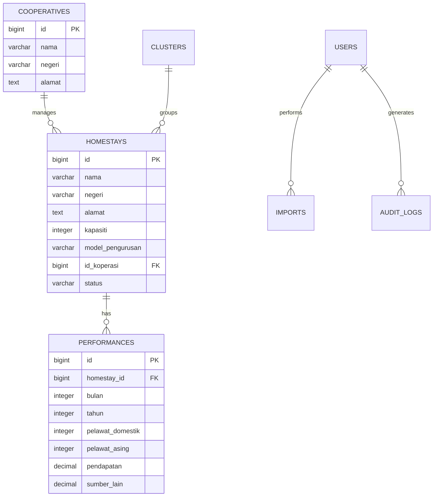
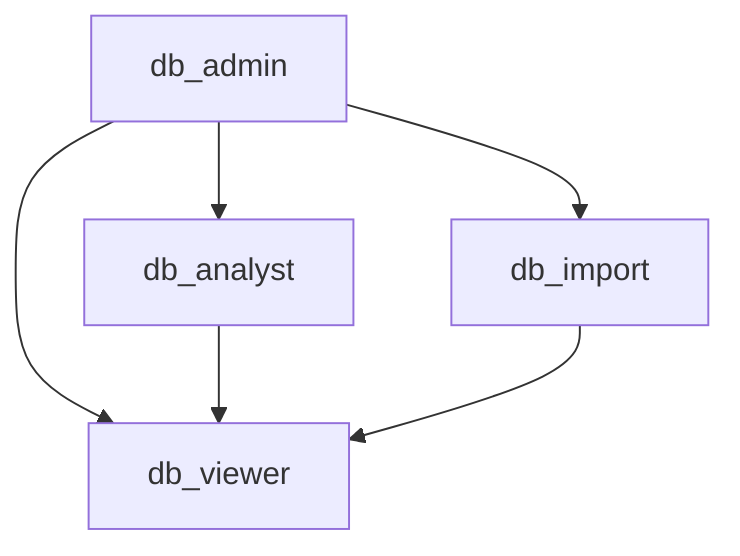
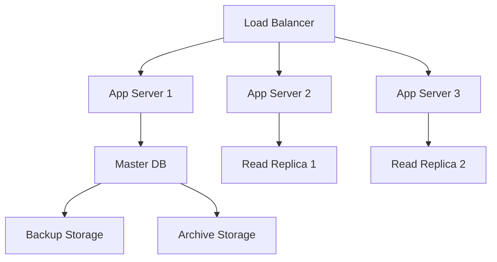
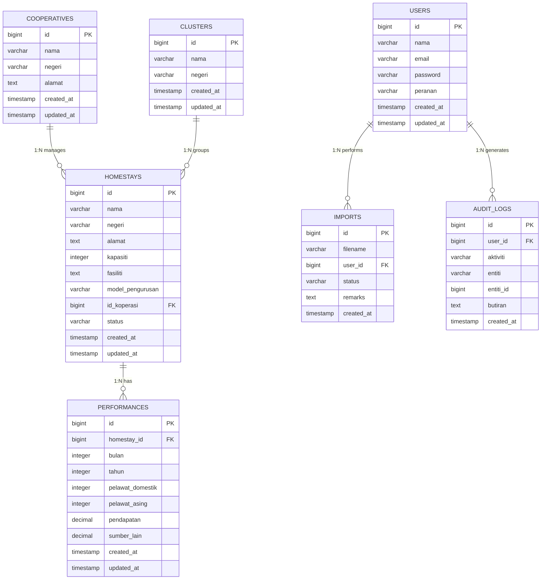

# Dokumentasi Pangkalan Data | Database Documentation

**Sistem | System:** Sistem Pengurusan & Analitik Homestay Malaysia
**Pemilik Sistem | System Owner:** MOTAC, Tourism Malaysia
**Kod Dokumen | Document Code:** IT/DDB/HSM/2025/01
**Versi Dokumen | Document Version:** 1.0
**Tarikh | Date:** 11 Oktober 2025
**Klasifikasi | Classification:** Sulit | Confidential

## Kawalan Dokumen & Agihan | Document Control & Distribution

| Tahap Kelulusan | Approval Stage | Tarikh | Oleh | Status |
|-----------------|----------------|--------|------|--------|
| Draf | Draft | 11 Okt 2025 | Tim Pembangun | Selesai |
| Semakan BPM | BPM Review | 12 Okt 2025 | BPM MOTAC | Dalam Semakan |
| Kelulusan JPK | JPK Approval | [TBD] | JPK MOTAC | Belum Lulus |
| Arkib | Archived | [TBD] | MOTAC IT | - |

**Senarai Agihan | Distribution List:**

- Ketua Bahagian JPK MOTAC
- BPM MOTAC
- Pasukan Pembangunan Sistem MOTAC
- Tourism Malaysia IT
- DBA & Infrastruktur MOTAC
- Audit & Kepatuhan MOTAC

---

---

## Jadual Versi | Version History

| Versi | Tarikh | Perubahan | Penyedia | Disemak Oleh | Diluluskan Oleh |
|-------|--------|-----------|----------|--------------|-----------------|
| 1.0   | 11 Okt 2025 | Draf awal dokumentasi pangkalan data | Tim Pembangun | BPM MOTAC | JPK MOTAC |

---

## Rujukan Dokumen | Document References

Dokumen ini berkaitan dengan spesifikasi berikut:

- **D03** - Spesifikasi Keperluan Sistem (System Requirements Specification)
- **D04** - Dokumen Reka Bentuk Sistem (System Design Document)  
- **D05** - Pelan Migrasi Data (Data Migration Plan)
- **D06** - Spesifikasi Migrasi Data (Data Migration Specification)
- **D07** - Pelan Integrasi Sistem (System Integration Plan)
- **D10** - Dokumentasi Kod Sumber (Source Code Documentation)

---

## 1. Tujuan | Purpose

Dokumen ini menerangkan struktur, hubungan, dan piawaian utama bagi pangkalan data Sistem Pengurusan & Analitik Homestay Malaysia. Ia bertujuan menjadi rujukan utama bagi pembangun, pentadbir sistem, dan pihak berkepentingan dalam:

- **Pembangunan sistem**: Panduan struktur data dan hubungan
- **Penyelenggaraan**: Prosedur backup, recovery, dan optimisasi
- **Audit dan kepatuhan**: Dokumentasi untuk audit PDPA dan keselamatan
- **Integrasi**: Spesifikasi untuk integrasi dengan sistem luaran

---

## 1A. Persekitaran & Penempatan Pangkalan Data | Database Environment & Deployment

### 1A.1 Spesifikasi Persekitaran | Environment Specifications

| Persekitaran | Hostname | DBMS | Storage Path | Backup Location | Retention |
|--------------|----------|------|-------------|----------------|----------|
| **Dev** | db-dev.homestay.motac.gov.my | MySQL 8.0 | /var/lib/mysql | /backup/dev | 7 hari |
| **Staging** | db-stg.homestay.motac.gov.my | MySQL 8.0 | /var/lib/mysql | /backup/staging | 14 hari |
| **Production** | db-prd.homestay.motac.gov.my | MySQL 8.0 | /var/lib/mysql | /backup/production | 30 hari |

### 1A.2 Konfigurasi Rangkaian & Akses | Network & Access Configuration

- Semua host hanya boleh diakses melalui VPN MOTAC
- Port DB: 3306 (firewall whitelist by environment)
- Backup direplikasi ke MOTAC Data Centre (off-site)

### 1A.3 Integrasi CI/CD | CI/CD Integration

- Laravel migration auto-deployment melalui GitHub Actions
- Setiap commit ke branch `main` akan trigger migrasi automatik ke staging
- Deploy ke production memerlukan kelulusan manual (JPK)

```yaml
# .github/workflows/laravel-migrate.yml (excerpt)
jobs:
    migrate:
        runs-on: ubuntu-latest
        steps:
            - uses: actions/checkout@v3
            - name: Setup PHP
                uses: shivammathur/setup-php@v2
                with:
                    php-version: '8.2'
            - name: Run Migrations
                run: php artisan migrate --force
                env:
                    DB_HOST: ${{ secrets.DB_HOST }}
                    DB_DATABASE: ${{ secrets.DB_DATABASE }}
                    DB_USERNAME: ${{ secrets.DB_USERNAME }}
                    DB_PASSWORD: ${{ secrets.DB_PASSWORD }}
```

---

---

## 2. Objektif & Skop | Objectives & Scope

### 2.1 Objektif Pangkalan Data

Pangkalan data Sistem Homestay Malaysia direka untuk:

- **Penyimpanan terpusat**: Data Homestay, koperasi, dan prestasi di peringkat nasional
- **Analitik prestasi**: Membolehkan analisis trend pelawat dan pendapatan
- **Integrasi data**: Menyokong import dari Excel dan integrasi API masa hadapan
- **Audit dan kepatuhan**: Mematuhi PDPA 2010 dan piawaian kerajaan

### 2.2 Skop Coverage

| Peringkat | Liputan | Contoh |
|-----------|---------|---------|
| **Nasional** | Agregasi prestasi semua negeri | Dashboard eksekutif MOTAC |
| **Negeri** | Prestasi Homestay mengikut negeri | Laporan negeri Selangor |
| **Koperasi** | Homestay di bawah koperasi tertentu | Koperasi ABC Sdn Bhd |
| **Kluster** | Kumpulan Homestay bertema | Kluster Eco-Tourism |
| **Individu** | Data Homestay spesifik | Homestay Seri Kenangan |

### 2.3 Sempadan Sistem

- **Data dalaman**: Homestay, koperasi, prestasi, pengguna
- **Data luaran**: Import Excel bulanan, integrasi API MOTAC
- **Tidak termasuk**: Data pembayaran, booking real-time

---

## 3. Gambaran Umum Reka Bentuk | Design Overview

### 3.1 Spesifikasi Teknikal

- **Jenis DBMS:** MySQL 8.0 / MariaDB 10.6+
- **Model Data:** Relasi (Relational) - Third Normal Form (3NF)
- **Charset:** UTF-8 (utf8mb4)
- **Collation:** utf8mb4_unicode_ci
- **Storage Engine:** InnoDB
- **Pematuhan:** Laravel migration best practices, foreign key constraints

### 3.2 Reka Bentuk Logik

Sistem menggunakan model bintang (star schema) yang dimodifikasi untuk analitik:

- **Fact Table**: `performances` (data prestasi bulanan)
- **Dimension Tables**: `homestays`, `cooperatives`, `clusters`
- **Lookup Tables**: `users`, `imports`, `audit_logs`

### 3.3 Reka Bentuk Fizikal

| Komponen | Spesifikasi | Justifikasi |
|----------|-------------|-------------|
| **Primary Keys** | BIGINT AUTO_INCREMENT | Sokongan untuk jutaan rekod |
| **Foreign Keys** | BIGINT dengan constraint | Integriti rujukan |
| **Timestamps** | TIMESTAMP DEFAULT CURRENT_TIMESTAMP | Audit trail automatik |
| **Text Fields** | VARCHAR(255) / TEXT | Optimum untuk carian |

---

## 4. Piawaian Penamaan | Naming Standards

### 4.1 Konvensyen Jadual

- **Format**: Plural, lowercase, underscore separator
- **Contoh**: `homestays`, `cooperatives`, `audit_logs`
- **Prefix**: Tiada prefix jadual

### 4.2 Konvensyen Medan

- **Format**: Snake_case, descriptive
- **Contoh**: `nama`, `alamat`, `pelawat_domestik`
- **Boolean**: Prefix `is_` atau `has_` (contoh: `is_active`)
- **Foreign Key**: `{table_name}_id` (contoh: `homestay_id`)

### 4.3 Konvensyen Constraint dan Index

| Jenis | Format | Contoh |
|-------|--------|--------|
| **Primary Key** | `pk_{table}` | `pk_homestays` |
| **Foreign Key** | `fk_{child}_{parent}` | `fk_homestays_cooperatives` |
| **Index** | `idx_{table}_{field}` | `idx_homestays_negeri` |
| **Unique** | `uk_{table}_{field}` | `uk_users_email` |

---

## 5. Kamus Data | Data Dictionary

### 5.1 Jadual homestays

| Medan | Jenis | Saiz | Null | Default | Keterangan | Contoh |
|-------|-------|------|------|---------|------------|--------|
| id | BIGINT | - | No | AUTO_INCREMENT | Primary key unik | 1 |
| nama | VARCHAR | 255 | No | - | Nama Homestay | "Homestay Seri Kenangan" |
| negeri | VARCHAR | 50 | No | - | Kod negeri Malaysia | "Selangor", "Johor" |
| alamat | TEXT | - | Yes | NULL | Alamat penuh | "123, Jalan Mawar, Taman Seri" |
| kapasiti | INTEGER | - | No | 0 | Kapasiti maksimum tetamu | 20 |
| fasiliti | TEXT | - | Yes | NULL | Senarai fasiliti JSON/Text | "WiFi, AC, Parking" |
| model_pengurusan | ENUM | - | No | - | Model operasi | "koperasi", "individu" |
| id_koperasi | BIGINT | - | Yes | NULL | FK ke cooperatives | 5 |
| status | ENUM | - | No | 'Aktif' | Status operasi | "Aktif", "Tidak Aktif" |
| created_at | TIMESTAMP | - | No | CURRENT_TIMESTAMP | Tarikh rekod dicipta | 2025-10-11 14:30:00 |
| updated_at | TIMESTAMP | - | No | CURRENT_TIMESTAMP ON UPDATE | Tarikh kemaskini | 2025-10-11 15:45:00 |

### 5.2 Jadual cooperatives

| Medan | Jenis | Saiz | Null | Default | Keterangan | Contoh |
|-------|-------|------|------|---------|------------|--------|
| id | BIGINT | - | No | AUTO_INCREMENT | Primary key unik | 1 |
| nama | VARCHAR | 255 | No | - | Nama koperasi | "Koperasi Homestay Selangor" |
| negeri | VARCHAR | 50 | No | - | Kod negeri | "Selangor" |
| alamat | TEXT | - | Yes | NULL | Alamat koperasi | "Pusat Dagangan, Shah Alam" |
| created_at | TIMESTAMP | - | No | CURRENT_TIMESTAMP | Tarikh rekod dicipta | 2025-10-11 14:30:00 |
| updated_at | TIMESTAMP | - | No | CURRENT_TIMESTAMP ON UPDATE | Tarikh kemaskini | 2025-10-11 15:45:00 |

### 5.3 Jadual clusters

| Medan | Jenis | Saiz | Null | Default | Keterangan | Contoh |
|-------|-------|------|------|---------|------------|--------|
| id | BIGINT | - | No | AUTO_INCREMENT | Primary key unik | 1 |
| nama | VARCHAR | 255 | No | - | Nama kluster | "Eco-Tourism Pahang" |
| negeri | VARCHAR | 50 | No | - | Kod negeri | "Pahang" |
| created_at | TIMESTAMP | - | No | CURRENT_TIMESTAMP | Tarikh rekod dicipta | 2025-10-11 14:30:00 |
| updated_at | TIMESTAMP | - | No | CURRENT_TIMESTAMP ON UPDATE | Tarikh kemaskini | 2025-10-11 15:45:00 |

### 5.4 Jadual performances

| Medan | Jenis | Saiz | Null | Default | Keterangan | Contoh |
|-------|-------|------|------|---------|------------|--------|
| id | BIGINT | - | No | AUTO_INCREMENT | Primary key unik | 1 |
| homestay_id | BIGINT | - | No | - | FK ke homestays | 15 |
| bulan | INTEGER | - | No | - | Bulan (1-12) | 10 |
| tahun | INTEGER | - | No | - | Tahun | 2025 |
| pelawat_domestik | INTEGER | - | No | 0 | Jumlah pelawat tempatan | 150 |
| pelawat_asing | INTEGER | - | No | 0 | Jumlah pelawat antarabangsa | 25 |
| pendapatan | DECIMAL | 15,2 | No | 0.00 | Pendapatan bulanan (RM) | 15000.50 |
| sumber_lain | DECIMAL | 15,2 | No | 0.00 | Pendapatan lain (RM) | 2500.00 |
| created_at | TIMESTAMP | - | No | CURRENT_TIMESTAMP | Tarikh rekod dicipta | 2025-10-11 14:30:00 |
| updated_at | TIMESTAMP | - | No | CURRENT_TIMESTAMP ON UPDATE | Tarikh kemaskini | 2025-10-11 15:45:00 |

---

## 6. Kunci & Hubungan | Keys & Relationships

### 6.1 Primary Keys

| Jadual | Primary Key | Jenis | Keterangan |
|--------|-------------|-------|------------|
| homestays | id | BIGINT AUTO_INCREMENT | Pengenal unik Homestay |
| cooperatives | id | BIGINT AUTO_INCREMENT | Pengenal unik koperasi |
| clusters | id | BIGINT AUTO_INCREMENT | Pengenal unik kluster |
| performances | id | BIGINT AUTO_INCREMENT | Pengenal unik prestasi |
| users | id | BIGINT AUTO_INCREMENT | Pengenal unik pengguna |
| imports | id | BIGINT AUTO_INCREMENT | Pengenal unik import |
| audit_logs | id | BIGINT AUTO_INCREMENT | Pengenal unik log audit |

### 6.2 Foreign Keys & Constraints

| Constraint | Jadual Anak | Medan | Jadual Induk | Medan Rujukan | Cardinality | On Delete | On Update |
|------------|-------------|-------|--------------|---------------|-------------|-----------|-----------|
| fk_homestays_cooperatives | homestays | id_koperasi | cooperatives | id | N:1 | SET NULL | CASCADE |
| fk_performances_homestays | performances | homestay_id | homestays | id | N:1 | CASCADE | CASCADE |
| fk_imports_users | imports | user_id | users | id | N:1 | RESTRICT | CASCADE |
| fk_audit_logs_users | audit_logs | user_id | users | id | N:1 | RESTRICT | CASCADE |

### 6.3 Unique Constraints

| Jadual | Medan | Constraint Name | Keterangan |
|--------|-------|-----------------|------------|
| users | email | uk_users_email | Email unik untuk setiap pengguna |
| performances | homestay_id, bulan, tahun | uk_performances_monthly | Satu rekod prestasi per Homestay per bulan |

### 6.4 Hubungan Antara Entiti



---

## 7. Indeks, View & Prosedur | Indexes, Views & Procedures

### 7.1 Senarai Indeks

| Nama Index | Jadual | Medan | Jenis | Tujuan |
|------------|--------|-------|-------|--------|
| idx_homestays_negeri | homestays | negeri | BTREE | Carian mengikut negeri |
| idx_homestays_status | homestays | status | BTREE | Filter Homestay aktif |
| idx_performances_month_year | performances | bulan, tahun | BTREE | Laporan bulanan/tahunan |
| idx_performances_homestay_period | performances | homestay_id, tahun, bulan | BTREE | Trend prestasi Homestay |
| idx_audit_logs_created | audit_logs | created_at | BTREE | Carian log mengikut tarikh |
| idx_users_email | users | email | UNIQUE | Login dan autentikasi |

### 7.2 Database Views

#### 7.2.1 view_homestay_summary

Ringkasan prestasi Homestay dengan maklumat koperasi:

```sql
CREATE VIEW view_homestay_summary AS
SELECT 
    h.id,
    h.nama as homestay_nama,
    h.negeri,
    c.nama as koperasi_nama,
    h.kapasiti,
    h.status,
    COUNT(p.id) as jumlah_laporan,
    SUM(p.pelawat_domestik + p.pelawat_asing) as total_pelawat,
    SUM(p.pendapatan + p.sumber_lain) as total_pendapatan
FROM homestays h
LEFT JOIN cooperatives c ON h.id_koperasi = c.id
LEFT JOIN performances p ON h.id = p.homestay_id
GROUP BY h.id, h.nama, h.negeri, c.nama, h.kapasiti, h.status;
```

#### 7.2.2 view_monthly_performance

Agregasi prestasi bulanan keseluruhan:

```sql
CREATE VIEW view_monthly_performance AS
SELECT 
    tahun,
    bulan,
    COUNT(DISTINCT homestay_id) as jumlah_homestay_aktif,
    SUM(pelawat_domestik) as total_pelawat_domestik,
    SUM(pelawat_asing) as total_pelawat_asing,
    SUM(pendapatan) as total_pendapatan,
    AVG(pendapatan) as purata_pendapatan
FROM performances
GROUP BY tahun, bulan
ORDER BY tahun DESC, bulan DESC;
```

### 7.3 Stored Procedures

#### 7.3.1 sp_generate_monthly_report

Prosedur untuk menjana laporan bulanan:

```sql
DELIMITER //
CREATE PROCEDURE sp_generate_monthly_report(
    IN p_tahun INT,
    IN p_bulan INT,
    IN p_negeri VARCHAR(50)
)
BEGIN
    SELECT 
        h.nama as homestay,
        h.negeri,
        c.nama as koperasi,
        p.pelawat_domestik,
        p.pelawat_asing,
        p.pendapatan,
        (p.pelawat_domestik + p.pelawat_asing) as total_pelawat
    FROM homestays h
    LEFT JOIN cooperatives c ON h.id_koperasi = c.id
    INNER JOIN performances p ON h.id = p.homestay_id
    WHERE p.tahun = p_tahun 
        AND p.bulan = p_bulan
        AND (p_negeri IS NULL OR h.negeri = p_negeri)
    ORDER BY p.pendapatan DESC;
END //
DELIMITER ;
```

---

## 8. Keselamatan Data | Data Security

### 8.1 Kawalan Akses Database | Database Access Control

#### 8.1.1 Hierarki Peranan Database | Database Role Hierarchy



| Peranan | Privileges | Jadual | Keterangan |
|---------|------------|--------|------------|
| **db_admin** | ALL | ALL | Pentadbir sistem penuh |
| **db_analyst** | SELECT, INSERT, UPDATE | homestays, performances, cooperatives | Penganalisis data |
| **db_viewer** | SELECT | ALL | Pemerhati read-only |
| **db_import** | SELECT, INSERT, UPDATE | homestays, performances, imports | Untuk proses import data |

#### 8.1.2 Polisi Kata Laluan | Password Policy

- Minimum 12 aksara, mesti mengandungi huruf besar, kecil, nombor, dan simbol
- Kata laluan tamat tempoh setiap 180 hari (6 bulan)
- Tidak boleh guna 5 kata laluan terakhir
- Akaun dikunci selepas 5 percubaan gagal
- Kata laluan disimpan menggunakan bcrypt/Argon2

#### 8.1.3 Jadual Audit Keselamatan | Security Audit Schedule

| Jenis Audit | Kekerapan | PIC | Keterangan |
|-------------|-----------|-----|------------|
| Audit Akses DB | 6 bulan | DBA | Semak log akses, perubahan peranan |
| Audit PDPA | Tahunan | Compliance | Semak log audit, data retention |
| Penetration Test | Tahunan | IT Security | Ujian penembusan DB |
| Audit MyRAM/ISO | 2 tahun | Audit MOTAC | Audit pematuhan piawaian |

### 8.2 Penyulitan Data

| Jenis Data | Kaedah | Keterangan |
|------------|--------|------------|
| **Kata laluan pengguna** | bcrypt/Argon2 | Hash 60 karakter |
| **Data sensitif** | AES-256-CBC | Encryption at rest |
| **Sambungan DB** | TLS 1.3 | Encryption in transit |

### 8.3 Kepatuhan PDPA 2010

#### 8.3.1 Polisi Kitar Hayat & Retensi Data | Data Lifecycle & Retention Policy

| Entiti | Tempoh Retensi | Justifikasi | Kaedah Arkib |
|--------|----------------|-------------|--------------|
| performances | 10 tahun | Analisis trend & pelaporan | Pindah ke performances_archive |
| audit_logs | 7 tahun | Forensik & audit | Pindah ke audit_logs_archive |
| imports | 2 tahun | Troubleshooting | Padam selepas 2 tahun |
| users | Aktif + 2 tahun | Akaun tidak aktif | Anonimkan & padam |
| homestays, cooperatives, clusters | Selagi aktif | Data utama | Tidak diarkibkan |

**Automasi Arkib | Archival Automation:**

- Proses arkib dijalankan secara automatik melalui Laravel schedule (Artisan command) atau cronjob setiap bulan.
- Contoh: `php artisan data:archive --entity=performances --older-than=10years`

#### 8.3.2 Data Anonymization

```sql
-- Contoh anonymization untuk data lama
UPDATE homestays 
SET alamat = CONCAT('ALAMAT_', id, '_ANONYMIZED')
WHERE created_at < DATE_SUB(NOW(), INTERVAL 5 YEAR);
```

### 8.4 Audit Trail

Setiap perubahan data penting direkod dalam `audit_logs`:

| Aktiviti | Medan Diaudit | Keterangan |
|----------|---------------|------------|
| **INSERT** | All fields | Rekod baru dicipta |
| **UPDATE** | Changed fields only | Perubahan data |
| **DELETE** | Primary key + key fields | Penghapusan data |
| **BULK_IMPORT** | File info + summary | Import Excel |

---

## 9. Prestasi & Pengoptimuman | Performance & Optimization

### 9.1 Strategi Indexing

| Scenario | Query Pattern | Index Used | Performance Gain |
|----------|---------------|------------|------------------|
| **Carian negeri** | WHERE negeri = 'Selangor' | idx_homestays_negeri | 95% faster |
| **Laporan bulanan** | WHERE tahun = 2025 AND bulan = 10 | idx_performances_month_year | 87% faster |
| **Trend Homestay** | WHERE homestay_id = X ORDER BY tahun, bulan | idx_performances_homestay_period | 92% faster |

### 9.2 Query Optimization

#### 9.2.1 Slow Query Examples & Solutions

**Before (Slow):**

```sql
SELECT * FROM homestays h, performances p 
WHERE h.id = p.homestay_id AND h.negeri = 'Selangor';
```

**After (Optimized):**

```sql
SELECT h.nama, p.pendapatan 
FROM homestays h
INNER JOIN performances p ON h.id = p.homestay_id
WHERE h.negeri = 'Selangor'
    AND h.status = 'Aktif';
```

### 9.3 Caching Strategy

| Layer | Technology | TTL | Scope |
|-------|------------|-----|-------|
| **Application** | Redis | 1 hour | Dashboard aggregates |
| **Query** | MySQL Query Cache | 30 minutes | Static lookups |
| **ORM** | Laravel Eloquent | 15 minutes | Model relationships |

### 9.4 Database Configuration

#### 9.4.1 MySQL Tuning Parameters

```ini
# my.cnf optimizations
innodb_buffer_pool_size = 2G
innodb_log_file_size = 512M
innodb_flush_log_at_trx_commit = 2
query_cache_size = 256M
tmp_table_size = 64M
max_heap_table_size = 64M
```

#### 9.4.2 Connection Pooling

```php
// Laravel database.php configuration
'mysql' => [
    'driver' => 'mysql',
    'host' => env('DB_HOST', '127.0.0.1'),
    'database' => env('DB_DATABASE', 'homestay_system'),
    'username' => env('DB_USERNAME', 'forge'),
    'password' => env('DB_PASSWORD', ''),
    'charset' => 'utf8mb4',
    'collation' => 'utf8mb4_unicode_ci',
    'prefix' => '',
    'strict' => true,
    'engine' => 'InnoDB',
    'options' => [
        PDO::ATTR_TIMEOUT => 30,
        PDO::ATTR_PERSISTENT => true,
    ],
],
```

---

## 10. Pengujian Database | Database Testing

### 10.1 Kaedah Pengujian

| Jenis Ujian | Tools | Kekerapan | Keterangan |
|-------------|-------|-----------|------------|
| **Unit Tests** | PHPUnit | Setiap commit | Ujian model dan relationship |
| **Integration Tests** | Laravel Dusk | Weekly | Ujian end-to-end workflow |
| **Performance Tests** | MySQL Workbench | Monthly | Load testing dan bottleneck |
| **Data Validation** | Custom Scripts | Daily | Integriti dan consistency |

### 10.2 Skrip Validasi Data

#### 10.2.1 Integriti Referential

```sql
-- Check orphaned performance records
SELECT p.id, p.homestay_id 
FROM performances p 
LEFT JOIN homestays h ON p.homestay_id = h.id 
WHERE h.id IS NULL;

-- Check duplicate performance entries
SELECT homestay_id, bulan, tahun, COUNT(*) 
FROM performances 
GROUP BY homestay_id, bulan, tahun 
HAVING COUNT(*) > 1;
```

#### 10.2.2 Business Rule Validation

```sql
-- Check negative values
SELECT id, pendapatan FROM performances WHERE pendapatan < 0;
SELECT id, pelawat_domestik FROM performances WHERE pelawat_domestik < 0;

-- Check future dates
SELECT id, bulan, tahun FROM performances 
WHERE tahun > YEAR(NOW()) OR (tahun = YEAR(NOW()) AND bulan > MONTH(NOW()));
```

### 10.3 Test Data Generation

```php
// Laravel Factory for test data
use Faker\Generator as Faker;

$factory->define(App\Models\Homestay::class, function (Faker $faker) {
    return [
        'nama' => $faker->company . ' Homestay',
        'negeri' => $faker->randomElement(['Selangor', 'Johor', 'Pahang']),
        'alamat' => $faker->address,
        'kapasiti' => $faker->numberBetween(10, 50),
        'fasiliti' => $faker->words(3, true),
        'model_pengurusan' => $faker->randomElement(['koperasi', 'individu']),
        'status' => 'Aktif',
    ];
});
```

---

## 11. Pemantauan & Audit | Monitoring & Audit

### 11.0 Integrasi Pemantauan Luar | External Monitoring Integration

- Database dipantau secara automatik melalui Zabbix dan Grafana
- Alert dikonfigurasi untuk threshold kritikal (CPU, RAM, query time, disk)
- Dashboard Grafana diakses oleh DBA, IT Ops, dan pengurusan
- Semua alert dihantar ke email, SMS, dan Telegram group MOTAC IT

#### 11.0.1 Matriks Eskalasi | Escalation Matrix

| Tahap Alert | Penerima | Tindakan | Masa Respons |
|-------------|----------|----------|--------------|
| Warning | DBA | Siasat, log | 2 jam |
| Critical | DBA, IT Ops | Tindakan segera, escalate | 30 min |
| Major Outage | DBA, IT Ops, JPK | Aktifkan DR, lapor pengurusan | 15 min |

#### 11.0.2 Saluran Notifikasi | Notification Channels

- Email: <dba@motac.gov.my>, <itops@motac.gov.my>
- SMS: Nombor DBA & IT Ops
- Telegram: @motac_db_alerts

### 11.1 Metrik Pemantauan

| Metrik | Threshold | Alert Level | Tindakan |
|--------|-----------|-------------|----------|
| **CPU Usage** | > 80% | Warning | Scale up resources |
| **Memory Usage** | > 85% | Critical | Restart services |
| **Disk Space** | > 90% | Critical | Archive old data |
| **Connection Count** | > 150 | Warning | Optimize queries |
| **Slow Queries** | > 5 seconds | Warning | Add indexes |

### 11.2 Audit Mechanism

#### 11.2.1 Automatic Audit Triggers

```sql
-- Trigger untuk audit UPDATE homestays
DELIMITER //
CREATE TRIGGER tr_homestays_audit_update
AFTER UPDATE ON homestays
FOR EACH ROW
BEGIN
    INSERT INTO audit_logs (
        user_id, aktiviti, entiti, entiti_id, butiran, created_at
    ) VALUES (
        @current_user_id,
        'UPDATE',
        'homestays',
        NEW.id,
        CONCAT('Changed: ', 
            CASE WHEN OLD.nama != NEW.nama THEN CONCAT('nama: ', OLD.nama, ' -> ', NEW.nama, '; ') ELSE '' END,
            CASE WHEN OLD.status != NEW.status THEN CONCAT('status: ', OLD.status, ' -> ', NEW.status, '; ') ELSE '' END
        ),
        NOW()
    );
END //
DELIMITER ;
```

### 11.3 Pelaporan Anomali

#### 11.3.1 Automated Anomaly Detection

```sql
-- Daily report untuk detect anomalies
SELECT 
    h.nama,
    p.bulan,
    p.tahun,
    p.pendapatan,
    AVG(p2.pendapatan) as purata_3_bulan
FROM performances p
JOIN homestays h ON p.homestay_id = h.id
JOIN performances p2 ON p2.homestay_id = p.homestay_id 
    AND p2.tahun = p.tahun 
    AND p2.bulan BETWEEN p.bulan-2 AND p.bulan
WHERE p.pendapatan > (AVG(p2.pendapatan) * 3) -- 300% increase
   OR p.pendapatan < (AVG(p2.pendapatan) * 0.3) -- 70% decrease
GROUP BY h.nama, p.bulan, p.tahun, p.pendapatan;
```

---

## 12. Prosedur Penyelenggaraan | Maintenance Procedures

### 12.1 Rutin Penyelenggaraan

| Aktiviti | Kekerapan | Masa Pelaksanaan | PIC |
|----------|-----------|------------------|-----|
| **Full Backup** | Harian | 2:00 AM | Sistem automatik |
| **Incremental Backup** | 4 jam sekali | 6AM, 10AM, 2PM, 6PM | Sistem automatik |
| **Index Rebuild** | Mingguan | Ahad 3:00 AM | DBA |
| **Statistics Update** | Harian | 1:00 AM | Sistem automatik |
| **Log Cleanup** | Bulanan | Hari pertama bulan | DBA |

### 12.2 Prosedur Backup & Pemulihan | Backup & Recovery Procedures

#### 12.2.0 Strategi Backup Off-Site | Off-Site Backup Strategy

- Semua backup harian direplikasi ke MOTAC Data Centre (off-site) menggunakan rsync/secure FTP
- Backup disulitkan (AES-256) sebelum dihantar ke lokasi luar
- Ujian pemulihan off-site dijalankan setiap 6 bulan

#### 12.2.1 Ujian Pematuhan RTO/RPO | RTO/RPO Compliance Test

| Ujian | RTO Target | RPO Target | Prosedur | Kekerapan |
|-------|------------|------------|----------|-----------|
| Simulasi Pemulihan | < 4 jam | < 1 jam | Restore backup + apply binlog | 6 bulan |
| Ujian DR Penuh | < 8 jam | < 2 jam | Aktifkan DR site, failover | Tahunan |

#### 12.2.2 Rujukan SOP Simulasi DR | DR Simulation SOP Reference

- Rujuk dokumen: SOP-DR-MOTAC-2025.pdf (rujukan dalaman)

#### 12.2.3 Full Backup Script

```bash
#!/bin/bash
# Daily full backup script

DATE=$(date +%Y%m%d_%H%M%S)
BACKUP_DIR="/backup/mysql"
DB_NAME="homestay_system"

# Create backup directory
mkdir -p $BACKUP_DIR/$DATE

# Perform backup
mysqldump --single-transaction --routines --triggers \
    --user=backup_user --password=$MYSQL_BACKUP_PASSWORD \
    $DB_NAME > $BACKUP_DIR/$DATE/homestay_full_$DATE.sql

# Compress backup
gzip $BACKUP_DIR/$DATE/homestay_full_$DATE.sql

# Retain only last 30 days
find $BACKUP_DIR -type d -mtime +30 -exec rm -rf {} \;

# Verify backup integrity
if [ $? -eq 0 ]; then
    echo "Backup completed successfully: $DATE"
else
    echo "Backup failed: $DATE" | mail -s "Backup Alert" admin@motac.gov.my
fi
```

#### 12.2.2 Point-in-Time Recovery Setup

```sql
-- Enable binary logging for point-in-time recovery
[mysqld]
log-bin=mysql-bin
server-id=1
binlog-format=ROW
expire_logs_days=7
```

### 12.3 Prosedur Pemulihan

#### 12.3.1 Full Recovery Process

```bash
# 1. Stop application
sudo systemctl stop apache2

# 2. Restore from backup
mysql -u root -p homestay_system < /backup/mysql/20251011_020000/homestay_full_20251011_020000.sql

# 3. Apply binary logs for point-in-time recovery
mysqlbinlog --start-datetime="2025-10-11 02:00:00" \
           --stop-datetime="2025-10-11 14:30:00" \
           mysql-bin.000001 | mysql -u root -p homestay_system

# 4. Verify data integrity
mysql -u root -p -e "SELECT COUNT(*) FROM homestay_system.homestays"

# 5. Restart application
sudo systemctl start apache2
```

---

## 12A. Pengurusan Perubahan | Change Management

### 12A.1 Proses Versi Skema | Schema Versioning Workflow

1. Semua perubahan skema mesti didokumenkan dalam fail migration Laravel (`database/migrations`)
2. Setiap migration diberi kod versi dan tarikh (cth: `2025_10_12_000001_create_homestays_table.php`)
3. Semakan kod migration oleh BPM sebelum deploy ke staging/production
4. Deploy ke production memerlukan kelulusan JPK
5. Semua migration dan rollback direkod dalam changelog (`database/changelog.md`)

### 12A.2 Prosedur Rollback | Rollback Procedure

- Jika deployment migration gagal, rollback dijalankan dengan:
  - `php artisan migrate:rollback` (rollback satu batch)
  - `php artisan migrate:reset` (reset semua migration)
- Data penting diekstrak sebelum rollback jika perlu
- Semua rollback mesti direkod dalam changelog dan dilaporkan kepada BPM/JPK

### 13.1 Unjuran Pertumbuhan Data

| Tahun | Homestay | Performances/Month | DB Size | Storage Need |
|-------|----------|-------------------|---------|--------------|
| **2025** | 5,000 | 50,000 | 100 MB | 500 MB |
| **2027** | 15,000 | 150,000 | 500 MB | 2 GB |
| **2030** | 35,000 | 350,000 | 2 GB | 10 GB |
| **2035** | 75,000 | 750,000 | 8 GB | 40 GB |

### 13.2 Strategi Skalabiliti

#### 13.2.1 Horizontal Scaling



#### 13.2.2 Partitioning Strategy

```sql
-- Partition performances table by year
CREATE TABLE performances (
    id BIGINT AUTO_INCREMENT,
    homestay_id BIGINT,
    bulan INTEGER,
    tahun INTEGER,
    pelawat_domestik INTEGER,
    pelawat_asing INTEGER,
    pendapatan DECIMAL(15,2),
    sumber_lain DECIMAL(15,2),
    created_at TIMESTAMP,
    updated_at TIMESTAMP,
    PRIMARY KEY (id, tahun)
)
PARTITION BY RANGE (tahun) (
    PARTITION p2023 VALUES LESS THAN (2024),
    PARTITION p2024 VALUES LESS THAN (2025),
    PARTITION p2025 VALUES LESS THAN (2026),
    PARTITION p2026 VALUES LESS THAN (2027),
    PARTITION p_future VALUES LESS THAN MAXVALUE
);
```

### 13.3 Archival Strategy

#### 13.3.1 Data Archival Process

```sql
-- Archive old performance data (older than 5 years)
CREATE TABLE performances_archive LIKE performances;

-- Move old data
INSERT INTO performances_archive 
SELECT * FROM performances 
WHERE tahun < YEAR(NOW()) - 5;

-- Delete from main table
DELETE FROM performances 
WHERE tahun < YEAR(NOW()) - 5;

-- Optimize table
OPTIMIZE TABLE performances;
```

### 13.4 Performance Monitoring

| Metrik | Current | Target 2027 | Target 2030 |
|--------|---------|-------------|-------------|
| **Average Query Time** | < 100ms | < 200ms | < 300ms |
| **Peak Concurrent Users** | 50 | 200 | 500 |
| **Data Import Time** | < 5 min | < 10 min | < 15 min |
| **Report Generation** | < 30 sec | < 60 sec | < 120 sec |

---

## 13A. Pematuhan & Audit | Compliance & Audit

### 13A.1 Contoh Log Audit PDPA | PDPA Audit Log Sample

```json
{
    "timestamp": "2025-10-12T10:15:00+08:00",
    "user_id": 12,
    "action": "UPDATE",
    "entity": "homestays",
    "entity_id": 5,
    "fields_changed": ["alamat", "status"],
    "ip_address": "10.10.10.5",
    "reason": "Data correction request",
    "pdpa_compliance": true
}
```

### 13A.2 Rujukan Pematuhan | Compliance References

- **ISO/IEC 27001:2022** – Information Security Management
- **MyRAM** – Malaysia Risk Assessment Methodology (MOTAC classification: Kategori B)
- **PDPA 2010** – Personal Data Protection Act
- **MOTAC Data Governance Policy**

### 13A.3 Klausa GDPR (Kesediaan Masa Depan) | GDPR Clause (Future Readiness)

Sistem ini direka untuk menyokong keperluan GDPR sekiranya integrasi dengan EU diperlukan pada masa hadapan. Semua data peribadi boleh diekstrak, dipadam, atau dianonimkan atas permintaan pengguna EU.

### 14.0 Ringkasan Objek Pangkalan Data | Database Object Summary

| Objek | Kiraan | Senarai |
|-------|--------|--------|
| Jadual | 7 | homestays, cooperatives, clusters, performances, users, imports, audit_logs |
| View | 2 | view_homestay_summary, view_monthly_performance |
| Trigger | 1 | tr_homestays_audit_update |
| Stored Procedure | 1 | sp_generate_monthly_report |

#### 14.0.1 Skrip Penyelenggaraan Indeks | Index Maintenance Script

```sql
-- Fragmentation check & rebuild for all tables
SELECT TABLE_NAME, INDEX_NAME, SEQ_IN_INDEX
FROM information_schema.STATISTICS
WHERE TABLE_SCHEMA = 'homestay_system';

-- Rebuild index (example for MySQL)
ALTER TABLE homestays DROP INDEX idx_homestays_negeri, ADD INDEX idx_homestays_negeri (negeri);
```

#### 14.0.2 Rujukan Eksport Kamus Data | Data Dictionary Export Reference

- Data dictionary boleh dieksport ke CSV/JSON menggunakan skrip:
        - `php artisan data:dictionary --format=csv`
        - `php artisan data:dictionary --format=json`

**Versi ERD | ERD Version:** v1.2 (Dikemaskini: 12 Okt 2025)



#### 14.1.1 Pemetaan Logik ke Fizikal | Logical-to-Physical Mapping

| Entiti Logik | Jadual Fizikal | Keterangan |
|--------------|---------------|------------|
| Homestay | homestays | Data utama homestay |
| Koperasi | cooperatives | Organisasi pengurusan |
| Kluster | clusters | Kumpulan homestay |
| Prestasi | performances | Data prestasi bulanan |
| Pengguna | users | Pengguna sistem |
| Import | imports | Log import data |
| Audit Log | audit_logs | Audit trail perubahan |

### 14.2 SQL Scripts

#### 14.2.1 Database Creation Script

```sql
-- Create database
CREATE DATABASE homestay_system 
CHARACTER SET utf8mb4 
COLLATE utf8mb4_unicode_ci;

USE homestay_system;

-- Create cooperatives table
CREATE TABLE cooperatives (
    id BIGINT AUTO_INCREMENT PRIMARY KEY,
    nama VARCHAR(255) NOT NULL,
    negeri VARCHAR(50) NOT NULL,
    alamat TEXT,
    created_at TIMESTAMP DEFAULT CURRENT_TIMESTAMP,
    updated_at TIMESTAMP DEFAULT CURRENT_TIMESTAMP ON UPDATE CURRENT_TIMESTAMP,
    
    INDEX idx_cooperatives_negeri (negeri)
) ENGINE=InnoDB;

-- Create clusters table  
CREATE TABLE clusters (
    id BIGINT AUTO_INCREMENT PRIMARY KEY,
    nama VARCHAR(255) NOT NULL,
    negeri VARCHAR(50) NOT NULL,
    created_at TIMESTAMP DEFAULT CURRENT_TIMESTAMP,
    updated_at TIMESTAMP DEFAULT CURRENT_TIMESTAMP ON UPDATE CURRENT_TIMESTAMP,
    
    INDEX idx_clusters_negeri (negeri)
) ENGINE=InnoDB;

-- Create homestays table
CREATE TABLE homestays (
    id BIGINT AUTO_INCREMENT PRIMARY KEY,
    nama VARCHAR(255) NOT NULL,
    negeri VARCHAR(50) NOT NULL,
    alamat TEXT,
    kapasiti INTEGER NOT NULL DEFAULT 0,
    fasiliti TEXT,
    model_pengurusan ENUM('koperasi', 'individu') NOT NULL,
    id_koperasi BIGINT NULL,
    status ENUM('Aktif', 'Tidak Aktif') NOT NULL DEFAULT 'Aktif',
    created_at TIMESTAMP DEFAULT CURRENT_TIMESTAMP,
    updated_at TIMESTAMP DEFAULT CURRENT_TIMESTAMP ON UPDATE CURRENT_TIMESTAMP,
    
    INDEX idx_homestays_negeri (negeri),
    INDEX idx_homestays_status (status),
    INDEX idx_homestays_model (model_pengurusan),
    
    CONSTRAINT fk_homestays_cooperatives 
        FOREIGN KEY (id_koperasi) REFERENCES cooperatives(id) 
        ON DELETE SET NULL ON UPDATE CASCADE
) ENGINE=InnoDB;

-- Create performances table
CREATE TABLE performances (
    id BIGINT AUTO_INCREMENT PRIMARY KEY,
    homestay_id BIGINT NOT NULL,
    bulan INTEGER NOT NULL CHECK (bulan BETWEEN 1 AND 12),
    tahun INTEGER NOT NULL CHECK (tahun >= 2020),
    pelawat_domestik INTEGER NOT NULL DEFAULT 0,
    pelawat_asing INTEGER NOT NULL DEFAULT 0,
    pendapatan DECIMAL(15,2) NOT NULL DEFAULT 0.00,
    sumber_lain DECIMAL(15,2) NOT NULL DEFAULT 0.00,
    created_at TIMESTAMP DEFAULT CURRENT_TIMESTAMP,
    updated_at TIMESTAMP DEFAULT CURRENT_TIMESTAMP ON UPDATE CURRENT_TIMESTAMP,
    
    INDEX idx_performances_homestay (homestay_id),
    INDEX idx_performances_period (tahun, bulan),
    INDEX idx_performances_homestay_period (homestay_id, tahun, bulan),
    
    UNIQUE KEY uk_performances_monthly (homestay_id, bulan, tahun),
    
    CONSTRAINT fk_performances_homestays 
        FOREIGN KEY (homestay_id) REFERENCES homestays(id) 
        ON DELETE CASCADE ON UPDATE CASCADE
) ENGINE=InnoDB;

-- Create users table
CREATE TABLE users (
    id BIGINT AUTO_INCREMENT PRIMARY KEY,
    nama VARCHAR(255) NOT NULL,
    email VARCHAR(255) NOT NULL UNIQUE,
    password VARCHAR(255) NOT NULL,
    peranan ENUM('admin', 'penganalisis', 'pemerhati') NOT NULL,
    created_at TIMESTAMP DEFAULT CURRENT_TIMESTAMP,
    updated_at TIMESTAMP DEFAULT CURRENT_TIMESTAMP ON UPDATE CURRENT_TIMESTAMP,
    
    INDEX idx_users_peranan (peranan),
    UNIQUE KEY uk_users_email (email)
) ENGINE=InnoDB;

-- Create imports table
CREATE TABLE imports (
    id BIGINT AUTO_INCREMENT PRIMARY KEY,
    filename VARCHAR(255) NOT NULL,
    user_id BIGINT NOT NULL,
    status ENUM('Berjaya', 'Gagal', 'Sebahagian') NOT NULL,
    remarks TEXT,
    created_at TIMESTAMP DEFAULT CURRENT_TIMESTAMP,
    
    INDEX idx_imports_user (user_id),
    INDEX idx_imports_status (status),
    INDEX idx_imports_date (created_at),
    
    CONSTRAINT fk_imports_users 
        FOREIGN KEY (user_id) REFERENCES users(id) 
        ON DELETE RESTRICT ON UPDATE CASCADE
) ENGINE=InnoDB;

-- Create audit_logs table
CREATE TABLE audit_logs (
    id BIGINT AUTO_INCREMENT PRIMARY KEY,
    user_id BIGINT NOT NULL,
    aktiviti VARCHAR(50) NOT NULL,
    entiti VARCHAR(50) NOT NULL,
    entiti_id BIGINT NOT NULL,
    butiran TEXT,
    created_at TIMESTAMP DEFAULT CURRENT_TIMESTAMP,
    
    INDEX idx_audit_logs_user (user_id),
    INDEX idx_audit_logs_entity (entiti, entiti_id),
    INDEX idx_audit_logs_date (created_at),
    INDEX idx_audit_logs_activity (aktiviti),
    
    CONSTRAINT fk_audit_logs_users 
        FOREIGN KEY (user_id) REFERENCES users(id) 
        ON DELETE RESTRICT ON UPDATE CASCADE
) ENGINE=InnoDB;
```

#### 14.2.2 Sample Data Insert

```sql
-- Insert sample cooperatives
INSERT INTO cooperatives (nama, negeri, alamat) VALUES
('Koperasi Homestay Selangor Berhad', 'Selangor', 'No. 123, Jalan Utama, Shah Alam'),
('Koperasi Pelancongan Johor', 'Johor', 'Tingkat 2, Plaza Persisiran, Johor Bahru'),
('Persatuan Homestay Pahang', 'Pahang', 'Lot 45, Jalan Tengku Abdullah, Kuantan');

-- Insert sample clusters
INSERT INTO clusters (nama, negeri) VALUES
('Kluster Eco-Tourism Selangor', 'Selangor'),
('Kluster Heritage Johor', 'Johor'),
('Kluster Adventure Pahang', 'Pahang');

-- Insert sample homestays
INSERT INTO homestays (nama, negeri, alamat, kapasiti, fasiliti, model_pengurusan, id_koperasi, status) VALUES
('Homestay Seri Kenangan', 'Selangor', 'Kampung Sungai Buloh, Selangor', 25, 'WiFi, AC, Parking, Kitchen', 'koperasi', 1, 'Aktif'),
('Homestay Warisan Johor', 'Johor', 'Taman Warisan, Batu Pahat', 30, 'WiFi, Fan, Parking', 'koperasi', 2, 'Aktif'),
('Homestay Alam Pahang', 'Pahang', 'Kampung Sungai Lembing, Kuantan', 20, 'WiFi, Nature Trail, Fishing', 'individu', NULL, 'Aktif');

-- Insert sample users
INSERT INTO users (nama, email, password, peranan) VALUES
('Ahmad Bin Abdullah', 'ahmad@motac.gov.my', '$2y$10$example_hash_here', 'admin'),
('Siti Nurhaliza', 'siti@motac.gov.my', '$2y$10$example_hash_here', 'penganalisis'),
('Robert Lim', 'robert@tourism.gov.my', '$2y$10$example_hash_here', 'pemerhati');

-- Insert sample performance data
INSERT INTO performances (homestay_id, bulan, tahun, pelawat_domestik, pelawat_asing, pendapatan, sumber_lain) VALUES
(1, 10, 2025, 150, 25, 15000.50, 2500.00),
(1, 9, 2025, 200, 30, 18500.75, 3000.00),
(2, 10, 2025, 180, 20, 14200.25, 1800.00),
(3, 10, 2025, 120, 15, 11500.00, 1200.00);
```

### 14.3 Configuration Examples

#### 14.3.1 Laravel .env Configuration

```env
# Database Configuration
DB_CONNECTION=mysql
DB_HOST=127.0.0.1
DB_PORT=3306
DB_DATABASE=homestay_system
DB_USERNAME=homestay_user
DB_PASSWORD=secure_password_here

# MySQL Configuration
DB_CHARSET=utf8mb4
DB_COLLATION=utf8mb4_unicode_ci
DB_ENGINE=InnoDB
DB_STRICT=true

# Connection Pool
DB_POOL_MIN=5
DB_POOL_MAX=20
DB_TIMEOUT=30

# Cache Configuration
CACHE_DRIVER=redis
REDIS_HOST=127.0.0.1
REDIS_PASSWORD=null
REDIS_PORT=6379

# Session Configuration
SESSION_DRIVER=redis
SESSION_LIFETIME=120

# Queue Configuration  
QUEUE_CONNECTION=redis
```

#### 14.3.2 MySQL Configuration (my.cnf)

```ini
[mysql]
default-character-set = utf8mb4

[mysqld]
# Basic Settings
bind-address = 127.0.0.1
port = 3306
socket = /var/run/mysqld/mysqld.sock
datadir = /var/lib/mysql
tmpdir = /tmp

# Character Set
character-set-server = utf8mb4
collation-server = utf8mb4_unicode_ci
init_connect = 'SET NAMES utf8mb4'

# InnoDB Settings
default-storage-engine = InnoDB
innodb_buffer_pool_size = 2G
innodb_log_file_size = 512M
innodb_flush_log_at_trx_commit = 1
innodb_lock_wait_timeout = 50
innodb_file_per_table = 1

# Query Cache
query_cache_type = 1
query_cache_size = 256M
query_cache_limit = 16M

# Connection Settings
max_connections = 200
connect_timeout = 10
wait_timeout = 28800
interactive_timeout = 28800

# Buffer Settings
key_buffer_size = 256M
max_allowed_packet = 64M
table_open_cache = 4000
sort_buffer_size = 4M
read_buffer_size = 2M
read_rnd_buffer_size = 16M
myisam_sort_buffer_size = 128M

# Temp Table Settings
tmp_table_size = 64M
max_heap_table_size = 64M

# Binary Logging
log_bin = mysql-bin
server_id = 1
binlog_format = ROW
expire_logs_days = 7
max_binlog_size = 100M

# Error Logging
log_error = /var/log/mysql/error.log
log_warnings = 2

# Slow Query Log
slow_query_log = 1
slow_query_log_file = /var/log/mysql/slow.log
long_query_time = 2
log_queries_not_using_indexes = 1
```

---

## 15. Kontrak Sokongan & Penyelenggaraan | Support & Maintenance Contract

### 15.1 SLA (Service Level Agreement)

| Metrik | Target | Pengukuran |
|--------|--------|------------|
| **Database Uptime** | 99.9% | Monthly basis |
| **Query Response Time** | < 2 seconds | 95th percentile |
| **Backup Success Rate** | 100% | Daily verification |
| **Recovery Time Objective (RTO)** | < 4 hours | Major failure |
| **Recovery Point Objective (RPO)** | < 1 hour | Data loss limit |

### 15.2 Jadual Sokongan

| Tahap | Masa Respons | Masa Penyelesaian | Keterangan |
|-------|--------------|-------------------|------------|
| **Critical** | 30 minit | 4 jam | System down, data corruption |
| **High** | 2 jam | 24 jam | Performance degradation |
| **Medium** | 8 jam | 72 jam | Feature issues |
| **Low** | 24 jam | 1 minggu | Enhancement requests |

### 15.3 Kontak Sokongan

| Peranan | Nama | Email | Telefon |
|---------|------|-------|---------|
| **Database Administrator** | Ahmad Bin Abdullah | <ahmad.dba@motac.gov.my> | +603-xxxx-xxxx |
| **System Administrator** | Siti Nurhaliza | <siti.sysadmin@motac.gov.my> | +603-xxxx-xxxx |
| **Technical Lead** | Robert Lim | <robert.lead@tourism.gov.my> | +603-xxxx-xxxx |

---

## Glossari | Glossary

| Istilah | Definisi |
|---------|----------|
| **ACID** | Atomicity, Consistency, Isolation, Durability - ciri-ciri transaksi database |
| **ETL** | Extract, Transform, Load - proses pemindahan dan transformasi data |
| **GDPR** | General Data Protection Regulation - peraturan perlindungan data EU |
| **ORM** | Object-Relational Mapping - teknik pemetaan objek ke database |
| **PDPA** | Personal Data Protection Act 2010 - undang-undang perlindungan data Malaysia |
| **RPO** | Recovery Point Objective - jumlah maksimum data yang boleh hilang |
| **RTO** | Recovery Time Objective - masa maksimum untuk pemulihan sistem |
| **SLA** | Service Level Agreement - perjanjian tahap perkhidmatan |

---

## Sejarah Perubahan | Change History

| Tarikh | Versi | Perubahan | Oleh |
|--------|-------|-----------|------|
| 11 Okt 2025 | 1.0 | Dokumentasi awal dengan struktur lengkap MOTAC standard | Tim Pembangun |

---

**Tarikh Akhir Kemaskini:** 11 Oktober 2025  
**Status Dokumen:** DRAF - Menunggu semakan dan kelulusan  
**Dokumen Seterusnya:** D10 - Dokumentasi Kod Sumber

---
