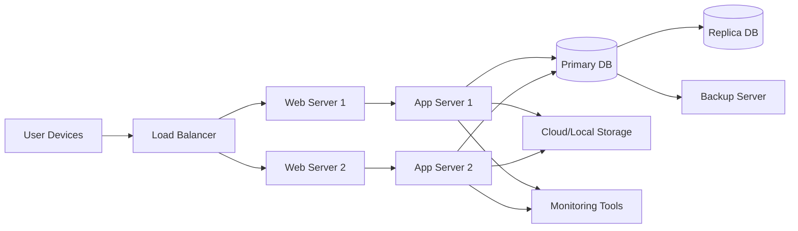
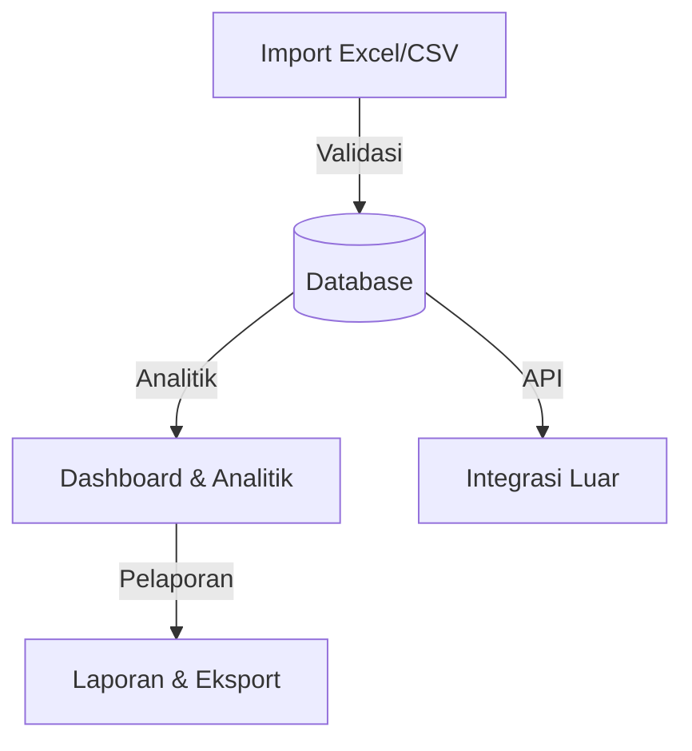

# Gambaran Keseluruhan Sistem (System Overview)

- Sistem: Sistem Pengurusan & Analitik Homestay Malaysia
- Pemilik Sistem: MOTAC, Tourism Malaysia
- Versi: 4.1
- Tarikh: 14 Oktober 2025
- Perubahan: Update teknologi frontend: Vue.js → Livewire

---

## 0. Ringkasan Eksekutif | Executive Summary

Sistem Pengurusan & Analitik Homestay Malaysia ialah platform digital bersepadu yang dibangunkan untuk memodenkan pengurusan, pemantauan, dan analitik industri Homestay di seluruh Malaysia. Sistem ini membolehkan MOTAC dan Tourism Malaysia mengumpul, mengesahkan, dan menganalisis data Homestay secara berpusat, sekaligus meningkatkan kecekapan pelaporan, ketelusan data, dan pembuatan keputusan strategik.

Sasaran utama sistem ini adalah untuk menyokong transformasi digital sektor pelancongan desa, memperkasakan pentadbiran negeri dan koperasi, serta menyediakan maklumat prestasi yang boleh dipercayai kepada semua pihak berkepentingan. Dengan ciri-ciri seperti import data automatik, dashboard interaktif, dan pelaporan fleksibel, sistem ini menjadi tulang belakang kepada usaha MOTAC dalam mempertingkatkan daya saing dan kelestarian industri Homestay Malaysia.

---

## 1. Sasaran & Objektif Sistem | System Goals & Objectives

**Sasaran (Goals):**

- Pemusatan data industri Homestay Malaysia untuk pemantauan nasional.
- Menyokong digitalisasi dan automasi pelaporan prestasi Homestay.
- Mempertingkatkan ketelusan, integriti, dan kebolehpercayaan data sektor pelancongan desa.
- Menyediakan asas data untuk analitik, pelaporan, dan pembuatan keputusan strategik MOTAC.

**Objektif (Objectives):**

- 100% laporan negeri dan koperasi dimuat naik melalui sistem baharu menjelang 2026.
- Masa pemprosesan laporan bulanan dikurangkan kepada <3 hari kerja.
- Semua data Homestay disahkan dan diseragamkan mengikut piawaian MOTAC.
- Dashboard dan laporan tersedia untuk semua peringkat (nasional, negeri, koperasi, individu).

---

## 2. Tujuan | Purpose

Menyediakan satu platform berpusat berasaskan Laravel untuk MOTAC dan Tourism Malaysia dalam mengurus, menganalisis, dan melaporkan data Homestay seluruh Malaysia. Sistem ini menyokong import data Excel, dashboard interaktif, analitik pelbagai peringkat, serta pelaporan fleksibel bagi tujuan pemantauan prestasi, pembuatan keputusan strategik, dan penambahbaikan pengurusan industri Homestay negara.

---

## 3. Skop Fungsi | Functional Scope

Jadual berikut memetakan modul utama sistem kepada peranan pengguna sasaran:

| Modul                | Fungsi Utama                                               | Pengguna Sasaran         |
|----------------------|-----------------------------------------------------------|--------------------------|
| Import Data          | Muat naik Excel, validasi, pelaporan ralat                | Admin                    |
| Dashboard            | Analitik nasional, negeri, koperasi, individu             | Admin, Penganalisis      |
| Pengurusan Homestay  | Carian, kemaskini, profil, sejarah prestasi               | Admin, Penganalisis      |
| Pelaporan            | Eksport Excel/PDF, laporan automatik/manual               | Admin, Penganalisis      |
| Pengurusan Pengguna  | Kawalan akses, audit trail, pengurusan peranan            | Admin                    |
| Audit & Log          | Jejak audit, pemantauan aktiviti, log import              | Admin                    |
| Notifikasi           | Amaran data tidak lengkap, status import, sistem          | Admin, Penganalisis      |
| API Integrasi        | Sinkronisasi data luaran (MOTAC API, Tourism Malaysia)    | Admin, Pemerhati         |

---

## 4. Seni Bina Sistem | System Architecture

Sistem ini dibina berasaskan seni bina Laravel MVC (Model-View-Controller) yang modular dan mudah diskalakan. Komponen utama termasuk:

- **Lapisan Model (Eloquent ORM):** Pengurusan data dan hubungan relasi.
- **Lapisan Controller:** Logik aplikasi, pemprosesan permintaan, dan pengurusan aliran data.
- **Lapisan View (Blade/Livewire):** Antaramuka pengguna dengan komponen interaktif server-side dan AlpineJS untuk interaktiviti ringan.
- **API Layer:** RESTful API untuk integrasi luaran.
- **Database Layer:** MySQL/MariaDB untuk penyimpanan data relasi.
- **Queue/Worker:** Proses latar untuk import berskala besar dan notifikasi.
- **Deployment:** Sokongan untuk cloud (AWS, DigitalOcean) dan on-premise.

### 4.1 Logical Architecture Diagram

```mermaid
flowchart TD
  User[Pengguna/Browser] -->|HTTPS| WebServer[Web Server (Apache/Nginx)]
  WebServer -->|PHP| App[Laravel Application]
  App -->|Eloquent ORM| DB[(MySQL/MariaDB)]
  App -->|REST API| ExtAPI[External APIs]
  App -->|Queue| Worker[Queue Worker]
  App -->|Blade/Livewire| UI[Dashboard/Frontend]
```

### 4.2 Physical Deployment Diagram



---

## 5. Ciri Utama Sistem | Key Features

- Admin boleh memuat naik fail Excel (XLSX/CSV) yang mengandungi data prestasi, kapasiti, dan struktur pengurusan Homestay.
- Sistem menggunakan Maatwebsite/Laravel-Excel untuk pemetaan medan, validasi, pratonton, dan pelaporan ralat.
- Sokongan untuk import data bulanan, gabungan, atau kluster.
- Struktur jadual normal untuk Homestay, kluster, pemilik, kapasiti, tempahan, koperasi, dan prestasi bulanan/tahunan.
- Menyokong pelbagai dimensi data: negeri, model pengurusan, asal pelawat, aliran pendapatan, kapasiti, dsb.
- Dashboard nasional, negeri, koperasi, dan Homestay individu.
- Visual interaktif: carta batang (prestasi mengikut negeri/masa), pai (perbandingan pelancong domestik vs antarabangsa, penembusan koperasi), garis (trend), peta (taburan), dan jadual (senarai 10 Homestay teratas mengikut pelawat/pendapatan).
- Paparan metrik utama: jumlah ketibaan, pendapatan, kadar penghunian, penggunaan kapasiti, penembusan koperasi, segmentasi pelawat (domestik/antarabangsa), pendapatan per bilik/Homestay, status kelengkapan laporan.
- Fungsi drill-down dari ringkasan nasional sehingga ke tahap Homestay terperinci.
- Senarai Homestay yang boleh dicari dan ditapis.
- Paparan butiran lengkap: kapasiti, fasiliti, struktur pengurusan/pemilik, sejarah prestasi, status koperasi, sumber pendapatan.
- Analitik perbandingan mengikut negeri, model pengurusan, atau dimensi lain.
- Eksport data dashboard dan analitik ke Excel/PDF.
- Penjanaan laporan bercetak untuk pelbagai peringkat.
- Pilihan penjadualan laporan automatik atau manual.
- Akses berasaskan peranan (Admin, Penganalisis, Pemerhati) menggunakan Laravel Policies/Gates.
- Autentikasi selamat (Laravel Breeze/Jetstream/UI).
- Audit trail untuk semua perubahan data penting dan sejarah import.
- Validasi menyeluruh dan maklum balas semasa import.
- Penunjuk status kelengkapan data (contoh: bulan tiada laporan, Homestay tidak melapor).
- Amaran kepada admin sekiranya terdapat data tidak konsisten atau tidak lengkap.
- Struktur modular Laravel (MVC, Eloquent, Service Providers).
- Ikut amalan terbaik migration, factory, seeder dan pagination.
- Penggunaan queue & notification untuk proses latar (import berskala besar, penjanaan laporan).
- Perlindungan penuh daripada CSRF, SQL injection, dan XSS.

---

## 6. Teknologi Utama | Technology Stack

- **Backend:** Laravel 12, Eloquent ORM, Policies/Gates
- **Frontend:** Blade, Livewire, AlpineJS, Bootstrap 5+, Chart.js, Vite
- **Database:** MySQL 8.0+/MariaDB
- **Integrasi Excel:** Maatwebsite/Laravel-Excel
- **Autentikasi/Autorisasi:** Laravel Sanctum, Spatie Laravel Permission
- **Queue/Notifikasi:** Laravel Queue (Redis), Notification, Horizon
- **Hosting:** LAMP/LEMP stack, on-premise atau cloud (AWS, DigitalOcean, dsb)

---

## 7. Keperluan Prestasi & Kapasiti | Performance & Capacity Requirements

- **Pengguna serentak:** Sehingga 500 pengguna aktif pada satu masa (peak).
- **Rekod Homestay:** Menyokong >50,000 Homestay dan 10 tahun data prestasi.
- **Masa respons dashboard:** <2 saat untuk paparan utama, <5 saat untuk laporan kompleks.
- **Import data:** Proses import Excel sehingga 10,000 baris dalam <3 minit.
- **Kapasiti DB:** Skala sehingga 10 juta rekod prestasi, 1TB data.
- **Skalabiliti:** Sokongan untuk penambahan node aplikasi dan replikasi DB.

---

## 8. Keselamatan | Security Overview

- **Kawalan Akses Berasaskan Peranan (RBAC):**
  - Tiga peringkat utama: Admin (akses penuh), Penganalisis (akses dashboard & laporan), Pemerhati (akses terhad/paparan sahaja).
  - Pengurusan peranan dan kebenaran menggunakan `spatie/laravel-permission`.
- **Penyulitan Data:**
  - Kata laluan pengguna disimpan menggunakan bcrypt (hashing kuat).
  - Data sensitif (cth: token API) disimpan secara encrypted.
- **Penguatkuasaan HTTPS/TLS:**
  - Semua komunikasi antara klien dan pelayan menggunakan HTTPS (TLS 1.2+).
- **Audit Trail & Logging:**
  - Semua perubahan data penting direkod dalam audit log.
  - Tahap log: info, warning, error, critical.
  - Integrasi dengan Laravel Telescope/Horizon untuk pemantauan dan pengesanan anomali.
- **Pemantauan Intrusi:**
  - Notifikasi automatik untuk cubaan akses tidak sah atau ralat kritikal.

---

## 9. Aksesibiliti & Pengalaman Pengguna | Accessibility & User Experience

- **Pematuhan WCAG 2.1 AA:** Semua antaramuka mematuhi standard kebolehcapaian antarabangsa (warna, kontras, navigasi papan kekunci, teks alternatif).
- **Responsif & Cross-Browser:** Sokongan penuh untuk peranti mudah alih, tablet, dan desktop. Diuji pada Chrome, Edge, Firefox, Safari.
- **Antaramuka Berbilang Bahasa:** Sokongan penuh Bahasa Malaysia dan English untuk semua paparan utama.
- **UX Mesra Pengguna:** Navigasi intuitif, maklum balas segera, dan bantuan kontekstual di setiap modul utama.

---

## 10. Aliran Data & Integrasi | Data Flow & Integration

Sistem ini direka untuk memastikan aliran data yang lancar dari proses import sehingga ke pelaporan dan integrasi luaran. Berikut ialah gambaran aliran data utama:

1. **Import Data:** Admin memuat naik fail Excel/CSV → sistem melakukan validasi dan pemetaan medan.
2. **Penyimpanan:** Data yang sah disimpan ke dalam pangkalan data relasi (MySQL/MariaDB).
3. **Analitik & Dashboard:** Data diproses untuk analitik, dashboard, dan pelaporan.
4. **Pelaporan & Eksport:** Pengguna menjanakan laporan, eksport ke Excel/PDF, atau menjadualkan laporan automatik.
5. **Integrasi Luar:** Data boleh disinkronkan dengan sistem luaran (API MOTAC, Tourism Malaysia, dsb).

### 10.1 Data Flow Diagram (DFD Level 0)



### 10.2 Integration Flow

- **MOTAC API:** REST/JSON, OAuth2, sinkronisasi harian/mingguan.
- **Tourism Malaysia API:** REST/JSON, data pelancongan nasional.
- **Lain-lain:** Integrasi dengan sistem pelaporan atau analitik pihak ketiga (Google Data Studio, Power BI, dsb).

---

## 11. Integrasi Luar | External Integrations

- **MOTAC API:** REST/JSON, OAuth2, sinkronisasi harian/mingguan untuk data pelancongan dan Homestay nasional.
- **Tourism Malaysia API:** REST/JSON, pertukaran data pelancongan dan statistik pelawat.
- **Sistem Analitik Pihak Ketiga:** Integrasi dengan Google Data Studio, Power BI, dsb. melalui eksport CSV/Excel atau API.
- **Jenis Integrasi:** RESTful API, Webhook, eksport/import fail, authentication token.
- **Kekerapan Integrasi:** Real-time (webhook), harian/mingguan (batch), atau mengikut permintaan (manual sync).

---

## 12. Keperluan Infrastruktur | Infrastructure Requirements

- **Hosting:** Cloud (AWS, Azure, DigitalOcean) atau on-premise, dengan sokongan untuk auto-scaling dan high availability.
- **Pangkalan Data:** MySQL/MariaDB, replikasi untuk redundancy, backup automatik harian/mingguan.
- **Backup & Pemulihan:** Strategi backup penuh dan incremental, pemulihan bencana (disaster recovery) diuji secara berkala.
- **Rangkaian & Firewall:** Perlindungan DDoS, firewall aplikasi web (WAF), VPN untuk akses pentadbir.
- **Pematuhan:** Mematuhi piawaian keselamatan dan privasi data (contoh: ISO 27001, PDPA Malaysia).

---

## 13. Pemantauan & Log Sistem | System Monitoring & Logging

- **Pemantauan:** Integrasi dengan alat seperti Grafana, Prometheus, atau CloudWatch untuk pemantauan kesihatan sistem, penggunaan sumber, dan uptime.
- **Log Aplikasi:** Laravel log (Monolog), log audit untuk semua perubahan data kritikal, log akses pengguna.
- **Amaran & Notifikasi:** Notifikasi automatik kepada pentadbir jika berlaku ralat kritikal, kegagalan import, atau anomali data.
- **Audit Trail:** Rekod lengkap semua aktiviti penting untuk pematuhan dan forensik.

---

## 14. Ujian Sistem & Jaminan Kualiti | System Testing & Quality Assurance

- **Jenis Ujian:** Unit, integrasi, fungsional, regresi, UAT (User Acceptance Testing), dan ujian keselamatan.
- **Alat Ujian:** PHPUnit (backend), Laravel Dusk (end-to-end), Postman (API), serta CI/CD pipeline untuk automasi ujian.
- **Jaminan Kualiti:** Peer review kod, static analysis (PHPStan, ESLint), semakan piawaian PSR-12, dan pengesahan WCAG 2.1 AA untuk aksesibiliti.
- **Pelaporan Isu:** Mekanisme pelaporan dan penjejakan isu (contoh: GitHub Issues, Jira) untuk tindakan pembetulan segera.

---

## 15. Risiko & Pelan Mitigasi | Risks & Mitigation

| Risiko | Impak | Kebarangkalian | Mitigasi |
|--------|-------|---------------|----------|
| Kegagalan integrasi data MOTAC | Tinggi | Sederhana | Ujian integrasi awal, fallback manual, dokumentasi API jelas |
| Kelewatan migrasi data negeri/koperasi | Sederhana | Tinggi | Jadual migrasi berperingkat, latihan, sokongan teknikal |
| Serangan siber (DDoS, SQLi, XSS) | Tinggi | Sederhana | Firewall, WAF, audit keselamatan berkala, patching |
| Kekurangan sumber manusia | Sederhana | Sederhana | Latihan, onboarding, dokumentasi lengkap |
| Kegagalan backup/pemulihan | Tinggi | Rendah | Ujian DRP berkala, pemantauan backup, SOP pemulihan |

---

## 16. Pelan Jalan Sistem | System Roadmap

| Fasa | Tempoh | Aktiviti Utama |
|------|--------|---------------|
| Analisis & Reka Bentuk | Q1 2024 | Pengumpulan keperluan, reka bentuk sistem, draf dokumen |
| Pembangunan Teras | Q2 2024 | Pembangunan backend, frontend, integrasi utama, migrasi data |
| Ujian & Latihan | Q3 2024 | UAT, latihan pengguna negeri/koperasi, penambahbaikan |
| Go-Live & Sokongan | Q4 2024 | Pelancaran rasmi, pemantauan, sokongan teknikal |
| Penambahbaikan Lanjutan | 2025+ | Integrasi lanjutan, analitik AI, automasi laporan, penambahbaikan UX |

---

## 17. Glosari & Singkatan | Glossary & Abbreviations

| Istilah/Singkatan | Definisi |
|-------------------|----------|
| MOTAC | Kementerian Pelancongan, Seni dan Budaya Malaysia |
| UAT | User Acceptance Testing |
| API | Application Programming Interface |
| DFD | Data Flow Diagram |
| DRP | Disaster Recovery Plan |
| WAF | Web Application Firewall |
| PSR-12 | PHP Standard Recommendation 12 |
| WCAG 2.1 AA | Web Content Accessibility Guidelines 2.1 Level AA |
| CI/CD | Continuous Integration / Continuous Deployment |
| RBAC | Role-Based Access Control |
| Homestay | Program penginapan pelancong di rumah penduduk tempatan |
| Koperasi | Organisasi koperasi pengurusan Homestay |
| Analitik | Proses analisis data untuk mendapatkan maklumat bermakna |

---

## 18. Versi Kod & Kawalan Versi (Version Control)

- Semua kod sumber diuruskan menggunakan Git dan disimpan dalam repositori rasmi (cth: GitHub).
- **Struktur branch:**
  - `main`: Kod stabil untuk produksi
  - `develop`: Ciri baharu dan integrasi sebelum produksi
  - `feature/*`: Pembangunan ciri baharu
  - `bugfix/*`: Pembetulan pepijat
- **Tagging:**
  - Versi utama ditanda dengan format `vX.Y.Z` (cth: `v1.0.0`)
- Setiap perubahan mesti melalui proses pull request dan semakan rakan sekerja (peer review).

---

## 19. Pengurusan Kebergantungan (Dependency Management)

- Kebergantungan utama didokumenkan dalam `composer.json` dan `package.json`.
- **Pakej utama Laravel/PHP:**
  - `maatwebsite/excel` (import/export Excel)
  - `barryvdh/laravel-dompdf` (PDF eksport)
  - `spatie/laravel-permission` (pengurusan peranan & kebenaran)
  - `laravel/breeze` atau `laravel/jetstream` (autentikasi)
  - `laravel/sanctum` atau `passport` (API auth, jika perlu)
  - `phpunit/phpunit` (ujian automatik)
- Kemas kini kebergantungan dilakukan secara berkala dan diuji sebelum deployment.
- Semua kebergantungan didokumenkan dalam README dan fail changelog.

---

## 20. Struktur Servis & Repositori (Service & Repository Structure)

- **Service Layer:**
  - Semua logik perniagaan kompleks ditempatkan dalam kelas servis di `app/Services/`.
  - Contoh: `HomestayImportService`, `ReportService`.
- **Repository Layer:**
  - Jika digunakan, repositori diletakkan di `app/Repositories/` untuk pengasingan akses data.
- Setiap kelas servis/repositori mesti mempunyai docblock PHPDoc yang jelas (`@param`, `@return`, `@throws`).
- Dokumentasi struktur dan penggunaan servis/repositori disediakan dalam fail kod dan dokumentasi teknikal.

---

## 21. Exception & Error Handling

- Semua exception sistem menggunakan mekanisme Laravel Exception Handling (`app/Exceptions/`).
- Exception khusus boleh didefinisikan untuk proses import, eksport, dan operasi kritikal.
- Logging ralat menggunakan Laravel Logging (`storage/logs/laravel.log`) dan boleh diintegrasi dengan sistem pemantauan (cth: Sentry).
- Semua ralat utama didokumenkan dan dipaparkan kepada pengguna dengan mesej mesra pengguna.

---

## 22. PHPDoc & Kod Gaya Piawai (PHPDoc & Coding Standards)

- Semua kod mematuhi piawaian PSR-12.
- Gunakan PHPDoc untuk setiap kelas, fungsi, dan parameter penting:
  - `@param`, `@return`, `@throws`, `@var`, `@property`
- Komentar ringkas dan padat pada logik kompleks atau keputusan kritikal.
- Semakan gaya kod automatik menggunakan `laravel pint` atau `php-cs-fixer`.

---

## 23. Dokumentasi Konfigurasi & Environment

- Semua konfigurasi sensitif disimpan dalam `.env` dan `.env.example`.
- Setiap pembolehubah `.env` mesti disertakan komen dan contoh:
  - `DB_CONNECTION=mysql` - Jenis sambungan pangkalan data (mysql, pgsql, dll)
  - `DB_HOST=127.0.0.1` - Alamat hos pangkalan data
  - `DB_PORT=3306` - Port untuk sambungan pangkalan data
  - `DB_DATABASE=homestay` - Nama pangkalan data
  - `DB_USERNAME=root` - Nama pengguna pangkalan data
  - `DB_PASSWORD=` - Kata laluan pangkalan data
  - `MAIL_MAILER=smtp` - Protokol penghantaran emel
  - `MAIL_HOST=smtp.mailtrap.io` - Hos pelayan SMTP
  - `MAIL_PORT=2525` - Port untuk sambungan SMTP
  - `MAIL_USERNAME=` - Nama pengguna untuk SMTP
  - `MAIL_PASSWORD=` - Kata laluan untuk SMTP
  - `APP_ENV=local` - Mod persekitaran (local, production, dll)
  - `APP_DEBUG=true` - Nyala/mati mod debug
  - `APP_URL=http://localhost` - URL aplikasi

---

## 24. Pelan Pemulihan Bencana & Sandaran (Disaster Recovery & Backup Plan)

- **Sandaran Berkala:**
  - Sandaran pangkalan data dan fail penting setiap hari.
  - Simpanan sandaran di lokasi berasingan (cth: cloud storage, offsite).
- **Ujian Pemulihan:**
  - Uji proses pemulihan daripada sandaran sekurang-kurangnya sebulan sekali.
  - Pastikan semua data boleh dipulihkan dan sistem berfungsi seperti biasa.

---

## 25. Latihan & Dokumentasi Pengguna (User Training & Documentation)

- **Dokumentasi Pengguna:**
  - Sediakan manual pengguna dan panduan cepat.
  - Dokumentasi dalam talian dan boleh diakses terus dari aplikasi.
- **Latihan Pengguna:**
  - Sesi latihan untuk admin dan pengguna utama.
  - Video latihan dan webinar untuk rujukan lanjut.

---

## 26. Penyelenggaraan & Sokongan (Maintenance & Support)

- **Penyelenggaraan Berkala:**
  - Kemas kini sistem dan kebergantungan setiap bulan.
  - Semak dan optimakan prestasi pangkalan data.
- **Sokongan Pengguna:**
  - Saluran sokongan untuk pengguna melaporkan isu atau mendapatkan bantuan.
  - Tindak balas dalam masa 24 jam untuk semua pertanyaan sokongan.

---

## 27. Pematuhan & Piawaian (Compliance & Standards)

- Pastikan sistem mematuhi semua undang-undang dan peraturan yang berkaitan.
- Ikut piawaian industri untuk keselamatan data, privasi, dan aksesibiliti.
- Sediakan laporan pematuhan dan audit secara berkala.

---

## 28. Maklumat Tambahan (Additional Information)

- **Laman Web Rasmi:**
  - [Tourism Malaysia](https://www.tourism.gov.my)
  - [MOTAC](https://www.motac.gov.my)
- **Repositori Kod Sumber:**
  - [GitHub - Sistem Pengurusan Homestay](https://github.com/motac/homestay-management-system)
- **Dokumentasi API:**
  - [API Documentation](https://api.tourism.gov.my/docs)

---

## 29. Sejarah Semakan (Revision History)

| Tarikh       | Versi   | Keterangan                  | Pengarang         |
|--------------|---------|-----------------------------|-------------------|
| 2023-10-11   | 1.0.0   | Versi awal dokumen          | Pasukan MOTAC     |
| 2023-10-12   | 1.0.1   | Pembetulan kecil            | Pasukan MOTAC     |
| 2023-10-13   | 1.1.0   | Penambahan bahagian 4-9     | Pasukan MOTAC     |
| 2023-10-14   | 1.1.1   | Pembetulan ralat            | Pasukan MOTAC     |
| 2023-10-15   | 1.2.0   | Penambahan bahagian 10-16   | Pasukan MOTAC     |
| 2023-10-16   | 1.2.1   | Pembetulan akhir sebelum    | Pasukan MOTAC     |
|              |         | pengeluaran                 |                   |

---
